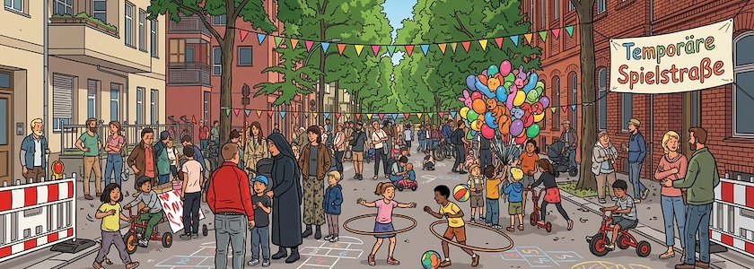

Morgen, am **Dienstag, den 7. Juli 2026 zwischen 15:00 Uhr und 18:00 Uhr** ist es wieder soweit, dann wird die **Glasower Straße zwischen Benda- und Bruno-Bauer-Straße** in 12051 Berlin-Neukölln zum zweiten Mal in diesem Jahr für den Autoverkehr gesperrt und [erneut](https://qm-glasower-strasse.de/buntes-gewimmel-bei-der-temporaeren-spielstrasse/) zur [temporären Spielstraße](https://qm-glasower-strasse.de/glasower-strasse-wird-wieder-zur-spielstrasse/) umgewidmet. Wie schon beim [letzten Mal im Juni](https://kantel.github.io/posts/2026060801_temporaere_spielstrasse/) kann dann fröhlich und unbehelligt vom Autoverkehr auf der Straße gespielt, getobt, getanzt und gelacht werden.

**Autofahrer, bitte aufgepasst**: Die Straße ist im besagten Abschnitt nicht nur gesperrt, sondern von 13:00 Uhr bis 18:00 Uhr gilt hier auch absolutes Halteverbot. Autos, die dennoch dort parken, werden abgeschleppt.

Die temporäre Spielstraße wird in diesem Jahr noch zwei Mal, am 25. August und am 22.&nbsp;September, jeweils auch wieder von 15:00 Uhr bis 18:00 Uhr, wiederholt werden. Veranstaltet wird sie von anwohnenden Menschen aus dem Kiez. Sie freuen sich über viele, fröhliche Kinder und ihre erwachsenen Begleitpersonen.

---

**Bild**: *[Temporäre Spielstraße](https://www.flickr.com/photos/schockwellenreiter/55375477773/)*, erstellt mit [OpenArt](https://openart.ai/home). Prompt: »*A cordoned-off city street in Berlin-Neukölln, Glasower Straße, like @image1 lined with multi-story residential and commercial buildings, some featuring red brick facades. No shops. Many children are playing in the street with hoops, balls, balloons, and a few pedal cars, supervised by a handful of adults. Colorful triangular pennants are strung across the street. A colorful banner reading "Temporäre Spielstraße" (Temporary Play Street) hangs on the right side of the street. Franco-Belgian comic book style. Language: German. No speech bubbles, no text boxes.*« Modell: Nano Banana&nbsp;2, nach einem [Photo](https://www.flickr.com/photos/schockwellenreiter/55324872079/) von mir.