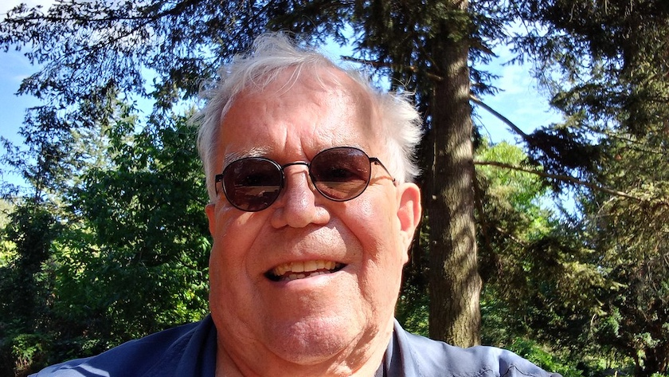

Endlich habe ich wieder die Haare ~~schön~~ wüst (poese Pöen), dank [Coiffeure Marina & Team](https://www.facebook.com/coiffeuremarinaundteam/?locale=de_DE) *(Facebook-Link)*. Zwar war die Berliner S-Bahn in den [letzten Wochen](https://www.deutschebahn.com/de/presse/presse-regional/pr-berlin-de/aktuell/presseinformationen/Stellwerkserneuerung-in-Schoeneweide-13897424) -- wie schon seit Jahren -- wieder ihrer Lieblingsbeschäftigung nachgegangen, den Berliner Südosten vom Verkehr abzukoppeln (wieviel Jahre braucht es eigentlich, eine simple [Stellwerkstechnik in Schweineöde](https://bauprojekte.deutschebahn.com/p/berlin-schoeneweide_estw) zu erneuern?), aber heute hatte sie ein Einsehen und ich kam durch. Doch ich sollte mich nicht zu früh freuen, für August sind schon wieder [neue Streckenstillegungen angekündigt](https://www.deutschebahn.com/de/presse/presse-regional/pr-berlin-de/aktuell/presseinformationen/Bauarbeiten-der-DB-InfraGO-in-den-Sommerferien-So-faehrt-die-S-Bahn-13961096).

Weiter geht es also mit den [unendlichen Geschichten](https://de.wikipedia.org/wiki/Bahnhof_Berlin-Sch%C3%B6neweide#Umbau) rund um den Bahnhof Schöneweide.

---

**Photo** ([cc](https://creativecommons.org/licenses/by-sa/4.0/deed.de)) 2026: *[Jörg Kantel](http://cognitiones.kantel-chaos-team.de/cv.html)*