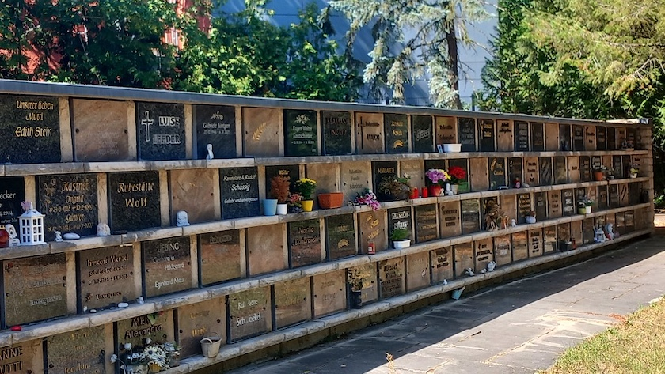

Nach dem [Besuch bei den Haarschneiderinnen meines Vertrauens](https://kantel.github.io/posts/2026070901_haare_wuest/) habe ich noch den [Emmauskirchhof](https://kantel.github.io/posts/2026042301_fruehling_emmauskirchhof/) besucht und die Wand mit [Gabis](https://kantel.github.io/posts/2024041901_rip_gabi/) Urnengrab photographiert. Regelmäßige Leserinnen und Leser des *Schockwellenreiters* wissen, was das bedeutet: Mit diesem Photo möchte ich auf den [Kampf um den Emmauswald](https://emmauswald-bleibt.de/), der früher ebenfalls Teil des [Emmauskirchhofs](https://evfbs.de/start/friedhoefe/region-sued/einzeldarstellung/emmaus/kurzportraet) war, hinweisen.

Denn der mit seinen rund vier Hektar größte Neuköllner (und kleinste Berliner) Wald soll nach dem Willen des Berliner Senats unter dem Regierenden Bürgermeister *Kai Wegner* (CDU) und des Vonovia-Konzerns weitgehend abgeholzt, versiegelt und bebaut werden. Die Konzerntochter Buwog plant in und um den Emmauswald den Neubau von rund 600 Wohneinheiten, wobei sie den Berliner Sozialbauschlüssel von 30 Prozent einhalten muss.

Diese rund 200 bezahlbaren Einheiten sollen auf einer nahegelegenen Brache »direkt an der Straße« errichtet werden, erklärt *Alina Bause*, Sprecherin der Initiative »Emmauswald bleibt!«, im [Gespräch mit der Tageszeitung junge Welt](https://www.jungewelt.de/artikel/525728.protest-gegen-vonovia-halt-das-ist-unser-wald.html) *(jW)*. Für die »teuren Eigentumswohnungen mit Tiefgarage« hingegen plane Buwog mehr als zwei Hektar des Waldes zu roden. Die Luxusimmobilien selbst würden zu »Gentrifizierung und weiterer Vertreibung führen«.

>»In einem hochverdichteten Gebiet wie Nordneukölln eine Grünfläche zu roden, um Eigentumswohnungen zu bauen, die sich kein Normalverdiener leisten kann, ist umweltpolitisch und wohnungspolitisch wahnwitzig«, erklärt *Rouzbeh Taheri*, Mitinitiator des Volksentscheids »Deutsche Wohnen & Co. enteignen«, gegenüber *jW*. Bausenator *Christian Gaebler* (SPD) habe den Bezirk in dieser Frage entmachtet, »um die Profitinteressen von Vonovia durchzusetzen«, führte der Spitzenkandidat der Neuköllner Linken zur anstehenden Abgeordnetenhauswahl aus: »Neukölln braucht bezahlbare Wohnungen, die nur durch Genossenschaften und öffentliche Bauträger geschaffen werden.«

Auch die Lokalpolitikerin *Christina Hilmer-Benedict* (Grüne) und die stellvertretende SPD-Fraktionsvorsitzende im Berliner Abgeordnetenhaus, *Derya Çağlar*, sprachen sich am Rande des Protests gegen eine Rodung aus: Dem drängenden Mangel an Wohnungen für Normalverdiener begegne man so nicht.

Über den Protest der Schulkinder am frühen Montagmittag [berichtete auch der RBB](https://www.rbb-online.de/abendschau/videos/20260706_1930/emmauswald.html) in einem zweiminütigen Filmbeitrag der Abendschau vom 6.&nbsp;Juli&nbsp;2026.

---

**Photo** ([cc](https://creativecommons.org/licenses/by-sa/4.0/deed.de)) 2026: *[Jörg Kantel](http://cognitiones.kantel-chaos-team.de/cv.html)*