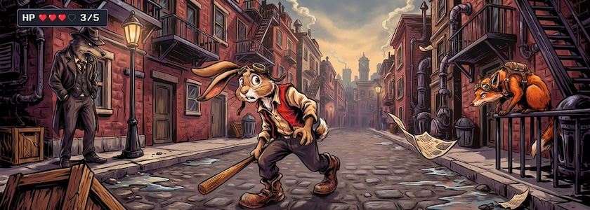

Der 45-minütige Vortrag »[Wir müssen uns Schrödingers Katze als halbtot vorstellen](https://www.youtube.com/watch?v=CqoX9IY8gbQ) -- Über KI, Urteilskraft und die Kunst, Widersprüche auszuhalten«, den *Ralf Stockmann* von der Zentral- und Landesbibliothek Berlin am 24.&nbsp;April&nbsp;2026 auf der 49.&nbsp;Jahrestagung der Informationsdienstleistenden und Bibliotheken der Max-Planck-Gesellschaft gehalten hatte, hat unter meinen ehemaligen EDV-Kollegen der MPG eine große, meist positive Resonanz gefunden.

<iframe class="if16_9" src="https://www.youtube.com/embed/CqoX9IY8gbQ?si=qyRm0z-m6MaVPXWK" title="YouTube video player" frameborder="0" allow="accelerometer; autoplay; clipboard-write; encrypted-media; gyroscope; picture-in-picture; web-share" referrerpolicy="strict-origin-when-cross-origin" allowfullscreen></iframe>

>Generative KI konfrontiert uns mit einem grundlegenden Widerspruch: Ihre Ergebnisse können gleichzeitig beeindruckend und fehlerhaft, nützlich und riskant, intelligent und erstaunlich begrenzt sein. Wer sinnvoll mit KI arbeiten will, muss diese Ambivalenz weder auflösen noch verdrängen, sondern professionell mit ihr umgehen.  Der Vortrag zeichnet den Weg von frühen Debatten über maschinelle Intelligenz bis zur heutigen KI-Praxis nach. Er betrachtet verlorene Wetten gegen Maschinen – von Schach über Go bis zum Turing-Test –, diskutiert KI als mögliche neue »Kränkung der Menschheit« und fragt, welche Urteilskraft Menschen in einer Welt leistungsfähiger Sprachmodelle benötigen.

Im Zentrum steht dabei eine praktische KI-Literacy. Auch ich halte den Vortrag für eine wichtige Stimme bei der Diskussion über das Für und Wider im Umgang mit der gekünstelten Intelligenzia. 

---

**Bild**: *[Der Märzhase in Dystopia (auf der Suche nach Schrödingers Katze)](https://www.flickr.com/photos/schockwellenreiter/55364798800/)*, erstellt mit [Ideogram 4.0](https://ideogram.ai/). Prompt: »*The March Hare creeps fearfully through a dystopian, steampunk-style metropolis. He wears aviator goggles pushed up onto his forehead and a rust-red vest; he carries a baseball bat in his hand. The street appears deserted, yet at two different street corners, a sinister-looking anthropomorphic wolf in a floppy hat and a fox—also wearing aviator goggles—are watching the March Hare. It is a late summer evening, and the sun is already low in the sky. The image resembles a screenshot from an RPG; a status bar and several health points represented by small hearts are visible in the upper-left corner. Classic American comic book style. No speech bubbles or text boxes.*«