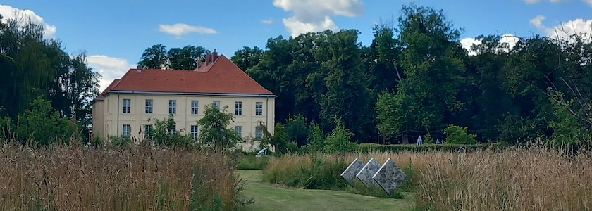
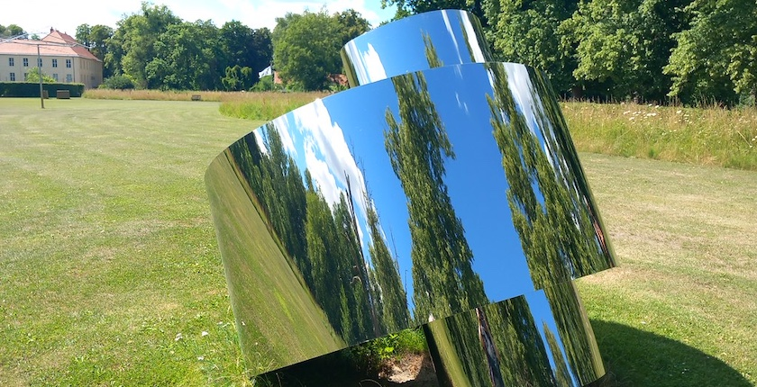
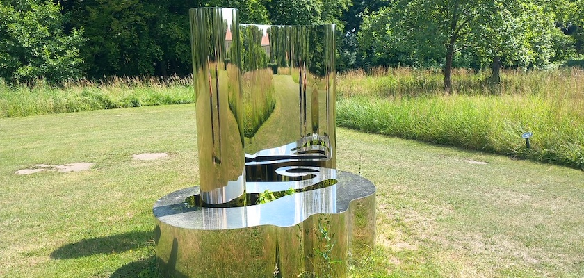
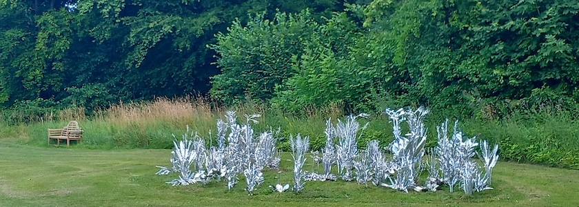
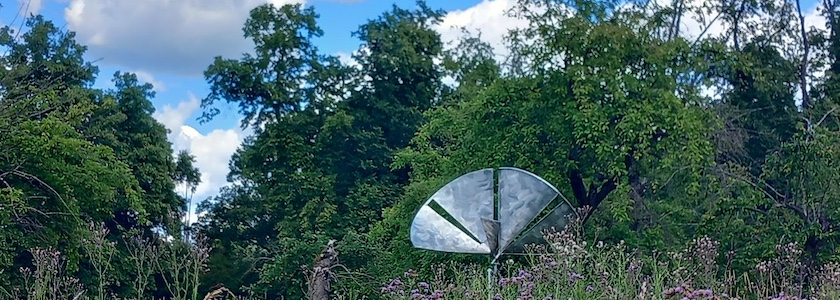
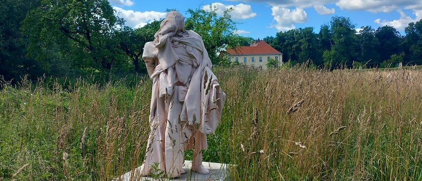
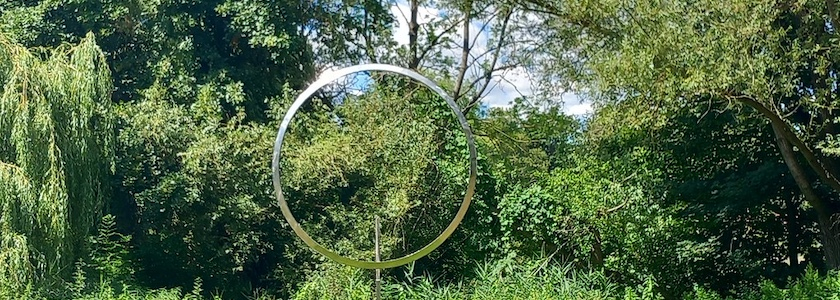
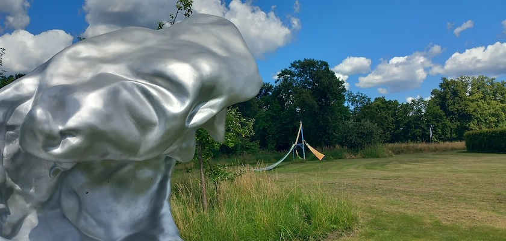

Etwa 25 Kilometer von Berlin und zehn Kilomenter westlich von Oranienburg entfernt liegt das Dorf [Schwante](https://de.wikipedia.org/wiki/Schwante), ein kleiner  Ortsteil der Gemeinde Oberkrämer in der Region Oberhavel in Brandenburg. Südwestlich des Ortskerns liegt das [Schloss Schwante](https://de.wikipedia.org/wiki/Schloss_Schwante), ein zweigeschossiger, dreiflügeliger Barockbau aus dem 18. Jahrhundert, der seit 2019 von dem Kunstberaterpaar *Daniel Tümpel* und *[Loretta Würtenberger](https://de.wikipedia.org/wiki/Loretta_W%C3%BCrtenberger)* samt ihrer Großfamilie bewohnt wird.

Zum [Schloßgut Schwante](https://www.schlossgut-schwante.de/) gehört ein zehn Hektar großer [Skulpturenpark](https://www.komoot.com/de-de/highlight/6254612), der 2020 eröffnet wurde und seitdem im Sommer (Mai bis Oktober) jeden Sonnabend und Sonntag von 12:00 Uhr bis 18:00 Uhr für Besucher zugänglich ist. Der Eintritt kostet 12&nbsp;€ pro Person.

Jede Saison wird im Park eine Jahresausstellung präsentiert, die Werke im Dialog zwischen Kunst und Natur zeigen. Jährlich kommen neue Werke hinzu, ältere Werke verlassen den Skulpturenpark wieder. Die allerliebste Freundin und ich fanden, daß Park und Ausstellung einen Besuch wert seien. 

Es entstehen nämlich jedes Mal wechselnde Konstellationen anstelle abgeschlossener Ausstellungen - ein atmendes Konzept. Analog zur Natur, die sich gleichzeitig zyklisch wie auch anagenetisch entwickelt, bleibt auch der Ausstellung ein inhaltlicher Kern sowie Werke aus den Vorjahren erhalten.

Der Park bietet so unverwechselbares kulturelles Erlebnis, bei dem Kunst und Natur miteinander verschmelzen. Dazu gehörte auch, daß bei unserem Besuch am vergangenen Wochenende die Insekten- und Schmetterlingsvielfalt in den ungemähten Wiesenteilen des Parks den Kunstwerken fast den Rang ablief.

Da es im traditionellen Sinne keine einzelne definierte »Route« gibt, können Besucher das Gelände in ihrem eigenen Tempo erkunden und Wegen folgen, die zu den verschiedenen Skulpturen führen. Das Erlebnis dreht sich mehr um Entdeckung und Immersion als um einen festen Pfad. Das Design des Parks ermöglicht einen gemütlichen Spaziergang, der in der Regel einige Stunden dauert, um die Kunst und die natürlichen Besonderheiten vollständig zu würdigen.

Wir sind uns allerdings nicht sicher, ob wir wirklich alle ausgestellten Werke entdeckt haben, aber im [Ausstellungsguide](https://www.schlossgut-schwante.de/guide) sind alle Skulpturen gelistet, die derzeit den Skulpturenpark bevölkern, im [Ausstellungsarchiv](https://www.schlossgut-schwante.de/archiv) sind alle früheren Ausstellungen zu finden.

Zum Abschluß des Besuches laden das Gartenrestaurant mit Backsteinhaus und Hofladen dazu ein, den Tag gemütlich ausklingen zu lassen.

### Verwendete Quellen

- Daniel Tümpel und Loretta Würtenberger: *[Schlossgut Schwante](https://www.schlossgut-schwante.de/)*, aufgerufen am 13.&nbsp;Juli&nbsp;2026
- Brigitte Werneburg: *[Neuer Skulpturenpark in Brandenburg](https://taz.de/Neuer-Skulpturenpark-in-Brandenburg/!5692695/): Sommertag mit Bildhauerei*, TAZ vom 28.&nbsp;Juni&nbsp;2020
- Komoot: *[Schlossgut Schwante Skulpturenpark](https://www.komoot.com/de-de/highlight/6254612)*, aufgerufen am 13.&nbsp;Juli&nbsp;2026
- Wikipedia: *[Schloss Schwante](https://de.wikipedia.org/wiki/Schloss_Schwante)*, aufgerufen am 13.&nbsp;Juli&nbsp;2026

### Anreise

S-Bahn 25 bis Bahnhof Hennigsdorf, weiter mit RB 55 Richtung Kremmen bis Station Schwante. Von dort sind es fußläufig 7 Minuten bis zum Schlossgut.

---

**Photos** ([cc](https://creativecommons.org/licenses/by-sa/4.0/deed.de)) 2026: *[Jörg Kantel](http://cognitiones.kantel-chaos-team.de/cv.html)*