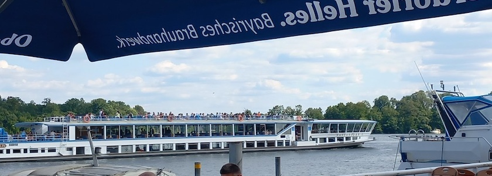

Über die Wiedereröffnung der **Terrassen am See** in Tegelort hatte ich ja vor sechs Wochen [auf diesen Seiten schon berichtet](https://kantel.github.io/posts/2026060202_terrassen_am_see/). Gestern waren die liebste aller Freundinnen und ich wieder einmal dort, um der Hitze zu entfliehen. Wir haben es uns dort bei einem Bier gut gehen lassen (sie mit alkoholfrei und ich ohne alkoholfrei) und den vorbeifahrenden Ausflugsdampfern nachgeschaut.

Und da ja bekanntlich die *asozialen Netze* (speziell das Gesichtsbuch) und ich in diesem Leben keine Freunde mehr werden, muss ich das Photo der »[Havelstern](https://www.sternundkreis.de/ships/ms-havelstern/)«, das ich dort geschossen hatte, in diesem ~~Blog~~ Kritzelheft veröffentlichen. Denn dafür sind Kritzelhefte schließlich da.

---

**Photo** ([cc](https://creativecommons.org/licenses/by-sa/4.0/deed.de)) 2026: *[Jörg Kantel](http://cognitiones.kantel-chaos-team.de/cv.html)*