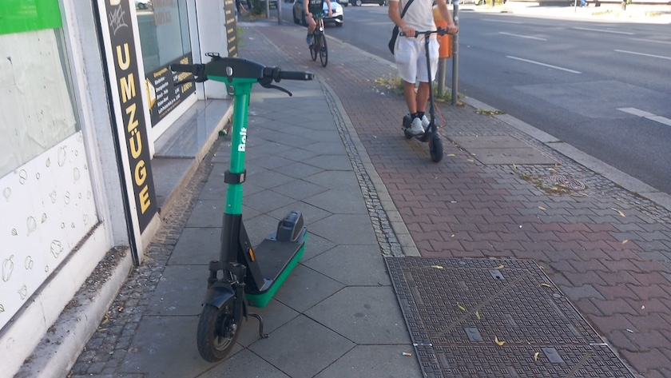

Zwischen Radweg und Hauswand findet der durchschnittliche Berliner ~~gehirnamputierte~~ E-Scooter-Nutzer immer noch Platz, um seinen geliehenen Roller abzustellen. Was heißen hier »Fußweg« und »Fußgänger«? Fußgängerinnen und Fußgänger stören doch nur bei der Roller-Raserei. Schon die Einführung dieser Klein- und Leihfahrzeuge war eine beSCHEUERte Idee, und das Trottoir gehört seitdem den ~~Gehirnamputierten~~ E-Scootern.

---

**Photo** ([cc](https://creativecommons.org/licenses/by-sa/4.0/deed.de)) 2026: *[Jörg Kantel](http://cognitiones.kantel-chaos-team.de/cv.html)*