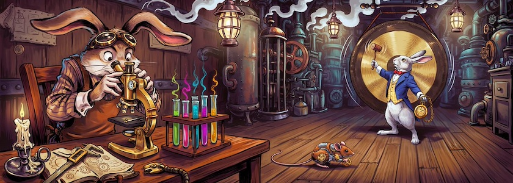

Eigentlich hatte ich [hier ja geschrieben](https://kantel.github.io/posts/2026061601_ink_und_inky_2/), daß ich momentan (noch?) nichts mit [Ink](https://www.inklestudios.com/ink/), der freien (MIT-Lizenz) Skriptsprache für interaktive Fiktion und den dazugehörenden Editor [Inky](http://cognitiones.kantel-chaos-team.de/multimedia/spieleprogrammierung/inkle.html) anstellen möchte, aber unser aller Datenkrake glaubte mir nicht und spülte diesen Ink-Workshop in meinen Feedreader:

<iframe class="if16_9" src="https://www.youtube.com/embed/maICUcaf9GM?si=qmaN1M9MaNtowfeo" title="YouTube video player" frameborder="0" allow="accelerometer; autoplay; clipboard-write; encrypted-media; gyroscope; picture-in-picture; web-share" referrerpolicy="strict-origin-when-cross-origin" allowfullscreen></iframe>

Das Video ist das erste der (etwa?) siebenteiligen Tutorialreihe »[Writing Interactive Fiction Using the Ink Game Engine with James the Tech](https://www.youtube.com/playlist?list=PLjgCLYVYeo2wpBeUBIT0C9IWiceH_Hiuo)« der *[Richmond Public Library](https://www.yourlibrary.ca/)* in Kanada. Achtung, die Playlist ist ein wenig durcheinandergeraten, die korrekte Reihenfolge der Tutorials ist Video&nbsp;2, Video&nbsp;1, Video&nbsp;4, 5, und 6 (Video&nbsp;3 ist wohl versehentlich dazwischengeraten und mehr eine Art Bonus-Video).

Und da ich wohl doch nicht der gemütliche Elefant im grünen Morgenmantel, sondern eher der [verrückte Märzhase](https://de.wikipedia.org/wiki/M%C3%A4rzhase) bin, werde ich in den nächsten Tagen (wenigstens ein klitzekleines bisschen) etwas mit Ink und Inky ausprobieren. Allein schon deshalb, weil sich damit relativ einfach interaktive Geschichten mit statischen Seiten für das Web erzeugen lassen. Damit könnte ich dann auch endlich [meinen Indieweb-Account](https://kantel.github.io/posts/2026061101_neocities/) bei [Neocities](https://kantel.neocities.org/) beleben. *Still digging!*

---

**Bild**: *[March Hare in the Lab](https://www.flickr.com/photos/schockwellenreiter/55393152004/)*, erstellt mit [Ideogram 4.0](https://ideogram.ai/). Prompt: »*The March Hare, wearing aviator goggles pushed up onto his forehead, sits in a steampunk-style laboratory in front of a large microscope. Next to him on the lab table are test tubes in racks filled with neon-colored, steaming liquids. A white rabbit with a blue jacket, a yellow checkered waistcoat, and a white stand-up collar with a red bow stands in the background, striking a giant gong hanging on the wall with a mallet. In the other hand, it carries a large pocket watch with a gold chain. In the background, strange, large machines belch out clouds of steam. The scene is illuminated by antique gas lanterns hanging from the ceiling. Colored Franco-Belgian comic style. No textboxes, no speech-bubbles.*«