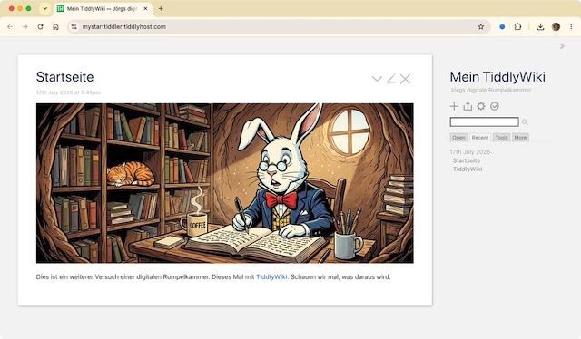

Eher zufällig geriet **[TiddlyWiki](https://tiddlywiki.com/)** als ~~digitaler Zettelkasten~~ digitale Rumpelkammer und Alternative zu [Anytype](https://kantel.github.io/#category=Anytype) in meinen Fokus. Ich muss früher schon einmal darüber gestolpert sein, da die Software einen [Eintrag in meinem Wiki](http://cognitiones.kantel-chaos-team.de/webworking/wiki/tiddlywiki.html) bekommen hatte. TiddlyWiki ist eine freie (BSD-Lizenz) JavaScript-Anwendung, die eine vollständige Wiki-Software innerhalb einer einzelnen HTML-Datei realisiert.

Die Applikation schreibt das Wiki als kompakte HTML-Datei heraus, die inklusive des eingebundenen JavaScript-Codes in der Basisversion eine Größe von etwa 400 Kilobyte hat. Das Wiki wird vollständig durch JavaScript gesteuert und benötigt **keine Serveranwendung**. Dadurch eignet sich TiddlyWiki hervorragend für kleine, unabhängige Informationssammlungen, die auch auf externen Datenträgern mitgenommen und auf verschiedenen Browser- und Betriebssystemplattformen betrachtet und bearbeitet werden können. Und es ist dadurch auch prädestiniert für meine [Flucht in die Digitale Souveränität](https://kantel.github.io/#category=Digitale%20Souver%C3%A4nit%C3%A4t).

Ich habe heute den ganzen Tag mit der Software herumgespielt, aber die Software macht es einem nicht einfach. Die Desktop-Anwendung für den Mac ist noch reichlich buggy und stürzt regelmäßig ab (was von den Machern auch zugegeben wird, sie versprechen »baldige Abhilfe«). Auch die Lernkurve ist ziemlich steil. Daher habe ich mir für meine ersten Versuche einen kostenlosen Account bei [TiddlyHost](https://tiddlyhost.com/) zugelegt, wo Ihr auch die [Ergebnisse meiner Bemühungen](https://mystarttiddler.tiddlyhost.com/) verfolgen könnt.

Auch die Dokumentation ist -- vorsichtig formuliert -- etwas unübersichtlich geraten, aber die [»Explore«-Seiten auf Tiddlyhost](https://tiddlyhost.com/explore) zeigen, wozu die Software in der Lage sein kann, wenn man als Nutzerin oder Nutzer endlich die Bedienung der Software verstanden hat. Außerdem macht sie einen nerdigen Eindruck und soll die Basis sein, auf der auch [Twine](http://cognitiones.kantel-chaos-team.de/multimedia/spieleprogrammierung/twine2.html) beruht. All das zieht mich irgendwie an.

Ein Nachteil ist sicher noch, daß TiddlyWiki ein eigenes Wiki-Markup als Auszeichungssprache nutzt, aber es soll ein Plugin für Markdown geben. Meine Vision ist jedenfalls, daß ich mein TiddlyWiki als nicht-editierbare HTML-Seite exportiere (auch das soll möglich sein) und dieses dann auf meinem [Neocities-Account](https://kantel.neocities.org/) veröffentliche. Mittelfristig könnte es dann mein [bisheriges Wiki](http://cognitiones.kantel-chaos-team.de/index.html) ablösen. Aber davor haben die Götter noch viel Erkundugsarbeit gesetzt. *Still digging!*

---

**Bild**: *[Rabbit Hole](https://www.flickr.com/photos/schockwellenreiter/55400223115/)*, erstellt mit [OpenArt](https://openart.ai/home). Prompt: »*@Rudi Rabbit wearing glasses sits at a desk in a rabbit burrow. It wears a large pocket watch on a chain. On the desk in front of the rabbit lies an enormous notebook, in which the rabbit is writing with an old-fashioned fountain pen. Next to it is a mug of steaming coffee. Writing utensils are in another mug. Many old books and files line the shelves all around the burrow. A cat is curled up on one of the shelves, sleeping. Sunlight shines through a window in the burrow wall. Colored classic American comic style. No speech bubbles, no textboxes, no headlines.*« Modell: Nano Banana&nbsp;2.