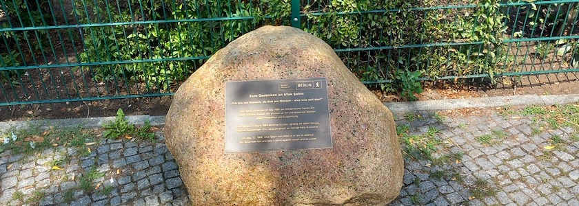

Am 12. Mai 1989 wurde der 24-jährige Berliner **Ufuk Şahin** auf dem Fußweg vor dem Haus im Wilhelmsruher Damm 224 erstochen, nachdem er von seinem aus der Nachbarschaft stammenden Mörder rassistisch beleidigt wurde. Er hinterließ seine Ehefrau, ein Kind sowie seine Eltern und Geschwister. Seine letzten Worte »Ich bin ein Mensch, du bist ein Mensch. Also was soll das?« stehen bis heute für einen eindringlichen Appell zu Menschlichkeit und gegenseitigem Respekt.

Das Märkische Viertel war zu jener Zeit eine Hochburg der extrem rechten Partei »Die Republikaner«, deren Einzug ins Berliner Parlament im Januar des selben Jahres den erstarkenden Rassismus in Westberlin greifbar machte. Die Republikaner hatten im Wahlkampf einen Werbespot veröffentlicht, in dem Bilder vom Kottbusser Tor und insbesondere von muslimischen Frauen mit Kopftuch mit der Musik »Spiel mir das Lied vom Tod« unterlegt waren.

Der Mörder *Andreas Sch.* wurde Ende Oktober desselben Jahres wegen Körperverletzung mit Todesfolge zu fünf Jahren Haft verurteilt. Weder Gericht noch Staatsanwaltschaft wollten den offensichtlichen Rassismus als Grund für die Tat erkennen, obwohl der Täter als Motiv Ärger über »all die Kanaken« vor Gericht angegeben hatte.

Auch heute gibt es im Märkischen Viertel nicht nur viele Menschen mit Migrationshintergrund, sondern auch viele Wählerinnen und Wähler der rechtsextremen AfD. Und so dauerte es beschämende 37 Jahre, bis endlich anlässlich des 37. Todestages von Ufuk Şahin am 12.&nbsp;Mai&nbsp;2026 ein Gedenkstein mit mit seinen letzten Worten am Ort der Tat eingeweiht wurde.

Um die Erinnerungsarbeit im Bezirk weiter auszubauen, wurde am 11.&nbsp;Mai&nbsp;2026 erstmals der Ufuk-Şahin-Preis verliehen, der Engagement für ein respektvolles und solidarisches Miteinander würdigt. Der Preis soll künftig alle zwei Jahre vergeben werden.

**Ort**: Wilhelmsruher Damm 228, 13435 Berlin (direkt am U- und S-Bahnhof Wittenau).

### Literatur und Quellen

- Bezirksamt Reinickendorf von Berlin: *[Einweihung des Gedenksteins für Ufuk Şahin in Reinickendorf](https://www.berlin.de/ba-reinickendorf/aktuelles/pressemitteilungen/2026/pressemitteilung.1665875.php)*, Pressemitteilung vom 28.&nbsp;April&nbsp;2026
- Bezirksamt Reinickendorf von Berlin: *[Gedenkstein für Ufuk Şahin in Reinickendorf enthüllt](https://www.berlin.de/ba-reinickendorf/aktuelles/pressemitteilungen/2026/pressemitteilung.1670627.php)*, Pressemitteilung vom 12.&nbsp;Mai&nbsp;2026
- Marie Frank: *[Gedenken an Opfer rassistischer Gewalt](https://www.nd-aktuell.de/artikel/1118532.ufuk-sahin-gedenken-an-opfer-rassistischer-gewalt.html)*, nd vom 13.&nbsp;Mai&nbsp;2019
- Vera Gaserow: *[Todesursache Ausländerhaß](https://taz.de/Berlin-Todesursache-Auslaenderhass/!1812152/)*, TAZ vom 17.&nbsp;Mai&nbsp;1989
- Gedenktafeln in Berlin: *[Ufuk Şahin](https://www.gedenktafeln-in-berlin.de/gedenktafeln/detail/ufuk-sahin)*, aufgerufen am 22.&nbsp;Juli&nbsp;2026
- Lilli Messer: *[Gedenkstein gegen Rassismus: Erinnerung an Ufuk Şahin](https://taz.de/Gedenkstein-gegen-Rassismus/!6178831/)*, TAZ vom 14.&nbsp;Mai&nbsp;2026
- Plutonia Plarre: *[»Ich bin doch auch ein Mensch«](https://taz.de/Ich-bin-doch-auch-ein-Mensch/!1792721/)*, TAZ vom 1.&nbsp;November&nbsp;1989
- Eike Sanders und Ulli Jentsch: *[12. May 1989: Ufuk Şahin wird im Märkischen Viertel von einem Rassisten erstochen](https://rechtsaussen.berlin/2019/05/ufuk-sahin-wird-im-maerkischen-viertel-von-einem-rassisten-erstochen/)*, apabiz (Berlin rechtsaußen) vom Mai&nbsp;2019

---

**Photo** ([cc](https://creativecommons.org/licenses/by-sa/4.0/deed.de)) 2026: *[Jörg Kantel](http://cognitiones.kantel-chaos-team.de/cv.html)*