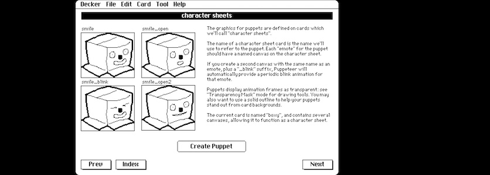

Der regelmäßig auf diesen Seiten erwähnte »Freund aus Bremen« hat wieder zugeschlagen. Vor ein paar Tagen machte er mich darauf aufmerksam, daß es von [Decker](http://cognitiones.kantel-chaos-team.de/programmierung/decker.html), der freien (MIT-Lizenz) und plattformübergreifenden (macOS, Linux, Windows, Web) Multimedia-Plattform zum Erstellen und Teilen interaktiver Dokumente mit Ton, Bildern, Hypertext und Skriptfunktionen, kurzum, dem Erbe von [HyperCard](http://cognitiones.kantel-chaos-team.de/programmierung/hypercard.html), ein neues Update gäbe.

In einem lag Kalle allerdings falsch. Seit der letzten Erwähnung in diesem ~~Blog~~ Kritzelheft vor [ziemlich genau einem Monat](https://kantel.github.io/posts/2026062401_decker/) gab es nicht nur ein Update, sondern sogar zwei Updates: Vor zwanzig Tagen erschien [Decker 1.68](https://internet-janitor.itch.io/decker/devlog/1573143/decker-168) und vor sechs Tagen wurde [Decker 1.69](https://internet-janitor.itch.io/decker/devlog/1590239/decker-169) freigegeben. Beides sind Wartungs-Releases mit Bugfixes und einem Schwerpunkt auf bessere Performance.

Aber es gab auch einige neue Features, speziell im Bereich Soundbearbeitung. Alle neuen Features und alle Änderungen könnt Ihr auf den oben verlinkten beiden Update-Seiten nachlesen.

Und ich? Sollte oder wollte ich nicht mal eine *Visual Novel* in Decker erstellen? Die schwwarz-weiße Retro-Ästhetik von Decker schreit doch geradezu nach einer Ditherpunk-Geschichte. *Soviel zu spielen, so wenig Zeit!*