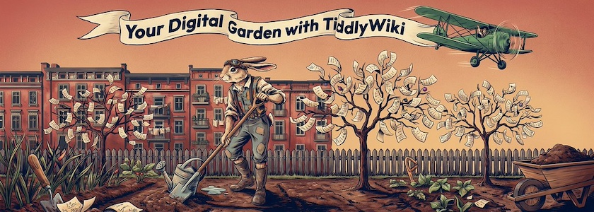
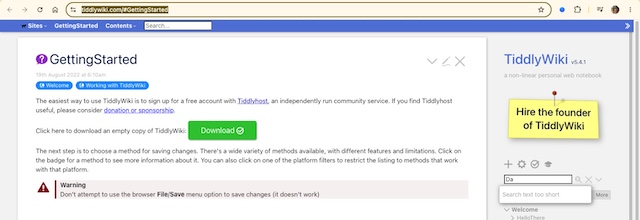
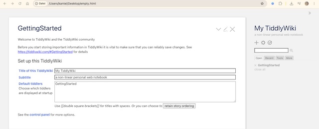
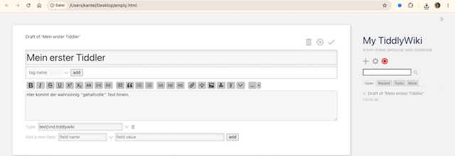

I did it! Mit Hilfe von *Ruth Ake* und ihrem wunderbaren Tutorial »[Digital Notes With TiddlyWiki](https://www.youtube.com/watch?v=jFCX5Nh2QIM)« ist es mir gelungen, die Einstiegshürden von TiddlyWiki zu überwinden und eine erste Website damit zu erstellen. Ich möchte Euch zeigen, wie ich vorgegangen bin und folge dabei weitgehend dem Tutorial[^1] von *Ruth Ake*[^2].

[^1]: Das ist nicht der einzige Weg in das TiddlyWiki-Universum. Mittlerweile habe ich weitere Tutorials durchgearbeitet, die teilweise andere Wege gehen. Und auch die scheinen alle zu funktionieren. Am Ende dieses Beitrags werde ich ein paar weitere Tutorials vorstellen, die mir hilfreich erschienen.

[^2]: Bis auf eine Ausnahme: Statt dem TiddlyWiki eigenen Markup habe ich mithilfe eines Plugins die Seiten mit Markdown erstellt. Denn da mein digitaler Zettelkasten [Joplin](http://cognitiones.kantel-chaos-team.de/webworking/staticsites/joplin.html) ist und die Notizen daher in Markdown vorliegen, wollte ich sie einfacher ins TiddlyWiki übertragen können.

Als erstes habe ich einen Ordner `tiddlywiki` angelegt, der meine Projekte enthalten soll. Darin habe ich ein Vereichnis `template` und das Verzeichnis `atlascuriosa` angelegt. Beide Verzeichnisse haben jeweils noch die Unterverzeichnisse `images` und `archiv` spendiert bekommen. Die Verzeichnisstruktur sieht also wie folgt aus:

~~~zsh
tiddlywiki
    > atlascuriosa
        > images
        > archiv
    > template
        > images
        > archiv
~~~

Das Verzeichnis `template` soll ein leeres Wiki beinhalten, auf das ich immer wieder für neue Projekte zugreifen kann, auch wenn ich mal offline bin. Das Template habe ich von der [Startseite von TiddlyWiki](https://tiddlywiki.com/#GettingStarted) (dort wo der große. grüne Download-Button ist) heruntergeladen.

Die Datei heißt `empty.html`, ist etwa 2,4 MB fett und enthält alles, was Ihr für die Bearbeitung und Erstellung Eurer TiddlyWiki-Seiten benötigt. Dann habe ich noch die komplette TiddlyWiki-Website heruntergeladen (indem ich rechts in der Seitenleiste auf den Kreis mit dem Haken geklickt habe). Diese Datei, `tiddlywiki.html`, ist ungefähr 6,8&nbsp;MB fett und enthält die komplette Dokumentation zu TiddlyWiki, auf die ich nun auch offline zugreifen kann. Wieder bin ich der Empfehlung gefolgt und habe sie in `help.html` umbenannt. Beide Dateien habe ich jeweils in die Projektverzeichnisse kopiert. Dabei habe ich die `empty.html` im Verzeichnis `altlascuriosa` in den Projektnamen umbenannt (`empty.html` -> `atlascuriosa.html`). Mein TiddlyWiki-Verzeichnis sieht nun also so aus:

~~~zsh
tiddlywiki
    > atlascuriosa
        > atlascuriosa.html
        > help.html
        > images
        > archiv
    > template
        > empty.html
        > help.html
        > images
        > archiv
~~~

Für die weitere Bearbeitung kann ich das Verzeichnis `template` vergessen. Ich benötige es erst wieder, wenn ich ein neues Projekt anlegen möchte. Ab sofort arbeite ich nur noch in dem Verzeichnis `atlascuriosa`.

Bevor überhaupt mit dem Editieren begonnen werden kann, empfiehlt *Ruth Ake*, eine Kopie von `atlascuriosa.html` in das `archiv`-Verzeichnis zu verschieben und es dort mit einem Timestamp zu versehen (zum Beispiel `atlascuriosa.html` -> `atlascuriosa20260723.html`). Der Vorgang sollte häufig wiederholt werden, am besten immer dann, wenn Ihr beginnt, mit dem Projekt zu arbeiten. Dieses Backup ist nützlich, falls Ihr irgendwann einmal Euer Projekt versehentlich zerschießt. Ihr könnt auch ältere Backups wieder löschen. Nur mindestens eines solltet Ihr zur Sicherheit aufbewahren.

## Einen ersten Tiddler erstellen

In TiddlyWiki werden die einzelnen Notizen oder Seiten »Tiddler« genannt. Wenn Ihr Euer Projekt das erste Mal startet, wird dieser »GettingStarted«-Tiddler gezeigt:

Hier könnt Ihr den Titel und den Untertitel festlegen. Um weiterarbeiten zu können, solltet Ihr auf jeden Fall das `GettingStarted` aus den Default Tiddlern entfernen. Dadurch wird verhindert, daß `GettingStarted` bei jedem Aufruf erneut geöffnet wird.

Um eine neue Notiz (einen neuen »Tiddler«) zu erstellen, klickt Ihr dann auf das `+`-Symbol rechts. Im neuen Tiddler gebt Ihr einen Titel ein. Falls gewünscht, könnt Ihr auch noch Schlagwörter (`tags`) zur besseren Organisation darunter hinzufügen[^3].

[^3]: Doch seid vorsichtig: Mit Tags könnt Ihr eine Menge anstellen. Verbaut Euch also nicht zukünftige Möglichkeiten mit unbedacht vergebenen Schlagwörtern.

In der große Textbox in der Mitte könnt Ihr den Text Eures Tiddlers eingeben. Bei der Formatierung helfen Euch die Schaltflächen oberhalb der Textbox. Zum Schluß klickt Ihr auf das Dropdown-Menü `Type` und wählt `TiddlyWiki 5` (`text/vnd.tiddlywiki`) aus.

Wenn Ihr auf den Haken oberhalb des Titels klickt, wird Euch Euer Tiddler angezeigt.

Mittlerweile solltet Ihr auch in der Seitenleiste rechts den roten Kreis bemerkt haben. Wenn Ihr auf diesen klickt, fragt Euch TiddlyWiki, wo es Eure Seiten abspeichern soll. Im Regelfalle ist das im Projektfolder, denn Ihr oben angelegt habt. Macht Euch keinen Kopf darüber, daß TiddlyWikk Eure Dateien hochzählt (zum Beispiel `atlascuriosa (1).html`, `atlascuriosa (2).html` und so weiter). Die jüngste Datei ist immer die mit der höchsten Nummer und aufräumen könnt Ihr zum Schluß. Dann löscht Ihr alle Dateien mit den niedrigeren Nummern und nennt die höchste Datei wieder in `atlascuriosa.html` (oder wie immer Ihr Euer Projekt genannt habt) um. Nicht vergessen, davon dann eine Kopie mit einem Zeitstempel versehen als Backup in Eurem Archivverzeichnis abzulegen.

Gratuliere, Ihr habt Euer erstes TiddlyWiki angelegt und einen ersten Tiddler erzeugt. Alle weiteren könnt Ihr im Prinzip genau so anlegen und Ihr seid daher erst einmal mit den Grundlagen von TiddlyWiki vertraut.

In weiteren Tutorials möcht ich Euch unter anderem zeigen, wie Ihr Multimedia-Inhalte wie zum Beispiel Bilder oder Videos in Euren Tiddlern einbindet, wie Ihr mit Hilfe von Plugins die Sprache auf »Deutsch« oder die Auszeichungssprache auf Markdown umstellt.

## Nützliche TiddlyWiki-Tutorials

<iframe class="if16_9" src="https://www.youtube.com/embed/jFCX5Nh2QIM?si=ptVszafdTUOrZCOx" title="YouTube video player" frameborder="0" allow="accelerometer; autoplay; clipboard-write; encrypted-media; gyroscope; picture-in-picture; web-share" referrerpolicy="strict-origin-when-cross-origin" allowfullscreen></iframe>

Wie oben schon erwähnt, war mir das etwa einstündige Tutorial »[Digital Notes With TiddlyWiki (No Cost, Offline, Cross-Platform, Searchable Notes)](https://www.youtube.com/watch?v=jFCX5Nh2QIM)« eine große Hilfe, um erst einmal durch die anfangs verwirrenden Möglichkeiten, die TiddlyWiki bietet, durchzusteigen. Es ist daher ein Muß für jeden Einsteiger.

<iframe class="if16_9" src="https://www.youtube.com/embed/hB6sT1MnpTs?si=I_FBysQqT2Y2rzjD" title="YouTube video player" frameborder="0" allow="accelerometer; autoplay; clipboard-write; encrypted-media; gyroscope; picture-in-picture; web-share" referrerpolicy="strict-origin-when-cross-origin" allowfullscreen></iframe>

In dem ebenfalls einstündigen Workshop der *Babycastles Academy* »[Tiddlywiki: Getting started with digital gardens, and networked thinking](https://www.youtube.com/watch?v=hB6sT1MnpTs)« zeigt der Komponist *[Gavin Gamboa](https://gavart.ist/)* (seine Website ist natürlich auch ein TiddlyWiki), wie Ihr Euer eigenes persönliches Wiki als digitalen Garten einrichtet. Anhand von TiddlyWiki demonstriert Gavin Beispiele für digitale Gärten, deren Nutzung für nicht-lineare Recherchen und die einzelnen Schritte zur Einrichtung.

>TiddlyWiki ist ein einzigartiges, nicht-lineares Notizbuch zum Erfassen, Organisieren und Teilen komplexer Informationen. Nutzen Sie es für Ihre To-do-Liste, zur Planung eines Essays oder Romans oder zur Organisation Ihrer Hochzeit. Halten Sie jeden Gedanken fest, der Ihnen durch den Kopf geht, oder erstellen Sie eine flexible und responsive Website.

Programmierkenntnisse sind nicht erforderlich, HTML-Kenntnisse seien jedoch hilfreich.

<iframe class="if16_9" src="https://www.youtube.com/embed/-kesTR1SVdc?si=U-KAE5g8cCdB93mA" title="YouTube video player" frameborder="0" allow="accelerometer; autoplay; clipboard-write; encrypted-media; gyroscope; picture-in-picture; web-share" referrerpolicy="strict-origin-when-cross-origin" allowfullscreen></iframe>

Und *last but not least* kommt man an die bekannteste Playlist (acht Videos, jedes etwa fünfzehn Minuten Spieldauer) von *[Francis Meetze](https://odysseyalive.com/)* nicht vorbei, auch wenn sie schon einige Jahre auf dem Buckel hat. Vor allem das letzte (und jüngste) Video »[Using TiddlyDesktop](https://www.youtube.com/watch?v=-kesTR1SVdc)« hat mir geholfen, TiddlyDesktop zu verstehen und die Motivation dahinter zu begreifen.

**War sonst noch was?** Ach ja, für die, die lieber lesen, als Videos gucken, gibt es von *Ralf Hersel* den Beitrag »[Strukturierte Notizen: TiddlyWiki](https://gnulinux.ch/serie-strukturierte-notizen-tiddlywiki)«. Er beginnt mit:

>Die Note-taking App TiddlyWiki ist alles, aber nicht normal. Ihr Konzept ist einzigartig und eröffnet viele Möglichkeiten.

Der Beitrag ist recht jung (vom 20. Oktober 2022) und auf GNU/Linux.ch erschienen. Und vom Lesen wird man sicher nicht dümmer.

---

**Bild**: *[Digital Garden with TiddlyWiki](https://www.flickr.com/photos/schockwellenreiter/55411621759/)*, erstellt mit [Ideogram&nbsp;4.0](https://ideogram.ai/). Prompt: *The March Hare, with aviator goggles pushed up onto his forehead, is digging with a shovel in an allotment garden. Around him grow small, still rather bare fruit trees laden with slips of paper bearing writing instead of fruit. A green biplane circles overhead, trailing an advertising banner that reads "Your Digital Garden with TiddlyWiki." It is a late summer afternoon; in the background, a few 1920s-style tenement buildings from Neukölln are visible. Classic American comic book style. No speech bubbles, no text boxes.*