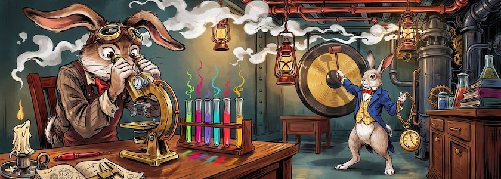

Nach meinem [gestrigen Beitrag über die Decker-Updates](https://kantel.github.io/posts/2026072301_decker_updates/) bekam ich das Thema *Visual Novel* nicht mehr aus meinem Kopf. Insbesondere hatte ich den Eindruck, daß der Platzhirsch [Ren'Py](http://cognitiones.kantel-chaos-team.de/multimedia/spieleprogrammierung/renpy.html), die kostenlose und frei verwendbare (MIT-Lizenz), in Python geschriebene Engine für die Erstellung von *Visual Novels*, aber auch von anderer Software, wie beispielsweise von Textadventures, Geschichten, Präsentationen und animierten Illustrationen, auf diesen Seiten vernachlässigt wurde. Und so ist die heutige Sammlung von Ren'Py-Tutorials nicht unserer allgegenwärtigen und allwissenden Datenkrake zu verdanken, sondern ich habe sie aktiv zusammengesucht.

<iframe class="if16_9" src="https://www.youtube.com/embed/PZRaYqhlPF8?si=bQrVYppQfRf05RC2" title="YouTube video player" frameborder="0" allow="accelerometer; autoplay; clipboard-write; encrypted-media; gyroscope; picture-in-picture; web-share" referrerpolicy="strict-origin-when-cross-origin" allowfullscreen></iframe>

An den Kanal »[Entdecke mit Mia](https://www.youtube.com/@MiaCodeExpedition)« *(Discover with Mia)* kommt wohl niemand vorbei, der sich mit Ren'Py beschäftigt. Der Stil ihrer Tutorials mag gewöhnungsbedürftig sein, aber ist dem Thema *Visual Novel* durchaus angemessen. Das [obige Video](https://www.youtube.com/watch?v=PZRaYqhlPF8) ist das erste aus der (aktuell) 35 Videos umfassenden Playlist »[Ren'Py Visual Novel Tutorials](https://www.youtube.com/playlist?list=PLfsxhEJYoqXsFzCUogDHuSFn2REJOf56z)«.

Die Reihe wird kontinuierlich erweitert, das letzte Update fand vor vier Tagen statt. Und zu fast allen Tutorials gibt es auf der [Itch.io-Seite der Autorin](https://discover-with-mia.itch.io/) weitere Materialien (Quellcode und Templates).

<iframe class="if16_9" src="https://www.youtube.com/embed/L5mucZMkLog?si=-B59HMOc_TAr6K46" title="YouTube video player" frameborder="0" allow="accelerometer; autoplay; clipboard-write; encrypted-media; gyroscope; picture-in-picture; web-share" referrerpolicy="strict-origin-when-cross-origin" allowfullscreen></iframe>

So neu, daß ich selber noch nicht reingeschaut habe, ist das Dev Log »[Goodbye Once Again](https://www.youtube.com/playlist?list=PLX70aXtWqUOiRSJvt2fjEgxRqQptGGTVI)« des YouTubers *Impurerio*. Er beschreibt darin die Entwicklung der titelgebenden *Visual Novel*. Bisher besteht das Dev Log aus sechse Videos, das erste wurde vor vier Monaten hochgeladen, das letzte Update fand vor drei Wochen statt.

Auch hier gibt es eine [Website mit weiteren Informationen](https://impurerio.tumblr.com/). Das Projekt scheint so spannend zu sein, daß es sich wohl lohnt, die weitere Entwicklung zu beobachten.

<iframe class="if16_9" src="https://www.youtube.com/embed/75NtGaBys-o?si=eRfZOyNq8VRM-mrx" title="YouTube video player" frameborder="0" allow="accelerometer; autoplay; clipboard-write; encrypted-media; gyroscope; picture-in-picture; web-share" referrerpolicy="strict-origin-when-cross-origin" allowfullscreen></iframe>

Ein Klassiker ist der Kurs »[Ren'Py for Beginners](https://www.youtube.com/playlist?list=PL9xdFa4m3yaVaZNCFPBvpJZBn24CiCoiP)« von *Kosmo Kat*. Er besteht zur Zeit aus zwanzig meist kurzen (fünf- bis zehnminütigen) Tutorials, die meist in sich abgeschlossen sind (die jüngsten Tutorials aus dem letzten Jahr neigen allerdings eher zu zwanzig Minuten Lauflänge).

Obwohl das erste Video schon vor fünf Jahren hochgeladen wurde, gibt es immer wieder mal neue Updates (die jüngsten sind etwa ein Jahr alt). Es lohnt sich also, diesen Kanal im Auge zu behalten.

<iframe class="if16_9" src="https://www.youtube.com/embed/s13N9Yon3-I?si=GormJS9gttkt6ITX" title="YouTube video player" frameborder="0" allow="accelerometer; autoplay; clipboard-write; encrypted-media; gyroscope; picture-in-picture; web-share" referrerpolicy="strict-origin-when-cross-origin" allowfullscreen></iframe>

Ganz neu und vermutlich ebenfalls noch nicht abgeschlossen ist die Reihe »[Ren'Py-Tutorials](https://www.youtube.com/playlist?list=PLnYlmLYu50ouFTEIDG7Ihb5XdGrebaoNV)« vom *[Team JPDE](https://jpde.itch.io/)*. Sie besteht aus aktuell fünf Tutorials, begann im letzten Jahr und behandelt explizit nur das aktuelle Ren'Py (Version 8.x und höher).

Hier fand das letzte Update vor vier Monaten statt und auch diese Reihe macht den Eindruck, als ob ich sie weiter beobachten sollte. *Still watching!*

---

**Bild**: *[March Hare in then Lab](https://www.flickr.com/photos/schockwellenreiter/55393099978/)*, erstellt mit [Ideogram&nbsp;4.0](https://ideogram.ai/). Prompt: *The March Hare, wearing aviator goggles pushed up onto his forehead, sits in a steampunk-style laboratory in front of a large microscope. Next to him on the lab table are test tubes in racks filled with neon-colored, steaming liquids. A white rabbit with a blue jacket, a yellow checkered waistcoat, and a white stand-up collar with a red bow stands in the background, striking a giant gong hanging on the wall with a mallet. In the other hand, it carries a large pocket watch with a gold chain. In the background, strange, large machines belch out clouds of steam. The scene is illuminated by antique gas lanterns hanging from the ceiling. Colored Franco-Belgian comic style. No textboxes, no speech-bubbles.*