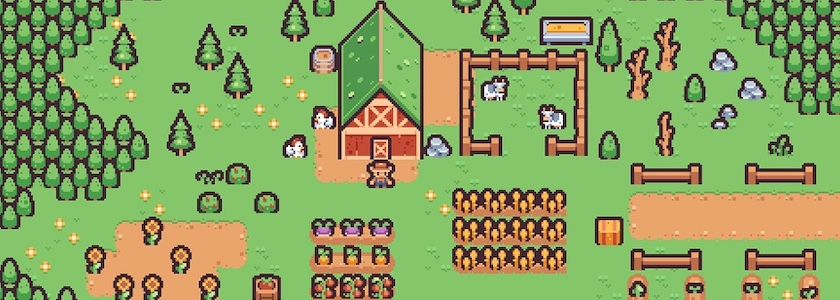
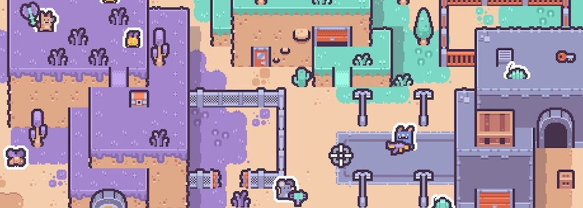
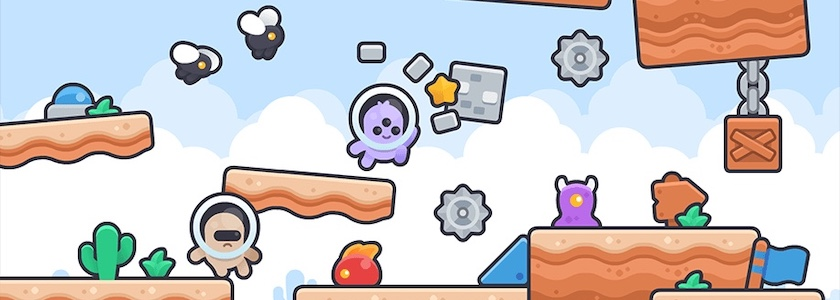

Es gibt Neues aus dem Hause [Kenney.nl](https://kenney.nl/) zu berichten, dem Menschen, der uns schon seit Jahren mit freien ([CC0](https://creativecommons.org/publicdomain/zero/1.0/)), qualitativ hochwertigen Sprites und Tiles für die Spieleprogrammierung versorgt.

So hat zum Beispiel die [Tiny-Reihe](https://kenney.nl/assets/series:Tiny), eine Serie von $16$x$16$ Pixeln großen Sprites ein neues Mitglied bekommen: [Tiny Farm](https://kenney.nl/assets/tiny-farm) ist ein Asset Pack aus mehr als 130 Dateien, mit denen Ihr Euer eigenes Farmsimulationsspiel aufbauen könnt.

Wie immer passen die Bilder auch zu den anderen der Tiny-Reihe. Falls Euch also irgendetwas fehlt, könnt Ihr darauf zurückgreifen.

Aber auch mit anderen Reihen von Kenney passt das Tiny-Farm-Pack gut zusammen: Sollte also Euer Farmspiel einen Angriff aus der Wüste überstehen müssen, könnt Ihr dafür die ebenfalls $16$x$16$ Pixel großen Tiles und Sprites des [Desert Shooter Packs](https://kenney.nl/assets/desert-shooter-pack) verwenden. Es besteht aus über 500 Bildern, damit dürften für die Inszenierung Eures Wüstenkrieges keine Wünsche offen bleiben.

Und sollten Eure Wüstenkrieger eine Stadt erobern wollen oder aus der Luft bekämpft werden, mit dem [RPG Urban Pack](https://kenney.nl/assets/rpg-urban-pack) oder dem [Pixel Shmup](https://kenney.nl/assets/pixel-shmup) stehen Euch Tonnen von weiteren $16$x$16$ Pixel großen Assets zur Verfügung.

**War sonst noch was?** Ach ja, Kenneys [New Platformer Pack](https://kenney.nl/assets/new-platformer-pack) (das mit den netten Aliens) hat ebenfalls ein Update verpasst bekommen. Und falls Ihr nahtlos ineinander übergehende Hintergrundbilder benötigt, schaut Euch die neuen [Skyboxes](https://kenney.nl/assets/skyboxes) von Kenney an.