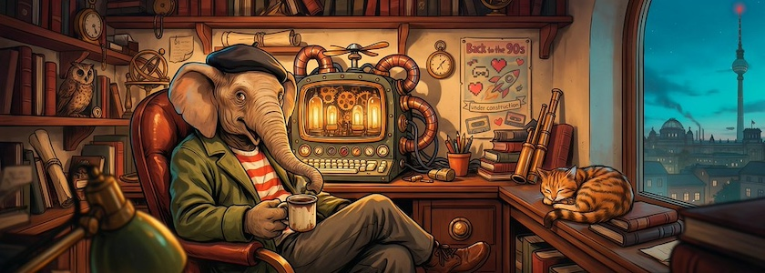

Hier hatte mich ja schon die Erkenntnis überwältigt, daß mir für [meine Idee](https://kantel.github.io/posts/2026050602_indieweb/), wieder [Webseiten ohne Sinn und Verstand](http://blog.schockwellenreiter.de/2022/05/2022052401.html) zu basteln, über die Jahre [sehr viel von den Basics von HTML und CSS abhanden gekommen waren](https://kantel.github.io/posts/2026061101_neocities/), obwohl ich sie mal besessen hatte. Aber da ich nun meine »[Ersten Schritte mit TiddlyWiki](https://kantel.github.io/posts/2026072302_tiddlywiki_first_steps/)« auf meinen Neocities-Account [hochgeladen](https://kantel.neocities.org/atlascuriosa) habe, ist es an der Zeit, diese verschütteten Kenntnisse wieder aufzufrischen:

<iframe class="if16_9" src="https://www.youtube.com/embed/Dq5MYv2BUwg?si=xvBIihvydoBcnbmS" title="YouTube video player" frameborder="0" allow="accelerometer; autoplay; clipboard-write; encrypted-media; gyroscope; picture-in-picture; web-share" referrerpolicy="strict-origin-when-cross-origin" allowfullscreen></iframe>

Wie [hier schon einmal geschrieben](https://kantel.github.io/posts/2026051201_indieweb_cont/), war meine erste Anlaufstelle der »Happy Coder« *[Kevin Workman](https://happycoding.io/)*. dem es nach dem überraschenden Ende von [Glitch 🎏 als Spielplatz](https://kantel.github.io/posts/2025052402_glitch_ende/) mit seinem Kurs »[Intro to WebDev](https://www.youtube.com/playlist?list=PLty5Qt07EFvBrbNMCg04Q2vUleiasg54M)« im Herbst letzten Jahres [ebenfalls](https://kantel.neocities.org/) nach [Neocities](https://de.wikipedia.org/wiki/Neocities) verschlagen hatte. Diesen Umzug hat er in dem obigen, einleitenden Video für diesen Kurs »[Coding HTML with Neocities](https://www.youtube.com/watch?v=Dq5MYv2BUwg)« dokumentiert und gleichzeitig in seinem Beitrag »[Online Code Editors](https://happycoding.io/tutorials/html/online-code-editors)« begründet.

Der gesamte Kurs besteht aus einer [Playlist mit 18 Videos](https://www.youtube.com/playlist?list=PLty5Qt07EFvBrbNMCg04Q2vUleiasg54M) und wurde vor sieben Monaten abgeschlossen. Doch Vorsicht: Wie so oft bei *Kevin Workman* sind die einzelnen Videos in umgekehrt-chronologischer Reihenfolge abgespeichert, so daß das jüngste Video ganz oben steht. Aber der Kurs ist sehr lehrreich und wird von [einer Website begleitet](https://happycoding.io/tutorials/html/).

<iframe class="if16_9" src="https://www.youtube.com/embed/vlDAQXqOqKo?si=AfK_ByS48ASkyXvY" title="YouTube video player" frameborder="0" allow="accelerometer; autoplay; clipboard-write; encrypted-media; gyroscope; picture-in-picture; web-share" referrerpolicy="strict-origin-when-cross-origin" allowfullscreen></iframe>

Wer es etwas kompakter mag, dem wie das 45-minütige Video »[Simple Website Layout From Scratch Using HTML/CSS :D](https://www.youtube.com/watch?v=vlDAQXqOqKo)« der YouTuberin (?) *Flickarity* empfohlen. Sie weiß, wovon sie schreibt, denn sie hat das alles bei ihrer eigenen Neocities-Site [scftst4rs.neocities.org](https://scftst4rs.neocities.org/) umgesetzt. Das Video ist Teil einer kleinen Playlist »[Website Making!!](https://www.youtube.com/playlist?list=PLCko29_rRuyrcrPbuZTTv1ZnyTQwfbMDw)«, die außer dem obigen Video nur noch das Video »[Basic HTML/CSS Tutorial (Website Building for Beginners!)](https://www.youtube.com/watch?v=hR4-oe9MIMY)« enthält (ebenfalls etwa 45 Minuten Lauflänge, auf drei Minuten vorspulen&nbsp;🤓).

Ich weiß jedenfalls, womit ich mich in den nächsten Tagen beschäftigen werde. *Still digging!*

---

**Bild**: *[Auf ins IndieWeb](https://www.flickr.com/photos/schockwellenreiter/55328104977/)*. erstellt mit [Ideogram 4.0](https://ideogram.ai/). Prompt: »*A friendly, anthropomorphic elephant wearing a green coat, a red-and-white striped T-shirt, and a black beret sits at a massive desk in front of a steampunk-style computer, using an old-fashioned keyboard. Shelves line the wall, crammed with books and steampunk knick-knacks. Through a window, one can see an alternative steampunk Berlin. A poster on one wall, between the shelves, reads “Back to the 90s,” adorned with a few Neocities-style stickers. Colored classic Amiercan comic style. Language: German. No textboxes, no speech bubbles, no headlines.*«