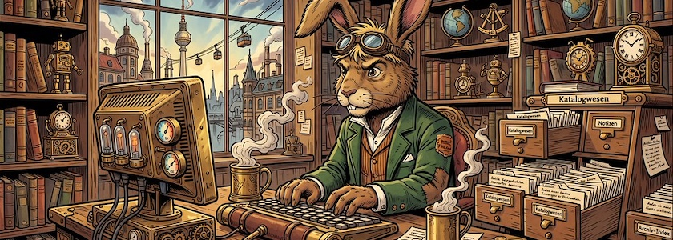
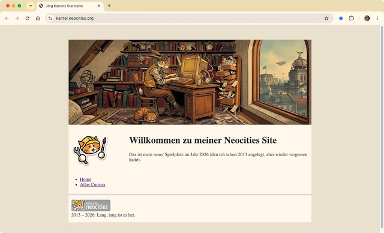

Ich habe meine [gestrige Ankündigung](https://kantel.github.io/posts/2026072801_indieweb_happy_coding/) wahrgemacht und auf [Neocities](https://kantel.neocities.org/) meine erste Website zusammengeschraubt. Dabei habe ich auf jedes Framework und jedes Template verzichtet und einfach mit einer völlig leeren Seite angefangen. Geholfen haben mir dabei die gestern vorgestellten Videos (besonders »[Simple Website Layout From Scratch Using HTML/CSS :D](https://www.youtube.com/watch?v=vlDAQXqOqKo)« der YouTuberin (?) *Flickarity*) und die Webseiten der W3-Schools zu [HTML](https://www.w3schools.com/html/default.asp) und [CSS](https://www.w3schools.com/css/default.asp).

Als erstes habe ich mir eine einfache HTML-Seite zusammengeklöppelt:

~~~html
<!DOCTYPE html>
<html>
  <head>
    <meta content="text/html; charset=UTF-8" http-equiv="Content-Type" />
    <title>
      Jörg Kantels Startseite
    </title>
    <link href="style.css" media="all" rel="stylesheet" type="text/css" />
  </head>
  <body>
    

      <header>
        
      </header>
      
      <nav>
         
        
        <ul>
          <li><a href="/">Home</a></li>
          <li><a href="atlascuriosa/">Atlas Curiosa</a></li>
        </ul>
      </nav>
    
      <section>
        <h1>
          Willkommen auf meiner Neocities Site
        </h1>
        

          Das ist mein neuer Spielplatz im Jahr 2026 (den ich schon 2013 angelegt,
          aber wieder vergessen hatte).
        

      </section>
      
      <footer>
        

           
          2013 – 2026: Lang, lang ist es her.
        

      </footer>
    
 <!-- container -->
  </body>
</html>
~~~

Sie besitzt ein `
`, in dem die [HTML-Layout-Elemente](https://www.w3schools.com/html/html_layout.asp) `<header>`, `<nav>`, `<section>` und `<footer>` eingebettet sind. Der `<header>` beinhaltet das Bannerbild, das Navigationselement `<nav>` ein Icon und eine ungeordnete Liste `<ul>` mit zwei Listeelementen `<li>` mit Links, die Main-Section `<section>` eine Überschrift `<h1>` und einen Paragraphen `
` mit ein wenig Text. Und schließlich ist da noch der `<footer>`, der ein kleines Badge-Bildchen und ebenfalls ein wenig Text besitzt.

Wie Ihr sehen könnt, habe ich im `<head>` der Seite schon einen Link zu einem Stylesheet eingebaut. Das ist auch bitter nötig, denn ohne dieses Stylesheet sieht die Seite recht armselig aus.

Was steht nun in diesem Stylesheet `style.css` alles drin?

~~~css
body {
  background: #ede4d4;
  color: #354145;
}

header, nav, section {
  border: none;
}

header {
  grid-row: 1 / 2;
  grid-column: 1 / 3;
}

nav {
  grid-row: 2 / 3;
  grid-column: 1 / 2;
  height: max-content;
}

section {
  grid-row: 2 / 3;
  grid-column: 2 / 3;
  height: max-content;
}

footer {
  grid-row: 3 / 4;
  grid-column: 1 / 3;
  border-top: black 1px solid;
  padding-left: 10px;
}

.container {
  max-width: 840px;
  margin: 50px auto;
  display: grid;
  grid-gap: 10px;
  grid-template-columns: 200px auto;
  background: #fef8ec;
}
~~~

Für die ganze Seite habe ich im `body` erst einmal eine Hintergrund- und die Textfarbe `color` festgelegt. Dann habe ich für die Klasse `.container` eine maximale Weite von 840 Pixeln und einen Rand (`margin`) oben und unten (50 Pixel) festgelegt und mit `auto` bestimmt, daß der Container rechts und links Ränder bekommt, mit denen er auf der Seite zentriert dargestellt wird.

Dann habe ich mich mit `display: grid;` entschieden, das [CSS Grid Layout](https://www.w3schools.com/css/css_grid.asp)  mit zwei Spalten zu verwenden. Dabei hat die erste Spalte eine Breite von 200 Pixeln, während die zweite Spalte ihre Breite automatisch anpasst. Und zwischen den einzelnen Grid-Elementen gibt es einen Leerraum (`grid-gap`) von zehn Pixeln. *Last but not least* bekam der Container eine eigene, etwas hellere Hintergrundfarbe verpasst.

Die drei Layout-Elemente `header`, `nav` und `section` werden ohne Umrandung (`border: none;`) gezeichnet.

Beim Grid-Layout werden immer die Ecken der einzelnen Elemente als Begrenzungspunkte angegeben. So reicht der Header von der Reihe $1$ bis zur Reihe $2$ (`grid-row: 1 / 2;`) und bei den Spalten von der ersten Ecke bis zur letzten, dritten Ecke (`grid-column: 1 / 3;`).

Die Navbar und der eigentliche Inhalt (`section`) nehmen beide die zweite Reihe in Anspruch, ihr Raum reicht also in beiden Fällen von der zweiten bis zur dritten Ecke (`grid-row: 2 /3`). Die Navbar belegt allerdings die erste Spalte (`grid-column: 1 / 2;`), während die `section` den Raum von der zweiten bis zur letzten (dritten) Ecke einnimmt: `grid-column: 2 / 3;`.

Eine Besonderheit dieser beiden Navigationselemente ist, daß sie nur den Raum belegen sollen, den sie wirklich benötigen. Dies wird mit `height: max-content;` erreicht.

Schließlich ist da noch der `footer`: Er belegt die letzte Reihe von den Ecken drei bis vier (`grid-row: 3 / 4;`) und die gleiche Spaltenbreite wie der Header (`grid-column: 1 / 3;`). Er wird von dem übrigen Layout oben mit einer dünnen, schwarzen Linie abgetrennt (`border-top: black 1px solid;`) und bekommt links ein Padding von zehn Pixeln verpasst, damit die Elemente nicht direkt am Rand kleben (`padding-left: 10px;`).

Das war eigentlich alles. Und so, wie im Screenshot, sieht die Seite aktuell auf Neocities aus. Natürlich ist da noch viel Luft nach oben, die weiteren Fortschritte könnt Ihr direkt auf meiner [Neocities-Site](https://kantel.neocities.org/) verfolgen. Und auch hier wird es sicher weitere Arbeitsberichte von meinen Ausflügen ins IndieWeb und meinen Versuchen, [Webseiten ohne Sinn und Verstand](http://blog.schockwellenreiter.de/2022/05/2022052401.html) zu basteln, geben. *Still digging!*

---

**Bild**: *[Die Zettelkästen des Märzhasen](https://www.flickr.com/photos/schockwellenreiter/55428722535/)*. erstellt mit [OpenArt](https://openart.ai/home). Prompt: »*The @March Hare sits at a desk in front of an antiquated, steampunk-style computer, typing on a keyboard. He wears a pair of aviator goggles, which he has pushed up onto his forehead. On the desk stands an open card catalog, its contents a chaotic jumble of handwritten index cards and loose scraps of paper. Beside the keyboard sits a mug of steaming coffee. Shelves crammed with books and steampunk knick-knacks line the walls. Through a window, one looks out upon a steampunk version of Berlin. Colored classic American comic style. Language: German. No speech bubbles, no textboxes. No German flags.*« Modell: Nano Banana&nbsp;2