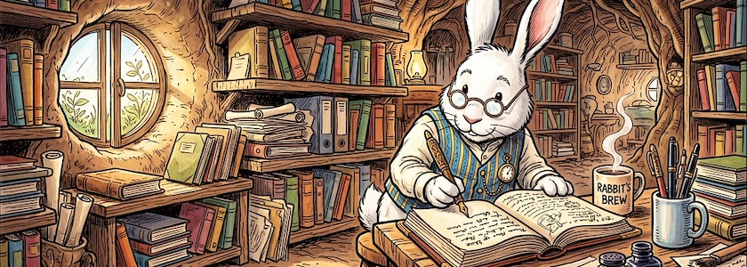

Soeben erreichte mich die Meldung, daß der freie (GPL 3.0) Markdown-Editor und Zettelkasten [Zettlr](http://cognitiones.kantel-chaos-team.de/webworking/auszeichnungssprachen/zettlr.html) in der [Version 4.7.0 erschienen](https://stadt-bremerhaven.de/zettlr-4-7-0-markdown-editor-bringt-frei-anpassbare-tastatur-kuerzungsbefehle-mehr/) ist. Zettlr ist für die effiziente Organisation großer Textmengen entwickelt worden. Das plattformübergreifende Werkzeug (Windows, macOS und Linux) richtet sich daher primär an Wissenschaftler, Journalisten und Autoren. Neben zahlreichen Detailverbesserungen und Fehlerbehebungen stechen primär zwei von der Community seit Langem geforderte Funktionen hervor.

Einmal führen die Entwickler frei anpassbare Tastatur-Kürzungsbefehle ein. Für mich als chronischen Mausschubser ein eher vernachlässigbares Feature. Zum anderen kann man aber nun das Theme des Text-Editors unabhängig vom Haupt-Theme der Anwendung einstellen. Das ist für Leute wie mich, die ihre Texte gerne im *Dark Mode* schreiben, die Vorschau aber lieber schwarz auf weiß sehen wollen, eine sinnvolle Erweiterung.

Die neue Version steht kostenlos über die [Website der Entwickler](https://zettlr.com/) sowie [bei GitHub](https://github.com/Zettlr/Zettlr/releases/tag/v4.7.0) zum Download bereit.

---

**Bild**: *[Rabbit's Brew](https://www.flickr.com/photos/schockwellenreiter/55209617689/)*. erstellt mit [Scenario](http://cognitiones.kantel-chaos-team.de/technikgeschichte/rechnerundnetze/scenario.html). Prompt: »*A white rabbit wearing a blue and yellow vest and glasses sits at a desk in a rabbit burrow. It wears a large pocket watch on a chain. On the desk in front of the rabbit lies an enormous notebook, in which the rabbit is writing with an old-fashioned fountain pen. Next to it is a mug of steaming coffee. Writing utensils are in another mug. Many old books and files line the shelves all around the burrow. Sunlight shines through a window in the burrow wall. Colored classic American comic style. No speech bubbles, no textboxes, no headlines.*« Modell: Nano Banana&nbsp;2