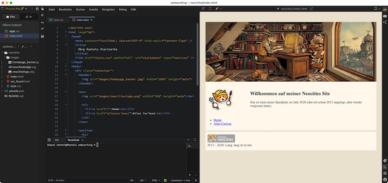

Es muß nicht immer [Visual Studio Code](https://marketplace.visualstudio.com/items?itemName=ExecutableBookProject.myst-highlight) sein. Um mein Projekt, [Webseiten ohne Sinn und Verstand](http://blog.schockwellenreiter.de/2022/05/2022052401.html) zu basteln, und dabei gleichzeitig meine Flucht weg von den Big-Tech-Konzernen und raus aus den asozialen Medien hinein ins IndieWeb zu unterstützen, habe ich nach einen Editor für HTML und CSS gesucht und bin dabei auf den [Phoenix Code Editor](https://phcode.io/) gestoßen.

Der Phoenix Code Editor, auch PH Code genannt, hiess ursprünglich *Brackets* und war eine Open-Source-Entwicklung von Adobe. Im Jahr 2021 wurde er freigegeben und wird seitdem als freies Community-Projekt (GPL) unter dem Namen Phoenix Code Editor weitergeführt -- teils von ehemaligen Brackets-Entwicklern.

Obwohl man auch zahlreiche andere Dateitypen und Sprachen (C, C#, C++ …) bearbeiten kann, liegt der Fokus ganz klar auf HTML, CSS und JavaScript. Er besitzt eine interne Live-Vorschau für HTML- und Markdown[^1]-Dateien, die auch eine Ansicht für verschiedene Ausgabegeräte (Smartphone, Tablet, Desktop) bereithält. Die Vorschau ist sehr mächtig und ersetzt in vielen Fällen die Entwicklertools der Browser.

[^1]: Bei der Markdown-Ansicht ist zur Aktualisierung allerdings vorher ein Speichern nötig.

Den Editor gibt es nicht nur als Desktop-Applikation für Windows, macOS und Linux, sondern auch als Webeditor für den Browser. Damit muss ich mein Chromebook nicht mit einer weiteren Applikation zumüllen.

Mit diesen Features ist Phoenix Code nicht nur der Editor für die Flucht aus den Datensilos ins IndieWeb, sondern er eignet sich auch als lokale Entwicklungsumgebung für [P5.js](http://cognitiones.kantel-chaos-team.de/programmierung/creativecoding/processing/p5js.html)-Projekte, vor allem, wenn auf das DOM der umgebenden HTML-Seite zugegriffen werden soll.

### Links

- [Phoenix Code Home](https://phcode.io/)
- [Phoenix Code Webeditor](https://phcode.dev/)
- [Phoenix Code Docs](https://docs.phcode.dev/)
- [Phoenix Code Blog](https://docs.phcode.dev/blog)

### Literatur

- Kurt Andro: *[Phoenix Code Editor](https://gnulinux.ch/phoenix-code-editor)*, GNU/Linux.ch vom 6. Januar 2026
- Ulrike Häßler: *[Open Source – Code-Editor Phoenix](https://www.mediaevent.de/phoenix-open-source-code-editor/)*, mediaevent.de, März 2025 

Sollte ich in den nächsten Tagen abgetaucht sein, dann spiele ich mit dem Phoenix Code Editor und bastel entweder an Webseiten ohne Sinn und Verstand oder mit  P5.js, dem JavaScript-Ableger von [Processing (Java)](http://cognitiones.kantel-chaos-team.de/programmierung/creativecoding/processing/processing.html). Denn die Beschäftigung damit liegt auf meiner Agenda auch schon lange brach. *Still digging!*

---

**Bild**: *[Die Zettelkästen des Märzhasen](https://www.flickr.com/photos/schockwellenreiter/55428447023/)*. erstellt mit [OpenArt](https://openart.ai/home). Prompt: »*The @March Hare sits at a desk in front of an antiquated, steampunk-style computer, typing on a keyboard. He wears a pair of aviator goggles, which he has pushed up onto his forehead. On the desk stands an open card catalog, its contents a chaotic jumble of handwritten index cards and loose scraps of paper. Beside the keyboard sits a mug of steaming coffee. Shelves crammed with books and steampunk knick-knacks line the walls. Through a window, one looks out upon a steampunk version of Berlin. Colored classic American comic style. Language: German. No speech bubbles, no textboxes. No German flags.*« Modell: Nano Banana&nbsp;2