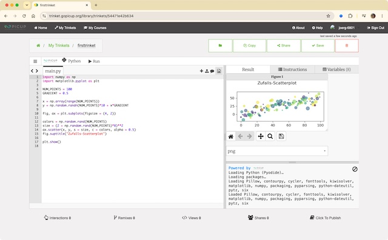

Im Februar dieses Jahres musste ich die [betrübliche Nachricht verkünden](https://kantel.github.io/posts/2026020501_trinket_ende/), daß die Online-Python-IDE [Trinket](http://cognitiones.kantel-chaos-team.de/programmierung/python/trinket.html) zum 31. August dieses Jahres [den Dienst einstellt](https://trinket.io/announcement), die [Trinket-Website](https://trinket.io/) wird definitiv geschlossen. Die Nachricht erreichte mich über ein [Video](https://www.youtube.com/watch?v=RzORjBydCdU) des Physik- und Python-Enthusiasten *[Rhett Allain](https://rjallain.medium.com/)*, nun gibt ein [weiteres Video](https://www.youtube.com/watch?v=e07TjUeeAdk) von *Rhett Allain* Entwarnung: Es gibt ein **[neues Trinket](https://trinket.gopicup.org/)**, und das sei sogar besser als das bald eingestellte.

<iframe class="if16_9" src="https://www.youtube.com/embed/e07TjUeeAdk?si=bVMNUiTfGDsvikyb" title="YouTube video player" frameborder="0" allow="accelerometer; autoplay; clipboard-write; encrypted-media; gyroscope; picture-in-picture; web-share" referrerpolicy="strict-origin-when-cross-origin" allowfullscreen></iframe>

Die Nachricht elektrisierte mich und so habe ich mir gleich auf **[trinket.gopicup.org](https://trinket.gopicup.org/)** einen Account zugelegt. [Gopicup.org](https://www.compadre.org/picup/) ist die offizielle Website von [PICUP](https://www.compadre.org/PICUP/webdocs/About.cfm) *(Partnership for Integration of Computation into Undergraduate Physics)*, eine Community, die Übungssets und andere Aktivitäten für Dozenten und Workshops anbietet, um Lehrkräften dabei zu helfen, Programmier- und Mathematikwerkzeuge in den Physikunterricht an Hochschulen zu integrieren. Soweit wie ich das aus den [GitHub-Seiten des Projekts](https://github.com/trinketapp/trinket-oss) entnehmen kann, haben sie das »alte« Trinket in JavaScript und [Pyodide](http://cognitiones.kantel-chaos-team.de/programmierung/python/pyodide.html) nachgebaut und unter eine OpenSource-Lizenz ([CC0 1.0 Universal](https://github.com/trinketapp/trinket-oss?tab=CC0-1.0-1-ov-file)) gestellt.

Bisher konnte ich bei meinen ersten Tests mit Python einige Unterschiede zum alten, »klassischen« Trinket feststellen: Da das neue Trinket auf Pyodide aufbaut, beherrscht es Python3 mit allen Bibliotheken, die Pyodide mittlerweile unterstützt, zum Beispiel [Pillow](http://cognitiones.kantel-chaos-team.de/programmierung/python/pillow.html), [Matplotlib](http://cognitiones.kantel-chaos-team.de/programmierung/python/matplotlib.html) und [Numpy](http://cognitiones.kantel-chaos-team.de/programmierung/python/numpy.html). Eine Besonderheit ist die Unterstützung von [VPython](http://cognitiones.kantel-chaos-team.de/programmierung/python/vpython.html)/[GlowScript](http://cognitiones.kantel-chaos-team.de/programmierung/python/glowwscript.html) sowohl in Python3 wie auch in einer eigenen Umgebung. Leider wird [Pythons Turtle](http://cognitiones.kantel-chaos-team.de/programmierung/python/turtlepython.html) systembedingt (noch?) nicht unterstützt (obwohl das doch einer der Stärken des »klassischen« Trinket war).

Das Projekt ist noch jung, gerade einmal vier Monate alt, da ist noch einiges zu erwarten. Glaubt man den Machern auf ihrer GitHub-Seite, ist für die Zukunft die Unterstützung weiterer Sprachen (zum Beispiel HTML, Java und R) geplant.

Ich muss gestehen, ich mag das Teil (alleine, weil ich das alte Trinket auch schon gemocht und gerne damit gearbeitet hatte). Jetzt bleibt nur noch das Problem der Digitalen Souveränität, denn vermutlich stehen die Server von `trinket.gopicup.org` irgendwo in den Vereinigten Staaten. Aber das Teil ist *Open Source* und auf den GitHub-Seiten gibt es Anleitungen, wie man sich (mit oder ohne Docker) einen eigenen Trinket-Server hochziehen kann. Also, welche europäische (mögichst Non-Profit-) Organisation fühlt sich angesprochen? Freiwillige vor, schafft zwei, drei, viele Trinkets!

---

**Bild**: *[The New Trinket Rulez](https://www.flickr.com/photos/schockwellenreiter/55433192748/)*, erstellt mit [OpenArt](https://openart.ai/home). Prompt: »*Illustration @Pedro Python with glasses and a pointer in front of a chart with physic diagrams in a crowded office with anthropomorphic animals. Large shelves with many books on the walls. A poster hangs on the wall behind with the inscription "The new Trinket rulez!" It’s a sunny morning. Colored classic American comic style. No speech bubbles, no textboxes.*« Modell: Nano Banana&nbsp;2.