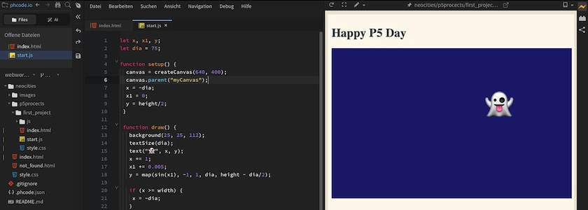

Heute wollte ich gleich zwei Fliegen mit einer Klappe schlagen: Ich wollte einmal wissen, wie gut der von mir [neu entdeckte Editor Phoenix Code](https://kantel.github.io/posts/2026073001_phoenix_code/) mit [P5.js](http://cognitiones.kantel-chaos-team.de/programmierung/creativecoding/processing/p5js.html), dem JavaScript-Ableger von [Processing (Java)](http://cognitiones.kantel-chaos-team.de/programmierung/creativecoding/processing/processing.html), zusammenarbeitet. Und zum anderen wollte ich wissen, ob und wie sich P5.js mit [Neocities](https://neocities.org/), dem freundlichen Hoster für meine Flucht ins [IndieWeb](https://en.wikipedia.org/wiki/IndieWeb) verträgt. Spoiler: Ich war beide Male erfolgreich.

Was habe ich also getan? Ich habe erst einmal (Ordnung muss sein) an der Directory-Struktur meiner Neocities-Site geschraubt und einen Dateibaum für meine P5.js-Experimente angelegt:

~~~zsh
p5projects/
|--> first_project/
     |--> index.html
     |--> start.js 
     |--> style.css
     |--> js/
          |--> p5.min.js 
~~~

Die Datei `p5.min.js` habe ich von der [Downloadseite von P5js.org](https://p5js.org/download/) heruntergeladen. Das ich sie projektspezifisch ablege, war eine Design-Entscheidung. Ich wollte für jedes Projekt die jeweils aktuelle Version zur Verfügung stellen. Wem das zu viel Speicherplatzverschwendung ist, der kann den Ordner `js/` auch direkt unterhalb von `p5projects/` ablegen und dann in all seinen `index.html` darauf verlinken. Aber da die `p5.min.js` nur knapp ein Megabyte fett ist, glaube ich, diese Entscheidung vertreten zu können.

Die `index.html` sieht wie folgt aus:

~~~html
<!DOCTYPE html>
<html lang="de">

<head>
  <meta charset="utf-8">
  <meta name="viewport" content="width=device-width, initial-scale=1.0">
  <title>Happy P5 Day</title>
  <link href="style.css" media="all" rel="stylesheet" type="text/css" />
  
  
  
</head>

<body>
  <main>
    <h1>Happy P5 Day</h1>
    

     
    
Zurück zu meiner <a href="../../">Neocities Startseite</a>.

  </main>
</body>

</html>
~~~

Die Zeile `

` nimmt später den P5.js-Sketch auf, der in diesem Beispiel `sketch.js` heißt. Doch bevor ich zum eigentlichen Sketch komme, möchte ich erst noch die Datei `style.css` vorstellen, die im wesentlichen nur ein wenig Kosmetik betreibt (sie sorgt vor allem dafür, daß die Seite der [Startseite](https://kantel.neocities.org/) meines Neocities-Auftritts ähnelt):

~~~css
body {
  background: #ede4d4;
  color: #354145;
}

main {
  padding: 10px;
  border: none;
  max-width: 840px;
  margin: 10px auto;
  background: #fef8ec;
}
~~~

Jetzt aber endlich der P5.js-Sketch `start.js`. Es ist ein einfaches Beispiel, indem ein Emoji einer Sinus-Funktion folgend, von links nach rechts über den Bildschirm gleitet. Wenn das Gespenst den rechten Bildschirmrand verlassen hat, taucht es am linken wieder auf:

~~~javascript
let x, x1, y;
let dia = 75;

function setup() {
  canvas = createCanvas(640, 400);
  canvas.parent("myCanvas");
  x = -dia;
  x1 = 0;
  y = height/2;
 }
 
 function draw() {
   background(25, 25, 112);
   textSize(dia);
   text("👻", x, y);
   x += 1;
   x1 += 0.005;
   y = map(sin(x1), -1, 1, dia, height - dia/2);
  
   if (x >= width) {
    x = -dia;
   }
 }
~~~

Der einzige Unterschied zu einem im P5.js-Webeditor gescripteten Sketch ist der, daß ein in einer Webseite eingebundener Canvas einer Variable zugewiesen wird, in diesem Fall:

~~~javascript
canvas = createCanvas(640, 400);
canvas.parent("myCanvas");
~~~

Und in der zweiten Zeile wird der Canvas einem `div` mit der ID `myCanvas` zugeordnet, das ich im obigen HTML-Code angelegt habe.

Hier ist der Sketch in seiner kompletten Einfachheit (um ihn hier einbetten zu können, habe ich dann doch den [Umweg über den P5.js-Webeditor](https://editor.p5js.org/kantel/sketches/vHdyzuPQZ) genommen):

<iframe width="670" height="430" src="ghostwalking/"></iframe>

Und hier könnt Ihr ihn auf meinem [Neocities-Spielplatz](https://kantel.neocities.org/p5projects/first_project/) bewundern, wo das Gespenst völlig autonom seine Runden dreht. Wenn das nicht das Versprechen »[Webseiten ohne Sinn und Verstand](http://blog.schockwellenreiter.de/2022/05/2022052401.html)« einlöst, was dann?

     