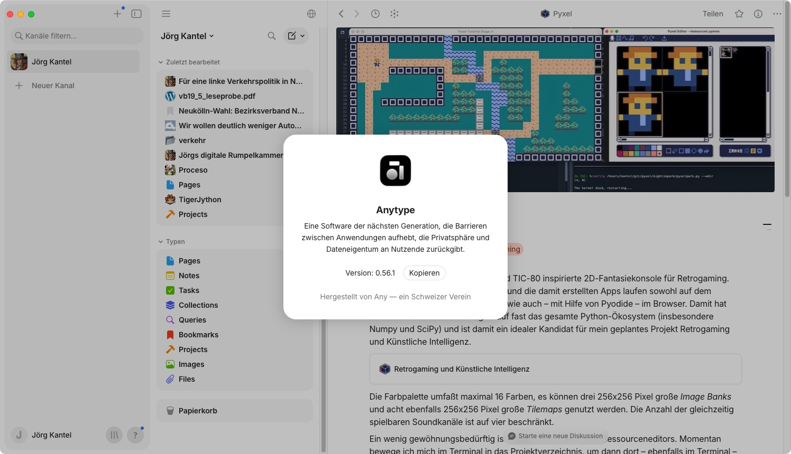

Auch wenn ich in den letzten Wochen mit etlichen digitalen Zettelkästen experimentiert hatte, bleibt vorerst [Anytype](https://anytype.io/) als meine digitale Rumpelkammer, die zusammen mit [Joplin](http://cognitiones.kantel-chaos-team.de/webworking/staticsites/joplin.html) die [Basis für mein »zweites Gehirn«](https://kantel.github.io/posts/2025112701_anytype_051/) bildet, mein Favorit. Dabei spielt einmal eine Rolle, daß man mit Anytype seine »Zettel« einfach aufhübschen kann (denn auch das Auge sammelt und katalogisiert mit), und zum anderen, daß Anytype einen [Export (einzelner) Seiten für das Web](https://kantel.github.io/posts/2025021401_anytype_web/) ermöglicht, die Software also ein Zwischending zwischen einem [digitalen Garten](https://kantel.github.io/posts/2024050701_digital_garden/) und einer digitalen Rumpelkammer darstellt.

Der Hauptgrund aber ist, daß Anytype, weil deren Server in der Schweiz stehen, sowohl DSGVO-konform und – durch den *local first*-Ansatz – auch ein Werkzeug für meine digitale Souveränität sein kann.

Von Anytype Desktop wurde nun kürzlich die [Version 0.56.1](https://community.anytype.io/t/anytype-desktop-0-56-0-its-fast/31082) freigegeben. Dieses Update konzentriert sich auf Geschwindigkeit und Benutzerfreundlichkeit. Die gesamte App startet schneller und Objekte öffnen sich sofort genau dort, wo Ihr aufgehört habt. Auch im »[Herzen von Anytype](https://community.anytype.io/t/anytype-heart-0-50-17/31083) wurden Verbesserungen implementiert. Und wie immer wurden auch  wieder etliche Fehler beseitigt.

<iframe class="if16_9" src="https://www.youtube.com/embed/iFo2T3VMLEk?si=44JhFawlsnbaxmfI" title="YouTube video player" frameborder="0" allow="accelerometer; autoplay; clipboard-write; encrypted-media; gyroscope; picture-in-picture; web-share" referrerpolicy="strict-origin-when-cross-origin" allowfullscreen></iframe>

Wie bei jedem Update erklärt Euch die personifizierte, fokussierte Neugier in [obigem Video](https://www.youtube.com/watch?v=iFo2T3VMLEk) alle wichtigen Neuerungen.

Das bedeutet übrigens nicht, daß meine Experimente mit anderen, möglichen Zettelkästen nutzlos wären. Als Ergänzungssoftware (nicht als Ersatz für Anytype) steht momentan [TiddlyWiki](https://kantel.github.io/#category=TiddlyWiki) ganz oben auf meiner Favoritenliste. Zwar sind dort die Möglichkeiten des Aufhübschens begrenzt und auch für die Synchronisation benutze ich einen Umweg über Joplin, aber ein »Digitaler Garten«, der als **eine** statische HTML-Seite bei jedem Hoster meiner Wahl läuft (also zum Beispiel auch auf [Neocities](https://kantel.neocities.org/atlascuriosa/)), aber im Original auf **meiner** Festplatte liegt, scheint sich damit recht einfach realisieren zu lassen. Und das macht TiddlyWiki interessant für mich. *Still digging!*

---

**Bild**: *[Die Zettelkästen des Märzhasen](https://www.flickr.com/photos/schockwellenreiter/55428491444/)*, erstellt mit [OpenArt](https://openart.ai/home). Prompt: »*The @March Hare sits at a desk in front of an antiquated, steampunk-style computer, typing on a keyboard. He wears a pair of aviator goggles, which he has pushed up onto his forehead. On the desk stands an open card catalog, its contents a chaotic jumble of handwritten index cards and loose scraps of paper. Beside the keyboard sits a mug of steaming coffee. Shelves crammed with books and steampunk knick-knacks line the walls. Through a window, one looks out upon a steampunk version of Berlin. Colored classic American comic style. Language: German. No speech bubbles, no textboxes. No German flags.*« Modell: Nano Banana&nbsp;2.