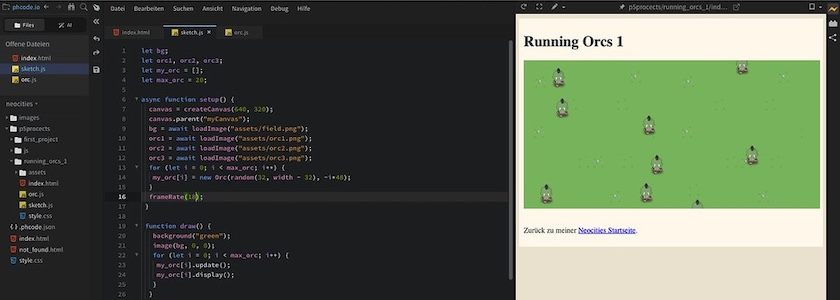

Heute wollte ich nicht nur Spaß mit [P5.js](http://cognitiones.kantel-chaos-team.de/programmierung/creativecoding/processing/p5js.html), dem JavaScript-Ableger von [Processing (Java)](http://cognitiones.kantel-chaos-team.de/programmierung/creativecoding/processing/processing.html), haben, sondern auch mit dem kürzlich von mir [neu entdeckten Editor Phoenix Code](https://kantel.github.io/posts/2026073001_phoenix_code/) und mit [Neocities](https://neocities.org/), dem freundlichen Hoster für meine Flucht ins [IndieWeb](https://neocities.org/). Also habe ich erst einmal eine Horde Orks über den Bildschirm wuseln lassen:

Dafür habe ich eine Klasse `Orc` angelegt und ihr eine eigene Datei `orc.js` spendiert (Ordnung muss ein):

~~~js
class Orc {
    constructor(_x, _y) {
        this.x = _x;
        this.y = _y;
        this.dy = random(1, 3);
        this.w = 32;   // width
        this.h = 48;   // height
        this.img = orc2;
    }
    
    update() {
        this.y += this.dy;
        if (this.y >= height + this.h) {
            this.y = random(-max_orc*this.h, -this.h);
            this.x = random(this.w, width - this.w);
            this.dy = random(1, 3);
        }
        
        if (frameCount % 4 == 1) {
            this.img = orc1;
        } else if (frameCount % 4 == 3) {
            this.img = orc3;
        } else {
            this.img = orc2;
        } 
    }
    
    display() {
        image(this.img, this.x, this.y);
    }    
}
~~~

Sie macht eigentlich nichts anderes, als daß sie die Orks von ihrer Startposition mit der Geschwindigkeit `dy` nach unten bewegt. Wenn sie den unteren Bildschirmrand erreicht haben, werden sie an eine zufällige Position oberhalb des Bildschirms befördert und auch die Geschwindigkeit wird per Zufallszahlengenerator neu gesetzt:

~~~js
        if (this.y >= height + this.h) {
            this.y = random(-max_orc*this.h, -this.h);
            this.x = random(this.w, width - this.w);
            this.dy = random(1, 3);
~~~

Für jeden Ork existieren drei Bildchen: `orc1.png`, `orc2.png` und `orc3.png` (linkes Bein unten, beide Beine unten, rechts Bein unten): 

&nbsp;&nbsp;

Sie werden in Abhängigkeit von der `frameRate()` abwechelnd aufgerufen, wobei das Bild `orc2.png` mit den beiden Beinen unten, immer zwischen den anderen beiden Bildern (also doppelt so häufig) aufgerufen wird:

~~~js
       if (frameCount % 4 == 1) {
            this.img = orc1;
        } else if (frameCount % 4 == 3) {
            this.img = orc3;
        } else {
            this.img = orc2;
        } 
~~~

Dadurch entsteht der Eindruck einer wuseligen Bewegung. Für die Bestimmung der Geschwindigkeit habe ich es mir einfach gemacht, sie wird durch die `frameRate()` geregelt (wie man im Hauptsketch unten sehen kann). Das Beispiel oben in der Seite läuft mit `frameRate(18)` als Reminiszenz an die frühen Kinojahre (das ist noch ein relativ gemächliches Wuseln), mit einer `frameRate(30)` wuseln die Orks nicht mehr, sondern sie rennen und mit einer `frameRate(60)` fliegen die Beine förmlich.

Hier ist also das Hauptprogramm `sketch.js` (es ist durch die Auslagerung der Klasse `Orc` recht kurz geraten):

~~~js
let bg;
let orc1, orc2, orc3;
let my_orc = [];
let max_orc = 20;

async function setup() {
  canvas = createCanvas(640, 320);
  canvas.parent("myCanvas");
  bg = await loadImage("assets/field.png");
  orc1 = await loadImage("assets/orc1.png");
  orc2 = await loadImage("assets/orc2.png");
  orc3 = await loadImage("assets/orc3.png");
  for (let i = 0; i < max_orc; i++) {
   my_orc[i] = new Orc(random(32, width - 32), -i*48);
  }
  frameRate(18);
 }
 
 function draw() {
   background("green");
   image(bg, 0, 0);
   for (let i = 0; i < max_orc; i++) {
    my_orc[i].update();
    my_orc[i].display();
   }
  }
~~~

Es ist mein erster Versuch mit der neuen `async …… await`-Funktion von P5.js 2.x, die eine separate `preload()`-Funktion überflüssig macht. Und damit der Sketch sowohl auf diesen Seiten (dazu unten mehr) wie auch auf Neocities in eine HTML-Datei direkt eingebunden werden kann, wurde der Canvas an eine Variable gebunden und dieser Variablen ein `parent` im DOM zugewiesen:

~~~js
  canvas = createCanvas(640, 320);
  canvas.parent("myCanvas");
~~~

Ansonsten werden im `setup()` die einzelnen Bilder geladen und in einer Schleife in einem Array die gewünschten Instanzen der Klasse Orc erzeugt (auch sie bekommen eine zufällige Position oberhalb des Canvas zugewiesen):

~~~js
 for (let i = 0; i < max_orc; i++) {
   my_orc[i] = new Orc(random(32, width - 32), -i*48);
  }
~~~

In `draw()` wird dann nur noch mit dem Hintergrundbild der ganze Canvas gefüllt (es hat »zufällig« die gleiche Größe wie der Canvas 🤓) und dann wieder in einer Schleife für `update()` und `display()` die einzelnen Instanzen der Klasse `Orc` aufgerufen:

~~~js
   for (let i = 0; i < max_orc; i++) {
    my_orc[i].update();
    my_orc[i].display();
   }
~~~

Die Bilder der Orks wie auch das Hintergrundbild stammen aus der Werkstatt von *Silveira Neto*, der sie unter einer Creativ-Commons-Lizenz ([CC-BY-SA-4.0](https://github.com/silveira/openpixels/tree/master?tab=CC-BY-SA-4.0-1-ov-file)) auf [GitHub veröffentlicht](https://github.com/silveira/openpixels/tree/master/examples/python/running_orcs) hat.

Und was das Einbinden des Sketches in diese Seiten angeht, ich habe mich daran erinnert, daß ich das vor etlichen Jahren (im Mai 2023) [schon einmal gelöst](https://kantel.github.io/posts/2023050401_roboter_im_netz/) hatte: Ich habe erst einmal ein Verzeichnis `js` als Unterverzeichnis der aktuellen Datei an- und in diese die Datei `p5.min.js` abgelegt, während im gleichen Verzeichnis wie die aktuelle Datei auch die Datei `sketch.js` liegt. Dies spiegelt die vertraute Struktur wieder, wie sie auch im [P5 Web Editor](https://editor.p5js.org/) oder bei [p5.vscode](https://github.com/antiboredom/p5.vscode#readme) zu finden ist. Im YAML-Header meiner Seite habe ich dann

~~~yaml 
include-in-header:
  - text: 
include-before-body:
  - text: 
  - text: 
~~~

[Quarto](http://cognitiones.kantel-chaos-team.de/webworking/staticsites/quarto.html) (das ist der *Static Site Generator* (SSG), der hinter diesem ~~Blog~~ Kritzelheft werkelt) mit diesen beiden Dateien verheiratet.

Damit ist hier der Umweg über den P5-Webeditor nicht mehr nötig.

Der Rest ist wie gehabt: Damit die HTML-Seite auch weiß, wohin sie den Sketch verschieben soll, muß an der Stelle ein `div` angelegt werden, das zum Beispiel auf dieser Seite so aussieht:

~~~html

~~~

Die Klasse `if16_9` wurde von mir erstellt und sollte das `div` eigentlich responsiv machen. Ob das funktioniert, muß ich allerdings noch testen (bei den YouTube-iFrames funktioniert es jedenfalls -- dafür habe ich die Klasse eigentlich entwickelt --, aber `iFrames` sind keine `div`).

Was [Phoenix Code](https://phcode.io/) angeht, erfüllt der Editor bisher [meine an ihn gestellten Erwartungen](https://kantel.github.io/posts/2026073001_phoenix_code/) bei der Erstellung von HTML-, CSS- und JavaScript-Dateien. Lediglich eine Syntax-Hervorhebung und eine Fehlererkennung für P5.js, wie sie [p5.vscode](https://github.com/antiboredom/p5.vscode#readme), die oben erwähnte Erweiterung für [Visual Studio Code](http://cognitiones.kantel-chaos-team.de/produktivitaet/visualstudiocode.html), bietet, vermisse ich ein wenig. Vielleicht fühlt sich jemand berufen, ein ähnliches Plugin für Phoenix Code zu schreiben. Ich wäre sehr dankbar dafür.

Natürlich habe ich die rennenden Orks auch auf meiner [Spielwiese bei Neocities veröffentlicht](https://kantel.neocities.org/p5projects/running_orcs_1/) (dafür hatte ich sie eigentlich programmiert). Und wie die Numerierung zeigt, soll es noch viel mehr P5.js-Projekte auf Neocities geben. Schaun wir mal, wie und ob ich diesen Vorsatz umsetzen kann.

Eine Änderung habe ich auch bei meiner [Neocities-Implementierung vorgenommen](https://kantel.github.io/posts/2026080102_p5js_phoenix_neocities/): Das Directory `js` mit der Datei `p5.min.js` habe ich doch nach oben -- unterhalb von `p5projects` -- verschoben. Damit es nun von allen Projekten gefunden wird, muß die HTML-Datei folgende Zeilen enthalten

~~~html
  
  
~~~

und eventuell noch weitere Sketche (wie in diesem Fall `orc.js`) aufrufen. Bei meiner wachsenden Begeisterung für P5.js fand ich es dann doch ineffizient, für jedes Projekt eine eigene `p5.min.js` abzulegen.

Zu guter Letzt noch (der Beitrag ist viel länger geworden, als ursprünglich geplant): Den [Quellcode und die Assets](https://github.com/kantel/webworking/tree/main/neocities/p5procects/running_orcs_1) für dieses Projekt findet Ihr natürlich auch wieder in meinem GitHub-Repositorium. Habt Spaß damit!

