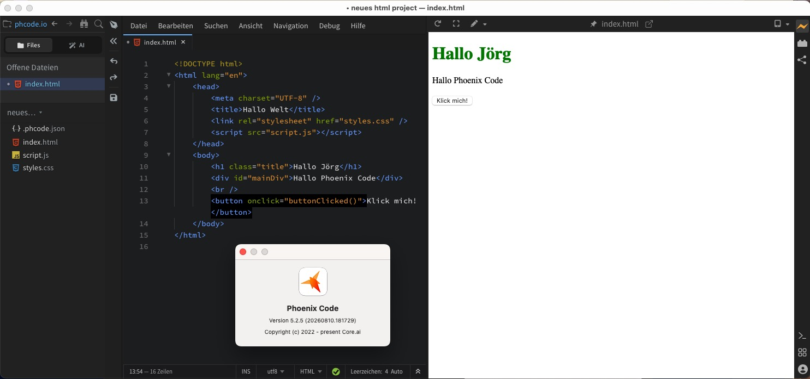

Soeben erreichte mich die Meldung, daß der **[Phoenix Code Editor](https://phcode.io/)**, die [jüngst von mir entdeckte Alternative](https://kantel.github.io/posts/2026073001_phoenix_code/) (nicht nur) für HTML, CSS und JavaScript, die mich bei meinem Projekt, [Webseiten ohne Sinn und Verstand](http://blog.schockwellenreiter.de/2022/05/2022052401.html) zu basteln und dabei gleichzeitig bei meiner Flucht weg von den Big-Tech-Konzernen und raus aus den asozialen Medien hinein ins IndieWeb, [unterstützen](https://kantel.github.io/posts/2026080102_p5js_phoenix_neocities/) [soll](https://kantel.github.io/posts/2026080501_running_orcs/), in der [Version 5.2 freigegeben](https://docs.phcode.dev/blog/release-5.2) wurde.

Diese Version kommt mit einem ganzen Bündel an Neuerungen: Sie bietet [Styles Bar](https://docs.phcode.dev/blog/release-5.2#style-your-page-visually-with-the-styles-bar) zum visuellen Gestalten der Seiten, [Code Intelligence](https://docs.phcode.dev/blog/release-5.2#code-intelligence-for-javascript-typescript-json-python-and-php) für JavaScript, TypeScript, JSON, Python und PHP, eine [Starter Bar](https://docs.phcode.dev/blog/release-5.2#start-from-a-blank-page) für leere Seiten, [Doc Comment Generation](https://docs.phcode.dev/blog/release-5.2#generate-doc-comments), eine [KI-Modellauswahl](https://docs.phcode.dev/blog/release-5.2#choose-your-ai-model), ein [verbessertes Git-Panel](https://docs.phcode.dev/blog/release-5.2#git-improvements), sowie eine [Video- und Audio-Vorschau](https://docs.phcode.dev/blog/release-5.2#video-and-audio-preview) direkt im Editor.

Die neue Version kann [hier heruntergeladen](https://phcode.io/) werden (das Update direkt aus dem Programm heraus funktioniert (noch?) nicht). Wenn man danach den nervenden Hinweis, daß man auf das kostenpflichtige »Phoenix Code Pro« updaten soll, wegklickt, funzt der Editor wie versprochen und die Arbeit mit ihm macht wieder Spaß.

---

**Bild**: *[Der Märzhase schreibt](https://www.flickr.com/photos/schockwellenreiter/55457090063/)*, erstellt mit [OpenArt](https://openart.ai/home). Prompt: »*The @March Hare sits at a desk in front of an antiquated, steampunk-style computer, typing on a keyboard. He wears a pair of aviator goggles, which he has pushed up onto his forehead. Lying on the desk in front of him is a gigantic notebook, in which he is jotting down notes with an old-fashioned fountain pen. Beside the keyboard sits a mug of steaming coffee. Shelves crammed with books and steampunk knick-knacks line the walls. A statue of the phoenix stands on one of the shelves. Through a window, one looks out upon a steampunk version of Berlin with an elevated old-fashioned railway in a steampunk style, but in the colors of the Berlin S-Bahn. Colored classic American comic style. Language: German. No speech bubbles, no textboxes. No German flags.*« Modell: Nano Banana&nbsp;2.