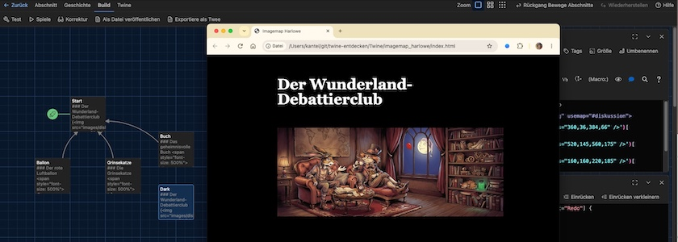
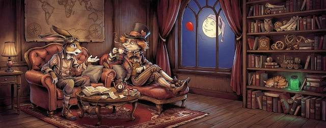

**Imagemaps** sind ein HTM-Element, das es erlaubt, mit der Maus auf eine Stelle in einem Bild zu klicken und dort auf eine andere Seite verlinkt zu werden. Klickt man jedoch auf eine andere Stelle in diesem Bild, passiert entweder gar nichts oder man wird auf eine ganz andere Seite verlinkt, je nachdem, ob das `<map>`-Element einen klickbaren Bereich definiert hat. In HTML kann das etwa so aussehen:

~~~html

<map name="NAME_OF_MAP">
    <area shape="rect" coords="360,36,384,66" href="PAGE_1">
    <area shape="rect" coords="520,145,560,175" href="PAGE_2">
    <area shape="rect" coords="160,160,230,185" href="PAGE_3">
    <area shape="rect" coords="2,80,36,140" href="PAGE_4">
</map>
~~~

Die Koordinaten sind in diesem Fall nicht völlig willkürlich gewählt, sondern sind untenstehendem Bild entnommen und definieren jeweils ein Rechteck um den roten Ballon, um die Katze im Regal, um das Buch auf den Tisch und die Lampe linksaußen:

Nur hinter diesen Rechtecken verbirgt sich jeweils ein Link, der auf entsprechende Seiten/Passagen verweist.

Natürlich geht das auch in [Twine](http://cognitiones.kantel-chaos-team.de/multimedia/spieleprogrammierung/twine2.html), nur eben je nach gewähltem Storyformat mit leicht abweichender Syntax. Ich habe das exemplarisch für [Harlowe](https://twine2.neocities.org/) ausprobiert, jedoch der wunderbare Aufsatz »[Clickable imagemaps in Twine](https://www.teuton.org/~stranger/clickableimagemapsintwine)« zeigt, wie Ihr das auch in [Chapbook](https://klembot.github.io/chapbook/guide/), Snowman oder [SugarCube](http://www.motoslave.net/sugarcube/2/) realisieren könnt.

In Harlowe wird eine Imagemap so realisiert:

~~~html
{
<map name="diskussion">
(link:'<area shape="rect" coords="360,36,384,66" />')[
        (goto:"Ballon")
]
(link:'<area shape="rect" coords="520,145,560,175" />')[
        (goto:"Grinsekatze")
]
(link:'<area shape="rect" coords="160,160,220,185" />')[
        (goto:"Buch")
]
(link:'<area shape="rect" coords="2,80,36,140" />')[
        (goto:"Dark")
]
</map>}
~~~

Das `(link:)`-Makro ermöglcht es uns, obigen HTML-Code in Harlowe nachzubilden, indem es statt auf HTML-Seiten auf entsprechende Passagen verweist. Allerdings werden in diesem Falle die Passagen nicht automatisch generiert, sondern müssen manuell angelegt werden. Zur Veranschaulichung habe ich dieses kleine Beispiel zusammengestrickt:

<iframe width="800" height="500" src="imagemap_harlowe/"></iframe>

Die Twine-Story ist ein wenig zu breit und passt nicht wirklich auf die Seite (ich hätte das Bild kleiner wählen sollen) und responsiv ist sie auch nicht, da die Positionen absolute Koordinaten sind, die eine variable Größe nicht zulassen. Aber um in Twine ein *Point and Click*-Abenteuer zu erstellen, ist die `<map>`-Funktion schon recht brauchbar.

Wenn der Mauszeiger über ein klickbares Rechteck bewegt wird, verändert er sein Aussehen zum `pointer` und signalisiert damit »hier kann geklickt werden«.

Wer wirklich responsive Spiele zum Beispiel für Mobilgeräte in Twine entwickeln will, der kommt ohne JavaScript nicht aus. Der oben verlinkte Aufsatz hat auch ein Beispiel dafür. Alternativ kann man aber auch die klassischen HTML-Image-Maps komplett aufgeben und stattdessen SVG-Graphiken verwenden, um Bilder anzuzeigen und Bereiche anklickbar zu machen. Dies bietet einige wesentliche Vorteile: Die Graphiken lassen sich leicht skalieren, verfügen über integrierte anklickbare Bereiche und unterstützen auch die automatische Hervorhebung von Bereichen.

Wenn das interessant klingt, schaue sich [diesen kurzen Artikel von Cyrus Firheir](https://gist.github.com/cyrusfirheir/2a247eeae668b1ee321b89b45f37b2e1) an.

### Literatur

- David Donachie: *[Clickable imagemaps in Twine](https://www.teuton.org/~stranger/clickableimagemapsintwine)*, David Donachie Blog vom 21.&nbsp;Juni&nbsp;2022
- Cyrus Firheir: *[Easy, Interactive, and Scalable Image Maps using SVGs](https://gist.github.com/cyrusfirheir/2a247eeae668b1ee321b89b45f37b2e1)*, zuletzt aufgerufen am 11.&nbsp;August&nbsp;2026

Natürlich werde ich die Geschichte auch noch auf meinen Neocities-Account hochladen, denn wenn das keine Webseite ohne Sinn und Verstand« ist, was ist dann eine »Webseite ohne Sinn und Verstand«?