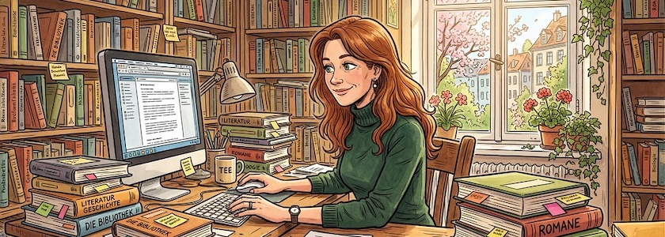

Der *Cornerturn* von *[Nele Hirsch](https://de.wikipedia.org/wiki/Cornelia_Hirsch)*, der Frau, die so wunderbar kompetent und unaufgeregt ihr [eBildungslabor](https://ebildungslabor.de/) beteibt, weg von dynamischen, serverseitig generierten hin zu statischen Webseiten, geht weiter (ich hatte im März dieses Jahres zum ersten Mal [darüber berichtet](https://kantel.github.io/posts/2026030402_publii/index.html)). Nun hat sie in dem Beitrag »[HTML als Format für Bildungsmaterialien](https://ebildungslabor.de/now/html-als-format-fuer-bildungsmaterialien/)« das Thema noch einmal vertieft und erweitert.

Sie berichtet darin, daß bei einem Seminar/Trainingscamp die Veranstalterinnen und Veranstalter aus den Materialien, die sie vorab verschickt hatte, (mit KI-Unterstützung) eine statische HTML-Site gestaltet und diese per Mail an die Teilnehmerinnen und Teilnehmer versandt hatten. Diese Datei ließ sich dann jeweils lokal im Browser öffnen.

*Nele Hirsch* sieht darin eine Entwicklung, die wahrscheinlich zukünftig noch zunehmen wird:

>Während ich »früher« wahrscheinlich selbst eine Mini-Website (z.B. über Github) gestaltet und die Inhalte dann darauf online gestellt hätte, läuft das Teilen nun lokal. Trotzdem bleibt es bei einem HTML-Format, was eine vielfältige Gestaltung ermöglicht. Zugleich können Teilnehmende und auch alle anderen Interessierten die Inhalte sehr niederschwellig weiternutzen und umgestalten.

In meinen Augen ist diese Entwicklung aber auch gleichzeitig ein wichtiger Schritt in Richtung »Digitale Souveränität«. Während viele (vorwiegend US-amerikanische) Bildungseinrichtungen immer noch auf das Angebot von Google Drive (und dabei meist Chromebooks ein-) setzen und sich somit komplett in die Hände der Datenkraken begeben, ist dies eine Alternative, die -- weil sie Server überflüssig macht -- einen Ausweg aus einem häufigen Dilemma weist: Denn viele (deutsche) Bildungseinrichtungen, die sich nicht in die Fänge der Datenkraken begeben wollen, setzen auf lokale Server, die an der Einrichtung betrieben werden. Die sind allerdings weitestgehend abhängig von dem (freiwilligen und ehrenamtlichen) Engagement (meist) einer Person, die diesen Server betreibt und am Leben erhält. Fällt dieses Engagement weg (zum Beispiel wenn diese Person auf eine andere Schule wechselt), stirbt der Server.

Da sind statische HTML-Seiten, die man ja mit JavaScript und CSS durchaus aufpeppen und ansprechend gestalten kann, eine empfehlenswerte Alternative. Und es ist auch nichts Verwerfliches, wenn man sich bei der *Gestaltung* dieser Seiten von einer gekünstelten Intelligenzia helfen lässt. Lediglich beim *Inhalt*, da würde ich lieber auf **meine** pädagogische Kompetenz und **mein** Wissen setzen.

Vielleicht sollte ich -- motiviert durch den Beitrag von *Nele Hirsch*, aber auch im Rahmen meiner [(Wieder-) Entdeckung des IndieWebs](https://kantel.github.io/#category=IndieWeb) -- mal eine Tutorialreihe zu den Grundlagen des Gestaltens statischer Seiten (HTML, CSS und JavaScript) schreiben und in diesem ~~Blog~~ Kritzelheft veröffentlichen. *Still digging!*

---

**Bild**: *[Frau am Schreibtisch](https://www.flickr.com/photos/schockwellenreiter/55128922725/)*, generiert mit [OpenArt](https://openart.ai/home). Prompt: »*A middle-aged woman with long, reddish-brown hair and green eyes, wearing a dark green turtleneck sweater, sits at a desk in a study, using a computer keyboard and mouse. Many books are stacked on the desk, with sticky notes protruding from them. The shelves along the walls are also overflowing with books. Spring sunshine streams through a window in the background. Colored Franco-Belgian comic style. No speech bubbles, no textboxes. Language: German.*« Modell: Nano Banana 2