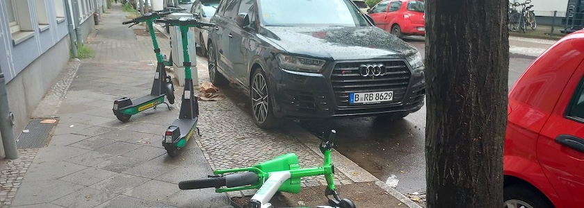

[Anfang Juli dieses Jahres](https://kantel.github.io/posts/2026070202_e_scooter_pest/) hatte ich über das [Bündnis »E-Scooter aus dem Weg«](https://www.fuss-ev.de/blog/aktuelles/e-scooter-aus-dem-weg-breites-berliner-buendnis/) berichtet, daß der FUSS e.V. mit dem Allgemeinen Blinden- und Sehbehindertenverein gegründet hatte. Jetzt ist in das Thema endlich Bewegung gekommen: Inzwischen gehören ihm 47 Organisationen und Initiativen, sowie zahlreiche Einzelpersonen -- wie auch ich -- an. Das hat der Politik einen Schub gegeben: Wenn am 31.März 2027 die Genehmigungen für wildes E-Scooter-Parken enden, soll es dafür keine neuen geben. Das haben dem Bündnis jetzt die Grünen, die Linken und die SPD versprochen, für die letzten zwei Parteien sogar die Spitzenkandidaten *Elif Eralp* und *Steffen Krach*. [Nur die CDU hält sich mit solchen Versprechen zurück](https://taz.de/E-Scooter-in-Berlin/!6203841/). 

Nicht nur bei mir in Neukölln, sondern auch im Wedding regt sich verstärkt der Widerstand gegen die Gehirnamputierten und ihre rollende Straßenpest: Der Weddingweiser geht über die obige Forderung des Bündnisses hinaus und [wünscht sich einen Volksentscheid wie in Paris über ein **Verbot der Leih-E-Scooter**](https://weddingweiser.de/e-scooter-frei-im-wedding/). Dem kann ich mich nur anschließen.

---

**Photo** ([cc](https://creativecommons.org/licenses/by-sa/4.0/deed.de)) 2026: *[Jörg Kantel](http://cognitiones.kantel-chaos-team.de/cv.html)*