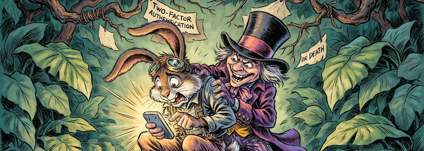

GitHub nervte: Wenn ich nicht innerhalb weniger Tage [meinen Account](https://github.com/kantel) auf [Zwei-Faktor-Authentifizierung](https://de.wikipedia.org/wiki/Zwei-Faktor-Authentisierung) (2FA) umstelle, würde dieser deaktiviert. Und auch meine Bank hatte die Smartphone-App für *ihre* Zwei-Faktor-Authentifizierung geändert. Ich müsste eine neue App für mein Smartphone herunterladen und neu einrichten.

Es kam, wie es  (bei mir) zu erwarten war: Da meine dicken Fingerchen und die winzige Tastatur meines Smartphones inkompatibel sind, hatte ich innerhalb weniger Minuten mein Smartphone so zerschossen, daß ich es komplett neu aufsetzen musste. Also habe ich nun ein sauberes Mobilgerät als zweiten Faktor mit jeweils einer eigenen App für jeden der beiden Dienste, und GitHub wie auch die Deutsche Bank sind wieder zufrieden mit mir, aber ich bin nicht zufrieden, weder mit GitHub noch mit der Deutschen Bank. So wie es jetzt ist, ist die Zwei-Faktor-Authentifizierung ein teueres und viel zu kompliziertes Sicherheitstheater. Warum muss die Einrichtung nur so umständlich sein? Warum brauche ich für GitHub eigentlich zwingend eine Zwei-Faktor-Authentifizierung (beim Online-Banking sehe ich das ja, wenn auch zähneknirschend, noch ein)? Und was ist, wenn mein Mobiltelephon verloren geht oder gar gestohlen wird? Bin ich dann von allen Transaktionen ausgeschlossen?

Seufz … jetzt werde ich erst einmal den heutigen Abend und vermutlich auch den morgigen Vormittag damit verbringen, mir mein mobiles Gerät wieder einzurichten. Danke an alle, die mir diese überflüssige Arbeit aufgehalst haben.

---

**Bild**: *[Der Märzhase und die Zwei-Faktor-Authentifizierung](https://www.flickr.com/photos/schockwellenreiter/55470133614/)*, erstellt mit [Ideogram&nbsp;4.0](https://ideogram.ai/). Prompt: »*The March Hare sits in a forest of leaves with his mobile phone, typing on the screen with a wild look in his eyes. He is perched on a stone, with aviator goggles pushed up onto his forehead. Standing behind him, grinning maliciously, is the Mad Hatter. Notes hang from the trees bearing the inscription "Two-factor authentication or death." Classic American comic book style. No speech bubbles. No text boxes.*«