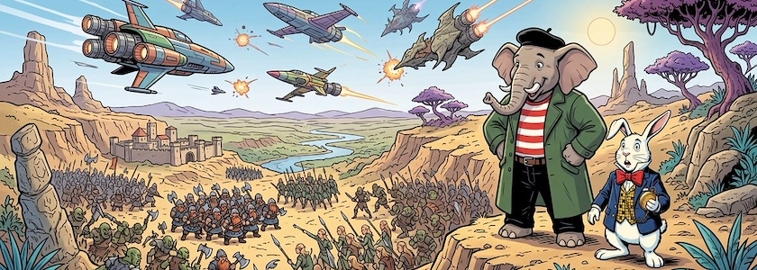

Bei meinen wilden Streifzügen durch das Internet sind mir in den letzten Tagen zwei Tutorialreihen zur Spieleprogrammierung untergekommen, die unterschiedlicher -- auch vom Genre -- kaum sein können, die ich aber beide für sehr interessant halte. Daher möchte ich sie Euch nicht vorenthalten:

### Python ASCII RPG Tutorial

<iframe class="if16_9" src="https://www.youtube.com/embed/13NMCcDij3A?si=HmZuNPYWjw6KrjNw" title="YouTube video player" frameborder="0" allow="accelerometer; autoplay; clipboard-write; encrypted-media; gyroscope; picture-in-picture; web-share" referrerpolicy="strict-origin-when-cross-origin" allowfullscreen></iframe>

Als es noch keine graphikfähigen Terminals gab, stellten Spiele traditionell ihre Spielwelt durch Schriftzeichen auf einem Terminal dar. Dafür gibt es auch heute noch eine Fan-Szene. Der *Ork Slayer* zeigt Euch in [seiner zwöfteiligen Tutorialreihe](https://www.youtube.com/playlist?list=PLIYv95CSVgLrlV8wkTAeOAHtw0It1NxT7), wie Ihr solch ein ASCII-basiertes [Comuputer-Rollenspiel](https://de.wikipedia.org/wiki/Computer-Rollenspiel) (RPG) in Python realisiert. Dabei sind -- nach der kurzen Einleitung -- die ersten vier Videos das eigentliche Tutorial, die folgenden Videos behandeln Ergebnisse und Erweiterungen des ursprünglichen Konzepts.

Mir schwirrt da schon seit längerem eine Idee durch den Kopf: Was wäre, wenn man das ASCII-Konzept auf UTF8/UTF16 ausdehnt und die Spielewelt mit Emojis generiert? Gefällt vielleicht nicht jedem Traditionalisten, es wäre aber auf jeden Fall eine interessante Erweiterung.&nbsp;🧌

### Meteor II - mit Greenfoot ein Spiel programmieren

<iframe class="if16_9" src="https://www.youtube.com/embed/n1CtCfdEubw?si=zhzw8-0pOj-Hplw4" title="YouTube video player" frameborder="0" allow="accelerometer; autoplay; clipboard-write; encrypted-media; gyroscope; picture-in-picture; web-share" referrerpolicy="strict-origin-when-cross-origin" allowfullscreen></iframe>

[Greenfoot](http://cognitiones.kantel-chaos-team.de/programmierung/creativecoding/greenfoot.html), die kleine, freie (GPL), interaktive, graphische Java-Entwicklungsumgebung für Spiele, die primär für Ausbildungszwecke entwickelt wurde, fand schon lange keine [Erwähnung mehr auf diesen Seiten](https://kantel.github.io/#category=Greenfoot). Zwar habe ich nicht vor, etwas Ernsthaftes mit Greenfoot anzustellen (doch wer weiß, man soll ja bekanntlich niemals nie sagen 🤓) doch ich mag die lockere, unbekümmerte aber dennoch kompetente Art, mit der *Berthold Metz* seine [Greenfoot-Tutorien](https://informatik-bg.de/greenfoot) präsentiert. Daher hat es mich sehr gefreut, als heute eine neue Tutorialreihe von ihm, »[Meteor II - mit Greenfoot ein Spiel programmieren](https://www.youtube.com/playlist?list=PLHyfj-hlgLBA)«, in meinen Feedreader schneite. In acht Folgen zeigt er Euch, wie Ihr mit Greenfoot einen Space-Shooter programmiert. Wie von *Berthold Metz* gewohnt, ist seine Playlist völlig unsortiert, aber da die einzelnen Videos durchnumeriert sind, werdet Ihr Euch die korrekte Reihenfolge schon zusammenbasteln können.

Die Playlist ist erst wenige Stunden alt, der versprochene Quellcode und die Assets sind an der [angegebenen Downloadquelle](https://informatik-bg.de/greenfoot) noch nicht verfügbar. Aber das wird sicher noch nachgeholt werden.

---

**Bild**: *[Krieg der Sterne und Steine](https://www.flickr.com/photos/schockwellenreiter/55474821420/)*, erstellt mit [OpenArt](https://openart.ai/home). Prompt: »*From a hill in an exotic landscape, @Qumbo and @Rudi Rabbit watch elves and dwarves battling orcs in the valley below, while spaceships fight in the sky. Franco-Belgian comic book style. No speech bubbles. No text boxes. Language: German.*« Modell: Nano Banana&nbsp;2.