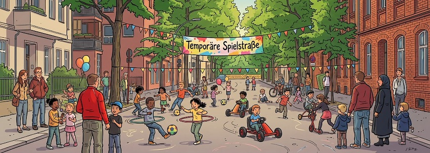

Am nächsten **Dienstag, den 25. August 2026 zwischen 15:00 Uhr und 18:00 Uhr** ist es endlich wieder soweit, dann geht direkt nach den Ferien die [temporäre Spielstraße](https://qm-glasower-strasse.de/glasower-strasse-wird-wieder-zur-spielstrasse/) in der Glasower Straße für dieses Jahr in die [dritte Runde](https://qm-glasower-strasse.de/es-wird-wieder-auf-der-strasse-gespielt/). Dafür wird die **Glasower Straße zwischen Benda- und Bruno-Bauer-Straße** in 12051 Berlin-Neukölln zum dritten Mal in diesem Jahr für den Autoverkehr gesperrt. Wie schon bei den beiden letzten Malen [im Juni](https://kantel.github.io/posts/2026060801_temporaere_spielstrasse/) und [im Juli](https://kantel.github.io/posts/2026070601_temporaere_spielstrasse_2/) dieses Jahres kann dann fröhlich und unbehelligt vom Autoverkehr auf der Straße gespielt, getobt, getanzt und gelacht werden.

**Autofahrer, bitte aufgepasst**: Die Straße ist im besagten Abschnitt nicht nur gesperrt, sondern von 13:00 Uhr bis 18:00 Uhr gilt hier auch absolutes Halteverbot. Das Ordnungsamt ist vor Ort. Autos, die dennoch dort parken, werden abgeschleppt.

Die temporäre Spielstraße wird in diesem Jahr noch ein Mal, am 22. September, auch wieder von 15:00 Uhr bis 18:00 Uhr, wiederholt werden. Veranstaltet und organisiert wird sie von anwohnenden Menschen aus dem Kiez -- aus der Nachbarschaft für die Nachbarschaft! Sie freuen sich über viele, fröhliche Kinder und ihre erwachsenen Begleitpersonen.

---

**Bild**: *[Temporäre Spielstraße in Neukölln](https://www.flickr.com/photos/schockwellenreiter/55375528034/)*, erstellt mit [OpenArt](https://openart.ai/home). Prompt: »*A cordoned-off city street in Berlin-Neukölln, Glasower Straße, like @image1 lined with multi-story residential and commercial buildings, some featuring red brick facades. No shops. Many children are playing in the street with hoops, balls, balloons, and a few pedal cars, supervised by a handful of adults. Colorful triangular pennants are strung across the street. A colorful banner reading "Temporäre Spielstraße" (Temporary Play Street) hangs on the right side of the street. Franco-Belgian comic book style. Language: German. No speech bubbles, no text boxes.*« Modell: Nano Banana&nbsp;2.