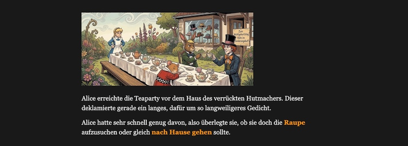
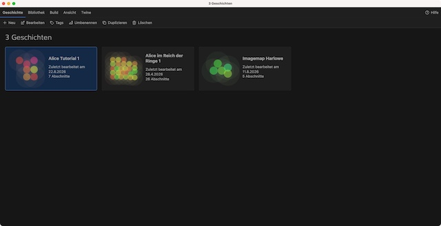
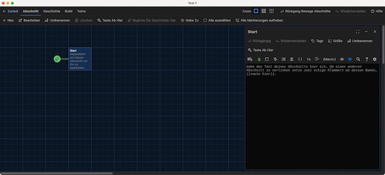
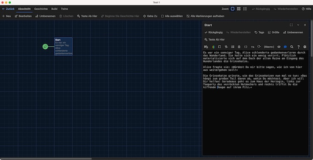
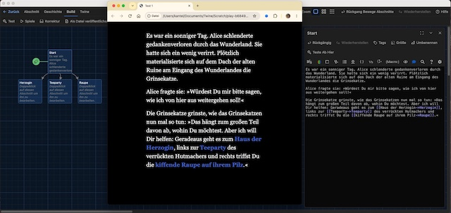
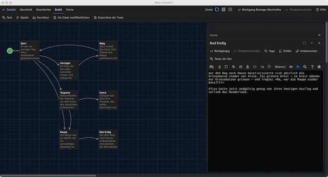
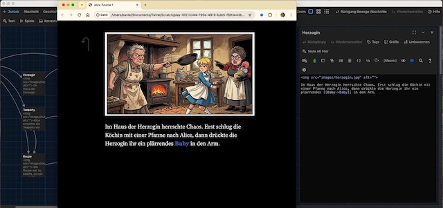
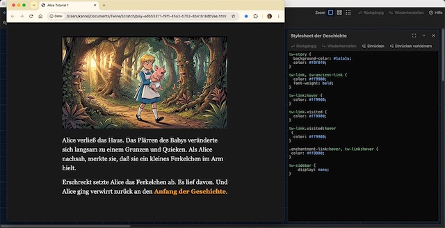

Ich habe der [Ankündigung vor drei Tagen](https://kantel.github.io/posts/2026082001_zurueck_ins_wunderland/) ein erstes Tutorial folgen lassen (eigentlich ist es ein zweites Tutorial, denn diese [Anleitung über Imagemaps in Twine](https://kantel.github.io/posts/2026081102_imagemaps_twine/), die ich vor etwa zwei Wochen erstellt hatte, gehört strenggenommen auch schon dazu). Dafür habe ich mein [altes Tutorial](https://kantel.github.io/posts/2026040801_chapbook_wunderland_reloaded/) zu [Chapbook](https://klembot.github.io/chapbook/guide/) genommen, das ich im April dieses Jahres verfasst hatte, und es nach [Harlowe](https://twine2.neocities.org/) portiert. Vieles klingt daher wie eine Wiederholung, aber es ist dennoch einiges neues dabei.

Das Tutorial geht davon aus, daß Ihr entweder Twine auf Eurem Desktop-Rechner installiert habt oder wißt, wie die Online-Version von Twine zu bedienen ist (die Bedienung ist in beiden Fällen gleich). Da die Online-Version Eure Ergebnisse jedoch nur im Browser-Cache vorrätig hält, empfiehlt sich ein regelmäßiges Abspeichern entweder als HTML- (`Build > Als Datei veröffentlichen`) oder als Twee-Datei (`Build > Exportiere als Twee`), damit Eure Ergebnisse nicht versehentlich im Daten-Nirwana verschwinden. Deshalb, aber auch aus anderen Gründen -- siehe den Abschnitt zu »Bilder« weiter unten --, empfehle ich eher die Desktop-Version von Twine.

Als erstes legt Ihr auf dem Startbildschirm von Twine unter `Geschichte > Neu` eine neue Geschichte an. Ich habe sie »Alice Tutorial 1« genannt, aber das könnt Ihr nach Belieben verändern (`Geschichte > Umbenennen`). Da Harlwowe das Default-Storyformat von Twine ist, braucht Ihr es normalerweise nicht extra einzustellen[^1].

[^1]: Es sei denn, Ihr seid Profis und habt »aus Gründen« das Default-Storyformat in ein anderes geändert (Profis nehmen oft [SugarCube](http://www.motoslave.net/sugarcube/2/)). Aber dann wisst Ihr sowieso, wie Ihr das Storyformat auf Harlowe zurückstellen könnt.

Falls Ihr doch ein anderes Storyformat als Default eingestellt hattet, die Storyformate könnt Ihr unter `Twine > Geschichtsformate` umstellen. Also achtet darauf, daß das Storyformat auf Harlowe 3.3.x (oder größer) eingestellt ist. Denn wenn das Storyformat einmal festgelegt ist, seid ihr für diese Geschichte daran gebunden, da die verschiedenen Storyformate bis auf wenige Befehle eine komplett unterschiedliche Syntax aufweisen. Bei einer nachträglichen Änderung des Storyformats müsst Ihr also sämtliche bisher erstellten Passagen ändern.

Jetzt könnt Ihr aber endlich mit der Geschichte beginnen. Öffnet daher mit einem Doppelklick die Startpassage und gebt folgenden Text ein:

~~~txt
Es war ein sonniger Tag. Alice schlenderte gedankenverloren durch das Wunderland. Sie 
hatte sich ein wenig verirrt. Plötzlich materialisierte sich auf dem Dach der alten 
Ruine am Eingang des Wunderlandes die Grinsekatze.

Alice fragte sie: »Würdest Du mir bitte sagen, wie ich von hier aus weitergehen soll!«

Die Grinsekatze grinste, wie das Grinsekatzen nun mal so tun: »Das hängt zum großen Teil 
davon ab, wohin Du möchtest. Aber ich will Dir helfen: Geradeaus geht es zum Haus der 
Herzogin, links zur Teeparty des verrückten Hutmachers und rechts triffst Du die
kiffende Raupe auf ihrem Pilz.«
~~~

Wegen der besseren Lesbarkeit habe ich alle Texte in diesem Tutorial umgebrochen. Harlowe ist aber, was Zeilenumbrüche angeht, sehr pingelig. Jeder Zeilenumbruch wird als neue Zeile interpretiert. Ihr dürft daher Zeilenumbrüche nur an den Stellen einsetzen, wo auch in der Geschichte eine neue Zeile oder ein neuer Absatz beginnen sollen. Der Editor in Twine hilft Euch aber dabei, da er ein *Soft Wrap* unterstützt, das heißt, lange Textzeilen werden in der Ansicht automatisch an den Fensterrand angepasst, ohne echte Umbruchzeichen in die Datei einzufügen. Die Texte werden also nie den Fensterrand verlassen.

Ähnlich einem »normalen« Editor- oder Schreibprogramm hat der Editor in Twine/Harlowe eine Menüzeile, die Euch beim Editieren unterstützen. Dazu in einem späteren Tutorial mehr.

## Wir wollen Links

Ihr könnt die Geschichte oben natürlich endlos weiterspinnen bis hin zu einem Roman. Aber dazu benötigt ihr Twine nicht, dafür reicht eine ordinäre Schreibmaschine. Aber wenn Ihr den letzten Absatz in der obigen Passage nehmt und ihn wie folgt abändert,

~~~txt
Es war ein sonniger Tag. Alice schlenderte gedankenverloren durch das Wunderland. Sie 
hatte sich ein wenig verirrt. Plötzlich materialisierte sich auf dem Dach der alten 
Ruine am Eingang des Wunderlandes die Grinsekatze.

Alice fragte sie: »Würdest Du mir bitte sagen, wie ich von hier aus weitergehen soll!«

Die Grinsekatze grinste, wie das Grinsekatzen nun mal so tun: »Das hängt zum großen 
Teil davon ab, wohin Du möchtest. Aber ich will Dir helfen: Geradeaus geht es zum 
[[Haus der Herzogin->Herzogin]], links zur [[Teeparty->Teeparty]] des verrückten 
Hutmachers und rechts triffst Du die [[kiffende Raupe auf ihrem Pilz->Raupe]].«
~~~

und danach auch noch auf `Build > Spiele` klickt, um das Spiel in einem Browserfenster zu öffnen, dann erhaltet Ihr dieses:

Im Browserfenster erscheint eine spielbare Version von Alice mit klickbaren Links (die momentan aber noch auf leere Passagen verweisen) und im Twine-Fenster sind wie von Geisterhand drei neue Passagen entstanden, mit den Titeln »Herzogin«, »Teeparty« und »Raupe«.

Dieser Absatz zeigt schon die wichtigste Funktionsweise von Twine: Wie werden Links (zu anderen Passagen) erstellt? Der einfachste Weg ist, das Linkziel zwischen zwei eckigen Klammerpaaren (`[[Link]]`) zu schreiben, so wie ich es bei `[[Teeparty]]` hätte machen können. Denn hier sind Linktext und Linkziel identisch, das heißt, der Link `[[Teeparty]]` führt zur Passage `Teeparty`.

Doch in den meisten Fällen unterscheiden sich Linktext und Linkziel. Hierfür gibt es in Twine die Pfeilnotation: `[[Linktext->Linkziel]]`, wie zum Beispiel in `[[kiffende Raupe auf ihrem Pilz->Raupe]]`. Hier verlinkt der komplette Text `kiffende Raupe auf ihrem Pilz` auf eine Passage mit Namen `Raupe`. Dabei ist zu beachten, daß Leerzeichen zählen. Daher sollte zumindest nach der Pfeilspitze kein Leerzeichen stehen, denn Twine sucht sonst das Linkziel `_Raupe` mit vorangestelltem Leerzeichen und das bringt nicht nur Twine, sondern – wie man in vielen Online-Tutorien sehen kann – auch Euch durcheinander. Wenn Ihr aber rechts und links von den Pfeilen keine Leerzeichen zulasst, seid Ihr immer auf der sicheren Seite.

Es gibt noch eine zweite Schreibweise mit rückwärtsgerichtetem Pfeil, die Linkkziel und Linktext umkehrt: `[[Linkziel<-Linktext]]`, also – um bei unserem Beispiel zu bleiben – `[[Raupe<-kiffende Raupe auf ihrem Pilz]]`. Mir hat sich der Sinn dieser vermutlich aus historischen Quellen gespeisten Schreibweise nie erschlossen und ich habe sie auch noch nie nutzen müssen.

Um die Verwirrung komplett zu machen, gibt es auch noch eine dritte Schreibweise mit einem vertikalen Trennstrich (`|`) in der Mitte: `[[Linktext|Linkziel]]`, also `[[kiffende Raupe auf ihrem Pilz|Raupe]]`. Hier weiß ich zumindest den Grund, die Schreibweise stammt aus Twine 1.x und ich habe sie aus reiner Gewohnheit auch lange noch verwendet. Hier gilt übrigens das gleiche wie bei den Pfeilen: Keine Leerzeichen rechts und/oder links vom vertikalen Strich. Und selbst ich als Gewohnheitstier habe mich von dieser Schreibweise verabschiedet. Wer daher neu in Twine ist, sollte keinen Grund haben, auf dieser veralteten Konvention zu beharren.

Um eine einheitliche Schreibweise zu realisieren, verwende ich **immer** den rechtsgerichteten Pfeil `->`, auch dann, wenn Linktext und Linkziel identisch sind, wie zum Beispiel bei `[[Teeparty->Teeparty]]`. Denn wer weiß, vielleicht ändert sich der Linktext ja noch (zum Beispiel bei einer Übersetzung in eine andere Sprache), während das Linkziel gleich bleiben soll.

Wenn Ihr – nachdem Ihr die Startpassage mit dem Text gefüttert habt – auf das Twine-Fenster schaut, werdet Ihr feststellen, daß Twine die Passagen `Herzogin`, `Teeparty` und `Raupe` für Euch schon angelegt und mit Pfeilen versehen hat. Die Pfeile zeigen von der Startpassage jeweils auf die verlinkte Passage und – sollte es von da einen Rücklink geben – als Doppelpfeil auch wieder zurück.

Ihr könnt die Passagen in dem Fenster beliebig mit der Maus hin- und herschieben und so ein wenig Struktur in Eure Geschichten bekommen.

Natürlich wollen auch diese Passagen mit Text gefüttert werden. Ich fange mit der `Herzogin` an:

~~~txt
Im Haus der Herzogin herrschte Chaos. Erst schlug die Köchin mit einer Pfanne nach 
Alice, dann drückte die Herzogin ihr ein plärrendes [[Baby->Baby]] in den Arm.
~~~

Auch die `Teeparty`

~~~txt
Alice erreichte die Teaparty vor dem Haus des verrückten Hutmachers. Dieser 
deklamierte gerade ein langes, dafür um so langweiligeres Gedicht.

Alice hatte sehr schnell genug davon, also überlegte sie, ob sie doch die 
[[Raupe->Raupe]] aufzusuchen oder gleich [[nach Hause gehen->Home]] sollte.
~~~

und die `Raupe` bekommen einen Text:

~~~txt
Die Raupe war zu bekifft, um ein vernünftiges Gespräch zu führen. Sie murmelte nur 
immerzu etwas vom »Reich der Ringe« und daß Alice dieses dringend besuchen müsste. 

Sie sagte noch: »Komm morgen wieder, dann erzähle ich Dir mehr«.

Alice beschloß, daß sie für heute genug habe und [[ging nach Hause->Bad Ending]].
~~~

Wenn Ihr jetzt wieder auf Euer Twine-Fenster schaut, werdet Ihr drei weitere, neue, aber noch leere Passagen finden, die Twine für Euch angelegt und mit Pfeilen versehen hat: `Baby`, `Home` und `Bad Ending`[^2]. Ihr könnt sie zur besseren Übersicht erst einmal anordnen, wie im Screenshot oben und dann ebenfalls mit Text füllen[^3].

[^2]: Aufmerksame Leser werden feststellen, daß in dem Screenshot noch ein Tippfehler ist: »Bad Endig« statt »Bad Endi**n**g«. Diesen Fehler habe ich zwischenzeitlich korrigiert.

[^3]: Was im obigen Screenshot schon passiert ist.

Die Passage `Baby`:

~~~txt
Alice verließ das Haus. Das Plärren des Babys veränderte sich langsam zu einem Grunzen 
und Quieken. Als Alice nachsah, merkte sie, daß sie ein kleines Ferkelchen im Arm 
hielt.

Erschreckt setzte Alice das Ferkelchen ab. Es lief davon. Und Alice ging verwirrt 
zurück an den [[Anfang der Geschichte->Start]].
~~~

Die Passage `Home`:

~~~txt
Zuhause traf Alice ihre Freunde, das weiße Kaninchen und den großen Elephanten, 
mit mit denen sie noch gemütlich ein Kännchen Kaffee trank. So wurde es doch noch 
ein gelungengener Nachmittag.
~~~

und *last but not least* die Passage `Bad Ending`:

~~~txt
Auf dem Weg nach Hause materialisierte sich pötzlich die Grinsekatze wieder vor Alice. 
Sie grinste breit – so breit können nur Grinsekatzen grinsen – und fragte: »Na, war 
die Raupe wieder bekifft?«

Alice hatte jetzt endgültig genug von ihrem heutigen Ausflug und verließ das 
Wunderland.
~~~

Dies ist eigentlich alles, was Ihr über Twine und Harlowe wissen müsst. Mit diesem einfachen Linkmechanismus (der übrigens in dieser Form in fast allen Storyformaten existiert) könnt Ihr Eure eigene interaktive und verzweigte Geschichte im Stil der »Choose Your Own Adventure Books« *(CYOA)* schreiben. Denn das ist der Kern von Twine[^4], alles andere ist im Grunde genommen nur Kosmetik. Aber da Kosmetik vieles doch erst schön macht, werde ich Euch nun noch ein wenig Kosmetik zeigen.

[^4]: Viele Twine-Stories kommen auch mit diesem Mechanismus aus, sie benutzen die fortgeschrittenen Features von Harlowe (oder auch den anderen Storyformaten) gar nicht.

## Wir wollen aber Bilder

>Alice fing an sich zu langweilen; sie saß schon lange bei ihrer Schwester am Ufer und hatte nichts zu tun. Das Buch, das ihre Schwester las, gefiel ihr nicht; denn es waren weder Bilder noch Gespräche darin. »Und was nützen Bücher,« dachte Alice, »ohne Bilder und Gespräche?«

Die Geschichte ist bisher ja recht schön erzählt, aber sie besitzt ein großes Manko: Denn was sind Geschichten ohne Bilder?

Doch das Verhältnis von Twine zu Bildern (und anderen Mulitmediadateien wie Musik, Sound oder Filmen) war von Anfang an ein schwieriges. Denn Twine war ursprünglich entworfen, um textbasierte, interaktive Abenteuer zu erzählen. Bilder waren da nicht vorgesehen. Doch das Publikum wollte – wie Alice – Bilder und so haben sich zwei mehr oder weniger inkompatible Lösungen gefunden:

### Lösung 1: Bilder online einbinden

Der erste Ansatz ist, die Multimediadateien online auf einem Server abzulegen, und sie dann per HTTP(S) einzubinden. Der Vorteil dieser Lösung ist, daß die Bilder – eine Online-Anbindung vorausgesetzt – immer von Twine gefunden werden, egal ob die Twine Story **in** Twine (im Test-Modus) aufgerufen wird, oder ob sie *standalone* läuft. Jedoch hat diese Methode auch zwei gewichtige Nachteile. Der erste Nachteil: Es ist **Euer** Server, auf dem die Daten liegen, Ihr zahlt, wenn Ihr die Geschichte veröffentlicht habt, für die Bandbreite, wenn andere die Geschichte aufrufen. Und zweitens: Ihr müßt zwingend online sein, auch wenn Ihr Euer Spiel entwickelt. Ein Schreiben oder Spielen am Strand ist damit in der Regel nicht möglich.

Außerdem hat sich hier noch eine böse Unsitte entwickelt, die man leider häufig auch Twine-Tutorials findet. Dort wird dann einfach mit einer Bildersuchmaschine ein passendes Bild gesucht. Ist dieses Bild gefunden, wird die URL kopiert und die Datei ohne Rücksicht auf Verluste vom **fremden** Server in die eigene Geschichte eingebunden.

Dieses *Hotlinking* genannte Verfahren ist aus mehreren Gründen eine Sünde: Erstens, wenn man sich nicht um die Bildrechte kümmert, gerät man dabei leicht in die Fallstricke einer Urheberrechtsverletzung und das kann teuer werden. Zweitens zahlt der Serverbetreiber und nicht Ihr die Kosten für den Datentransfer. Das macht ihn sicher nicht glücklich. Und drittens habt Ihr keine Kontrolle über die Daten. Auch ich habe schon einmal eines meiner (eigentlich harmlosen und unter einer freien Lizenz stehenenden) Photos einer Berliner Touristen-Attraktion gegen das Bild einer leicht bekleideten Dame ausgetauscht, nachdem ich bemerkt hatte, daß irgendein Dödel dieses Bild ungefragt per Hotlinking in seine dusselige Kommerzseite eingebunden hatte.

### Lösung 2: Daten lokal einbinden

Die zweite Lösung ist, die Daten lokal einzubinden. Dafür legt man sich am sinnvollsten unterhalb der eigentlichen Story-Datei (Beispiel: `story.html`) ein Verzeichnis (oder mehrere Vereichnisse) an, die die Asset-Dateien beinhalten. Das kann dann beispielsweise so aussehen:

~~~txt
- story.html
- images/
  - image01.jpg
  - image02.jpg
- audio/
  - song01.mp3
~~~

Wenn dann ein Bild in eine Twine-Story per relativer URL eingebunden ist, in Harlowe zum Beispiel mit:

~~~html

~~~

Dann findet Eure Twine-Story **nach dem Publizieren** das Bild auch, unabhängig davon, ob sie lokal oder über eine Webverbindung aufgerufen wurde.

Das Beispiel zeigt aber auch, daß Harlowe im Gegensatz zu SugarCube oder Chapbook keine eigenen Befehle zur Behandlung von Bildern kennt. Das Storyformat reicht sie einfach als HTML-Anweisungen an den Browser durch. Das hat Vor- und Nachteile. Der Vorteil ist: Man kann so zum Beispiel Bilder (oder Videos) via HTML und CSS beliebig auf den Seiten postionieren (was in Chapbook zum Beispiel nicht so einfach ist). Der Nachteil: Man **muss** HTML und CSS beherrschen, so passen sich zum Beispiel Bilder nicht automatisch der Fenstergröße an[^5] (was sie in Chapbook wiederum können).

[^5]: Das Problem der responsiven Darstellung der Twine-Seiten in Harlowe ignoriere ich erst einmal. Ich komme in einem späteren Tutorial darauf zurück.

Der Zusatz »nach dem Publizieren« weist auch gleich auf den größten Nachteil dieser Methode hin: Wird die Geschichte **innerhalb** von Twine gestartet (sei es über den Test- oder über den Play-Button), dann findet Twine Eure Assets nicht. Das liegt daran, daß Twine die Story temporär auf eine völlig obskure und nicht nachvolltiehbare URL hinausschreibt, beispielsweise auf (gekürzt)

~~~txt
file:///private/var/folders/x3/…/T/52f32371-9e39-4952-a4d8-6ee9f02e7df4.html
~~~

und wo soll das arme Twine da Eure Assets finden?

Der größte Vorteil dieser Methode ist allerdings der: Ist Eure Story mal publiziert, dann läßt sich die Datei mitsamt den Asset-Verzeichnissen entweder als `.zip`-Datei oder auch unkomprimiert auf jeden Server oder Dienst Eurer Wahl hochladen (zum Beispiel auf Itch.io) oder als Email an Eure Freunde verschicken. Und sie können sie dann auch spielen, ohne auf eine Internetverbindung angewiesen zu sein.

### Der Kompromiss: Twine überlisten

Nun möchte man aber gerne auch während der Entwicklung in Twine seine Bilder sehen, und sei es nur, um das Layout kontrollieren zu können. Hierfür habe ich folgende Lösung gefunden: Ruft man über den `Play`- oder `Test`-Button die Geschichte innerhalb von Twine auf, dann zeigt der Browser in seiner Adresszeile an, von wo er die Datei aufruft. In meinem Fall (macOS) ist das:

~~~txt
file:///Users/kantel/Documents/Twine/Scratch/voellig_obskurer_dateiname.html
~~~

Wenn ich nun in `Users/kantel/Documents/Twine/Scratch`[^6] eine Kopie meiner Assets-Verzeichnisse ablgege, dann habe ich zwar alle Assets zweimal auf meiner Festplatte[^7], aber dafür werden alle Assets auch innerhalb Twines angezeigt.

[^6]: Auf meinem Mac, der so überfürsorglich für den Benutzer alles übersetzt (was der Browser nicht tut), heisst das Verzeichnis dann `Benutzer:innen/kantel/Dokumente/Twine/Scratch/`.

[^7]: Aber das zweite, doppelte Verzeichnis kann ich ja löschen, wenn ich die Entwicklung abgeschlossen habe.

Ich weiß allerdings nicht, ob und wie das auch bei anderen Betriebssystemen (Windows, Linux) funktioniert. Und es dürfte auf gar keinen Fall bei der Online-Version von Twine funktionieren.

Die Verwendung des `alt`-Textes sollte eigentlich überall obligatorisch sein, damit sich sehbehinderte Menschen von ihrem Screenreader die Bildbeschreibung vorlesen lassen können. In diesem Tutorial habe ich aber bisher darauf verzichtet, um Platz zu sparen. Sollte ich die Story aber jemals veröffentlichen, werde ich das aber nachholen. Dient das Bild rein dekorativen Zwecken, zum Beispiel eine schöne Seitenumrandung, dann kann der alt-Text auch einfach nur aus einem leeren String bestehen:

~~~html

~~~

Moderne Screenreader werden dieses Bild dann freudig ignorieren.

So, und jetzt nach der langen Vorrede die neuesten Abenteuer von Alice mit Twine und Harlowe. Sie sind nahezu identisch mit der ersten Version, nur daß sie nun mit Bildern illustriert sind. Hier der Twee-Code der ersten Passage:

~~~txt

Es war ein sonniger Tag. Alice schlenderte gedankenverloren durch das Wunderland. Sie 
hatte sich ein wenig verirrt. Plötzlich materialisierte sich auf dem Dach der alten 
Ruine am Eingang des Wunderlandes die Grinsekatze.

Alice fragte sie: »Würdest Du mir bitte sagen, wie ich von hier aus weitergehen soll!«

Die Grinsekatze grinste, wie das Grinsekatzen nun mal so tun: »Das hängt zum großen 
Teil davon ab, wohin Du möchtest. Aber ich will Dir helfen: Geradeaus geht es zum 
[[Haus der Herzogin->Herzogin]], links zur [[Teeparty->Teeparty]] des verrückten 
Hutmachers und rechts triffst Du die [[kiffende Raupe auf ihrem Pilz->Raupe]].«
~~~

Die übrigen Passagen habe ich einfach in der gleichen Art mit Bildern aufgepeppt.

## Wir wollen Stil

Zum Abschluß dieses einführenden Tutorials in Twine und Harlowe möchte ich der Geschichte noch ein wenig Stil spendieren. Denn weder gefallen mir die Mogelknöpfe »Vor« und »Zurück« in der Seitenleiste, noch, daß besuchte Links in einer anderen Farbe angezeigt werden, als Links zu noch unbesuchten Passagen. Daneben habe ich einfach die Farben noch ein wenig aufgehübscht.

Das Handbuch von Harlowe empfiehlt zwar, viele Stilanpassungen mit Makros und Hooks zu erledigen (zu Makros und Hooks in einem späteren Tutorial mehr), doch das betrifft Stilanpassungen **innerhalb** einer einzelnen Passage (zum Beispiel Hervorhebung eines einzlnen Wortes oder einzelnen Satzes). Hier geht es aber darum, den Stil der vollständigen Anwendung anzupassen, und das wird auch in Harlowe mit CSS erledigt.

Dafür gibt es im Menü `Geschichte` das Untermenü `# Stylesheet` und alles, was hier eingetragen wird, überschreibt das Default-Stylesheet von Harlowe. Dafür gibt es in Twine ein paar Sonderklassen, die alle mit `tw-` beginnen. Um zum Beispiel die Mogelpfeile respektive die gesamte Seitenleiste verschwinden zu lassen, schreibt man in das Stylesheet:

~~~css
tw-sidebar {
	display: none;
}
~~~

Mein komplettes Stylesheet sieht momentan so aus:

~~~css
tw-story {
  	background-color: #1a1a1a;
  	color: #f0f0f0;
}

tw-link, tw-ancient-link {
  	color: #ff9900;
  	font-weight: bold;
}

tw-link:hover {
  	color: #ff9900;
}

tw-link.visited {
  	color: #ff9900;
}

tw-link.visited:hover {
  	color: #ff9900;
}

.enchantment-link:hover, tw-link:hover {
 	color: #ff9900;
}

tw-sidebar {
	display: none;
}
~~~

Dabei ist `tw-story` der gesamte (HTML-) Seite, vergleichbar mit dem `body` in anderen Webseiten.

Hier ist sicher noch Luft nach oben, aber ich bin kein CSS-Experte. Aber mit wenigen Änderungen an diesen Zeilen kann man zum Beispiel mit

~~~css
tw-story {
  	background-color: #eeeeee;
  	color: #010101;
}
~~~

die Geschichte schwarz auf weiß erscheinen lassen.

---

Das war es für heute. Ich habe das kleine Tutorial sowohl als [HTML-Datei](https://github.com/kantel/twine-entdecken/blob/master/Twine/alicereloadedharlowe/alice1/alice_tutorial_1.html) wie auch als [Twee-Datei](https://github.com/kantel/twine-entdecken/blob/master/Twine/alicereloadedharlowe/alice1/alice_tutorial_1.twee) mit [allen Assets](https://github.com/kantel/twine-entdecken/tree/master/Twine/alicereloadedharlowe/alice1/images) auf meinem GitHub-Account hochgeladen. *Habt Spaß damit!*