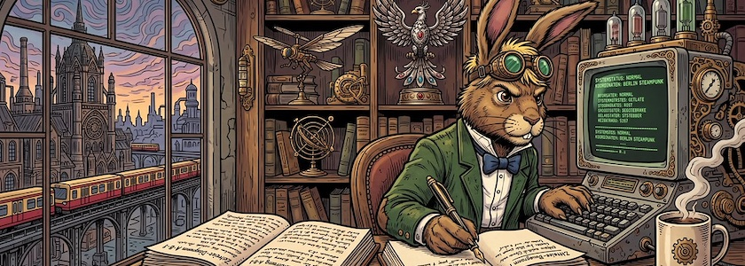

Natürlich wollte ich das Ergebnis meiner [gestrigen Bemühungen](https://kantel.github.io/posts/2026082301_twine_harlowe_wunderland/) auch auf diesen Seiten vorstellen. Dafür habe ich einfach ein `iframe` genutzt

~~~html
<iframe width="100%" height="600" src="alice1/"></iframe>
~~~

und die aus Twine exportierte HTML-Datei `index.html` genannt. (Der Name ist eigentlich Schall und Rauch, aber wenn die Datei `index.html` heißt, brauche ich ihren Namen hinter dem Verzeichnisnamen `alice1/` nicht noch einmal zu benennen). Und natürlich musste ich unterhalb des Verzeichnisses `alice1` auch das Verzeichnis `images` mit all den Bildern hochladen.

<iframe width="100%" height="600" src="alice1/"></iframe>

Um die Seite den neuen Größen anzupassen und nicht wieder in die Falle des [Wunderland-Debattierclubs](https://kantel.github.io/posts/2026081102_imagemaps_twine/) zu tappen, habe ich doch noch ein wenig an dem CSS der Twine-Seite geschraubt, um die Bilder wenigstens minimal responsiv zu gestalten:

~~~css
img {
  max-width: 80%;
  height: auto;
}
~~~

~~Wie man die Texte in Twine skaliert, darum kümmere ich mich später, wenn ich die Bedeutung der Parameter in `clamp()` und `calc()` [begriffen](https://kulturbanause.de/blog/skalierende-texte-und-schriftgroessen/) habe.&nbsp;🤓~~

<b style="color:red">[Update]</b>: Ich habe es gewagt, mit (nur die Zeile mit der `clamp()`-Funktion ist neu hinzugekommen)

~~~css
tw-story {
  	background-color: #1a1a1a;
  	color: #f0f0f0;
  	font-size: clamp(1.0em, 2.0vw, 1.75em);
}
~~~

habe ich auch so etwas wie Responsivität in die Textdarstellung bekommen. Bei besonders kleiner Darstellung scheint der verwendete (Default-) Font von Harlowe ein wenig überfordert, aber ansonsten sieht die Geschichte jetzt auch als `iframe` in diesem ~~Blog~~ Kritzelheft recht annehmbar aus. 

Zusätzlich haben die beiden bisher toten Enden der Geschichte mit »Noch einmal spielen?« einen Rücklink auf die Startseite spendiert bekommen, damit Ihr nicht im Daten-Nirwana hängen bleibt.

Außerdem habe ich diese Twine-Seiten auch auf meinen Neocities-Account [hochgeladen](https://kantel.neocities.org/twine/alice1/), denn sie gehören selbstverständlich auch zu den »Webseiten ohne Sinn und Verstand«.

---

**Bild**: *[Der Märzhase schreibt](https://www.flickr.com/photos/schockwellenreiter/55457151829/)*, erstellt mit [OpenArt](https://openart.ai/home). Prompt: »*The @March Hare sits at a desk in front of an antiquated, steampunk-style computer, typing on a keyboard. He wears a pair of aviator goggles, which he has pushed up onto his forehead. Lying on the desk in front of him is a gigantic notebook, in which he is jotting down notes with an old-fashioned fountain pen. Beside the keyboard sits a mug of steaming coffee. Shelves crammed with books and steampunk knick-knacks line the walls. A statue of the phoenix stands on one of the shelves. Through a window, one looks out upon a steampunk version of Berlin with an elevated old-fashioned railway in a steampunk style, but in the colors of the Berlin S-Bahn. Colored classic American comic style. Language: German. No speech bubbles, no textboxes. No German flags.*« Modell: Nano Banana&nbsp;2.