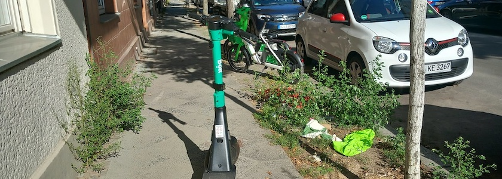

Nicht nur Neukölln, sondern noch mehr Berlin-Mitte leidet unter der E-Scooter-Pest: In Berlin sind in den ersten fünf Monaten des Jahres [mehr als 7.500 Verstöße wegen falsch geparkter E-Scooter](https://www.rbb24.de/panorama/beitrag/2026/08/berlin-e-scooter-falschparker-tausende-verstoesse.html) registriert worden. Das geht aus einer Antwort der Senatskanzlei auf eine Anfrage hervor, [die online einsehbar](https://pardok.parlament-berlin.de/starweb/adis/citat/VT/19/SchrAnfr/S19-26696.pdf) ist:

Demnach wurden etwas mehr als 6.000 der insgesamt 7.585 Ordnungswidrigkeitenanzeigen in Berlin-Mitte gestellt. Wie viele Barverwarnungen (Geldstrafen wegen geringfügiger Ordnungswidrigkeit) ausgestellt wurden, bleibt offen. Der Senatskanzlei zufolge wird darüber keine Statistik geführt, sie kämen zudem nur selten vor.

Die Senatskanzlei weist darauf hin, daß beim Abstellen von E-Scootern auf Gehwegen stets eine Mindestbreite von 1,50 Metern für Fußgänger freibleiben muss, an die sich offensichtlich niemand hält (siehe [Photo](https://www.flickr.com/photos/schockwellenreiter/55484415332/) oben).

Bei den meisten Ordnungswidrigkeiten handele es sich um Leihroller. In fast allen Fällen könne dadurch der genaue Verursacher nicht innerhalb einer Verjährungsfrist ermittelt werden -- die Verfahren würden daher überwiegend eingestellt. Die Anbieter des Rollers kommen dann mit einer Verwaltungsgebühr in Höhe von 25&nbsp;€ davon.

Bei diesen Peanuts wundert es mich nicht, daß die »Anbieter des Elektrokleinstfahrzeugs« nichts gegen die Falschparker unternehmen, die mit **ihren** Fahrzeugen (die die meiste Zeit sowieso nur nutzlos im Wege rumstehen) die Trottoirs zumüllen. Sie verdienen schließlich nicht schlecht daran. Die Folgen tragen die seh- und gehbehinderten Menschen dieser Stadt. Und der Senat wäscht seine Hände in Unschuld und zuckt bedauernd mit den Schultern.

---

**Photo** ([cc](https://creativecommons.org/licenses/by-sa/4.0/deed.de)) 2026: *[Jörg Kantel](http://cognitiones.kantel-chaos-team.de/cv.html)*