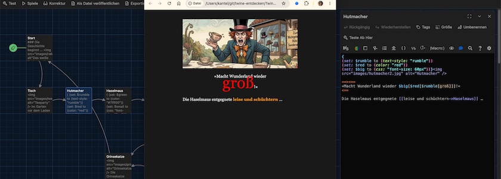

Nach meinem [letzten Ausflug](https://kantel.github.io/posts/2026082301_twine_harlowe_wunderland/) mit [Twine](http://cognitiones.kantel-chaos-team.de/multimedia/spieleprogrammierung/twine2.html) und [Harlowe](https://twine2.neocities.org/) ins Wunderland, möchte ich die Reise heute fortsetzen und weitere Features des Storyformats erkunden. Dafür habe ich Alice wieder an die Teetafel des verrückten Hutmachers geschickt.

Die Geschichte, die ich dieses Mal erzählen möchte, besteht aus acht Passagen und ich habe sie »Alice und die Teeparty« genannt. Die Startpassage bietet nicht viel Neues und sieht so aus:

~~~txt
### Die Geschichte beginnt …

Wie jeden Donnerstag ging Alice auf die Teeparty zu ihren Freunden, dem 
verrückten Hutmacher, dem Märzhasen und der Haselmaus. Sie war etwas mißmutig 
gestimmt, wußte aber nicht warum.

[[Weiter|Tisch]] …
~~~

Lediglich die erste Zeile bietet eine Überraschung: Die Auszeichungssprache von Harlowe besitzt viel Ähnlichkeit mit dem Markup von Markdown und daher bringen die drei Hashs (`###`) in Überschrift dritten Grades und werden nach `<h3>` übersetzt[^1].

[^1]: Harlowe besitzt auch noch einen eigenen, aus der Historie der Sprache entstandenen Markup-Code, zum Beispiel `//text//` für *italic* (`<i>`) und `''text''` für **bold** (`<b>`). Und so übersetzt folgerichtig auch `*text*` nach *emphasis* (`<em>`) und `**text**` nach **strong emphasis** (`<strong>`). Aber die Auswirkungen sind in der Regel identisch.

Die zweite Passage heißt »Tisch« und besteht aus diesem Inhalt:

~~~txt

Im Garten vor dem Laden des Hutmachers saßen alle schon um einen Tisch herum. 
Der Hutmacher hob seine Teetasse, prostete allen zu und 
[[schwadronierte->Hutmacher]] …
~~~

Sie ist eine Übergangspassage nur zur nächsten Passage »Hutmacher« führen soll, in der zum ersten Mal etwas wirklich Neues passiert:

~~~txt
{
(set: $rumble to (text-style: "rumble"))
(set: $red to (color: "red"))
(set: $big to (css: "font-size: 60px"))}

==><==
»Macht Wunderland wieder $big[$red[$rumble[groß]]]!«
<==

Die Haselmaus entgegnete [[leise und schüchtern->Haselmaus]] …
~~~

Hier fallen zuerst drei neue Dinge auf: *Makros*, *Variablen* und *Hooks*: Makros sind Anweisungen, die in runden Klammern stehen und deren Name mit einem Doppelpunkt abgeschlossen wird. Das häufigste Makro ist `(set: irgendetwas)`, mit dem unter anderen die Inhalte von Variablen gesetzt werden, zum Beispiel wird mit

~~~txt
(set: $name to "Alice")
~~~

die Variable `$name` mit dem Wert (dem String) `"Alice"` belegt. Variable erkennt man in Harlowe daran, daß ihnen ein Dollarzeichen (`$`) vorangestellt wird, wie in meinem Beispiel bei `$name`.

Hooks sind Textteile, die in irgendeiner Weise speziell behandelt werden sollen. In einfachster Form wird die Anweisung (ein Makro) in runden Klammern vorangestellt und der Text, für den der Hook bestimmt ist, folgt in eckigen Klammern[^2], zum Beispiel so:

[^2]: Es gibt in Harlowe aber auch *benannte* Hooks *(named hooks)*, bei denen Makros und Hooks an getrennten Stellen im Text auftauchen. Doch darüber mehr in einem späteren Tutorial.

~~~txt
(font: "Courier New")[Dieser Text wird in Courier geschrieben]
~~~

Sollen jedoch – wie in obigem Fall, mehrere Hooks auf einen Textabschnitt wirken, müssen sie geschachtelt werden und man verliert leicht die Übersicht. Daher kann man auch Hooks mithilfe des `set:`-Makros einer Variablen zuweisen und diese dann schachteln. Nach der entsprechenden Initialisierung wird dann das große, rote und rumpelnde Wort »groß« durch folgende Anweisung in Twine erstellt:

~~~txt
(set: $rumble to (text-style: "rumble"))
(set: $red to (color: "red"))
(set: $big to (css: "font-size: 60px"))

$big[$red[$rumble[groß]]]
~~~

Das sieht doch übersichtlicher aus als:

~~~txt
(css: "font-size: 60px")[(color: "red")[(text-style: "rumble")[groß]]]
~~~

Diese Anweisung funktioniert natürlich auch und in beiden Fällen müßt Ihr darauf achten, daß die offenen wie auch geschlossenen eckigen Klammern paarweise und an den richtigen Stellen auftreten.

Die geschweiften Klammern in obiger Passage sorgen dafür, daß die mehrzeiligen Makro-Anweisungen als eine einzige Zeile behandelt werden. Würdet Ihr sie nämlich weglassen, hättet Ihr eine große, leere, schwarze Fläche im Kopf Eurer Seite.

Die Anweisung `=><=` zentriert alle folgenden Textzeilen und die Anweisung `<==` schreibt alles, was folgt wieder linksbündig (das ist der Default). Mit `==>` könnt Ihr Euren Text rechtsbündig setzen und mit `<==>` erzwingt Ihr einen Blocksatz[^3].

[^3]: Diese Pfeile sind noch mächtiger, mit ihnen kann man auch die Breite der Ränder festlegen. So erzwingt zum Beispiel ein `===><=` daß der linke Rand $3/4$ der Randbreite einnimmt und der rechte Rand nur $1/4$.

Nach diesen Erläuterungen sollten Euch die Anweisungen in der nächsten Passage (»Haselmaus«) verständlich sein:

~~~txt
{
(set: $green to (color: "#7fff00"))
(set: $small to (css: "font-size: 12px"))}

==><==
»Ich fand es aber $small[$green[klein]] viel schöner.«
<==

Plötzlich hoppelte aufgeregt das [[weiße Kaninchen->Kaninchen]] in die Szene …
~~~

Farben können natürlich nicht nur mit CSS-Namen definiert werden, sondern zum Beispiel auch mit ihren Hex-Werten (hier zum Beispiel `#7fff00` für ein leuchtendes Grün).

Die vier letzten Passagen (»Kaninchen«, »Flamingo«, »Raupe« und »Grinsekatze«) bringen nichts Neues und sind hier nur der Vollständigkeit halber aufgeführt. Erst die Passage »Kaninchen«,

~~~txt

==><==
»Ich komme viel zu spät!«
<==

Sprach's und sprang ganz aufgeregt und dabei laut »zu spät, zu spät …« 
jammernd wieder davon.

[[Weiter->Flamingo]] …
~~~

dann die Passage »Flamingo«, in der die einzige Verzweigung in dieser Geschichte vorkommt,

~~~txt

Alice dachte, daß ihr dies zu dumm sei. Außerdem wusste sie nicht, wieso sie auf 
einmal einen Flamingo im Arm hatte. Sie überlegte, ob sie ihren 
[[geheimnisvollen, blauen Freund->Raupe]] besuchen oder mit der 
[[Grinsekatze->Grinsekatze]] plaudern solle.
~~~

nämlich der Abstecher zur »Raupe«,

~~~txt

Rauch … Rauch … Rauch …

Doch die Raupe war zu bekifft für ein vernünftiges Gespräch. Alice verabschiedete 
sich und versuchte dann doch, die [[Grinsekatze->Grinsekatze]] zu finden.
~~~

um sich schließlich bei der »Grinsekatze« wieder zusammenzufinden:

~~~txt

Die Grinsekatze materialisierte sich unverhofft in einer Astgabel, sagte »Schön, daß 
Du mich mal wieder besuchen willst« und verschwand ganz langsam wieder …

Das ist das Ende.

Alles auf [[Anfang->Start]]?
~~~

Diese kleine Geschichte ist natürlich kein literarisches Meisterwerk, sondern soll nur zeigen, wie man mit wenigen Zeilen seine Twine-Geschichten aufpeppen kann. Ihr habt natürlich ein Recht darauf, dieses Geschichtchen in seiner vollen Schönheit auch auf diesen Seiten durchspielen zu können:

<iframe width="100%" height="540" src="alice2/"></iframe>

Die Bilder für diese Geschichte habe ich wieder von einer gekünstelten Intelligezia ([OpenArt](https://openart.ai/home)) mit Hilfe von NanoBanana&nbsp;2 zusammenbasteln lassen.

Ich habe das kleine Tutorial sowohl als [HTML-Datei](https://github.com/kantel/twine-entdecken/blob/master/Twine/alicereloadedharlowe/alice2/alice_tutorial_2.html) wie auch als [Twee-Datei](https://github.com/kantel/twine-entdecken/blob/master/Twine/alicereloadedharlowe/alice2/alice_tutorial_2.twee) mit allen [Assets](https://github.com/kantel/twine-entdecken/tree/master/Twine/alicereloadedharlowe/alice2/images) auf meinem GitHub-Account hochgeladen. *Habt Spaß damit!*

Außerdem habe ich diese Twine-Seiten auch auf meinen Neocities-Account [veröffentlicht](https://kantel.neocities.org/twine/alice2/), denn sie gehören selbstverständlich auch zu den »Webseiten ohne Sinn und Verstand« und daher sollten sie auch dort zu finden sein.

### Was bisher geschah

Meine Twine-Harlowe-Reihe besteht bisher aus diesen fünf Beiträgen:

1. Der Wunderland-Debattierclub: [Klickbare Imagemaps in Twine](https://kantel.github.io/posts/2026081102_imagemaps_twine/)
2. [Zurück ins Wunderland (schon wieder)](https://kantel.github.io/posts/2026082001_zurueck_ins_wunderland/) und dieses Mal mit Harlowe
3. Alles auf Anfang: [Mit Twine und Harlowe ins Wunderland](https://kantel.github.io/posts/2026082301_twine_harlowe_wunderland/)
4. Aus meiner Webwerkstatt: [Twine-Stories in die eigenen Seiten einbinden](https://kantel.github.io/posts/2026082401_twine_einbinden/)
5. Alice und die Teeparty: Mit Twine und Harlowe ins Wunderland (Teil 2)

Fortsetzung folgt …
