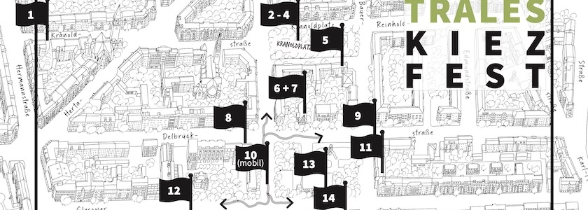

Am Freitag, den **4. September 2026 von 15:30 Uhr bis 17:30 Uhr** stellen wieder viele Neubritzer Einrichtungen und Projekte aus dem Gebiet zwischen Hermannstraße, Karl-Marx-Straße, Kranoldstraße/Kranoldplatz und Jahnstraße ihre Stühle und Bänke vor die Türe und bieten neben Informationen über ihre Einrichtung auch immer eine Spielstation für Kinder an.

Es ist das [**6. Dezentrale Kiezfest**](https://qm-glasower-strasse.de/6-dezentrales-kiezfest-mit-kinder-kiez-rallye/) in Folge und findet in Form einer **Kinder-Kiez-Rallye** statt. An 17 Stationen, organisiert von 15 Initiativen im Kiez, gibt es Spiel, Spaß oder Sport für Kinder und Informationen über die Einrichtungen für ihre erwachsenen Begleiterinnen oder Begleiter.

Und beim Kinder- und Jugendbüro Neukölln kann der Nachwuchs bei einer U16-Wahl mitmachen und lernen, wie Demokratie funktioniert. Das Projekt »[**Habici**](https://qm-glasower-strasse.de/vorgestellt-das-projekt-habibici-teilhabe-durch-aktive-mobilitaet/)« ist mit der mobilen Fahrradwerkstatt unterwegs und das Projekt »[**MusiKIEZieren**](https://qm-glasower-strasse.de/vorgestellt-das-projekt-musikiezieren/)« lädt zum Mitmachen bei Capoeira ein.

An den vielen anderen Stationen erwarten die Kinder Musik, Bewegungsspiele, Kreativangebote, Experimente, Dosenwurf, Glücksrad, Eierlauf, Kinderschminken und einige andere Überraschungsangebote.

Die Kinder können sich an jeder Station einen Stempel auf einem Laufzettel abholen. Wenn sie **mindestens fünf Stempel** auf der Karte haben, gibt es einen kleinen Preis, den sie sich im Quartiersmanagements-Büro in der Juliusstraße 14a bis 17:30 Uhr abholen können. Das ist übrigens die Station 15, wo man sich auch Klebetattoos machen lassen kann.

Veranstaltet wird das Dezentrale Kiezfest auch in diesem Jahr von [**proNeubritz e.V.**](https://proneubritz.jimdofree.com/) unter Mitwirkung der zahlreichen, teilnehmenden Initiativen und mit Unterstützung durch das [**Quartiersmanagement Glasower Straße**](https://qm-glasower-strasse.de/6-dezentrales-kiezfest-mit-kinder-kiez-rallye/).

Wir wünschen allen Kindern und allen Nachbarinnen und Nachbarn viel Spaß bei diesem Fest.

Und im Anschluss des Festes beginnt im Rahmen des Projekts »MusiKIEZieren« ab **18:30 Uhr** ein [**Konzert auf dem Kranoldplatz**](https://qm-glasower-strasse.de/musik-im-kiez-mit-folk-rap-und-postpunk/) mit den Bands »Lee«, »Nurifeles« und »Luana Madikera & fam.«. Der Eintritt ist frei.

**Caveat**: Ich bin [Vorstandsmitglied von proNeubritz e.V.](https://proneubritz.jimdofree.com/vorstand/) und Mitorganisator dieses Festes. Daher ist dieser Beitrag schamlose Eigenwerbung. 😜