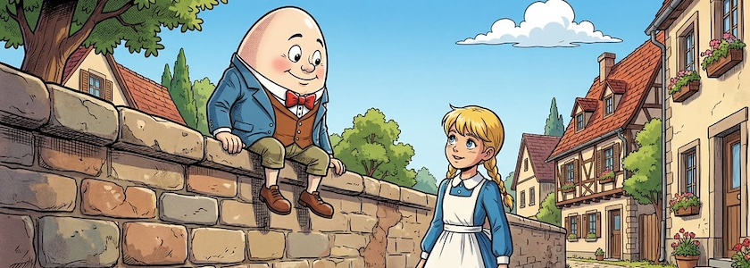
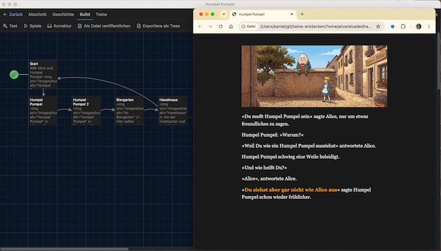

Heute möchte ich meine Reise mit Alice durch das Wunderland von [Twine](http://cognitiones.kantel-chaos-team.de/multimedia/spieleprogrammierung/twine2.html), der netten, kleinen, freien Engine (nicht nur) für interaktive Geschichten und dem (Default-) Storyformat [Harlowe](https://twine2.neocities.org/) fortsetzen. Ich möchte erkunden, wie man innerhalb einer Passage Texte hinzufügen kann, ohne daß die Passage neu geladen werden muss.

Dafür habe ich eine kleine Geschichte entwickelt, die gerade einmal aus fünf Passagen besteht. In der ersten Passage (`Start`) passiert noch nichts neues:

~~~html
### Alice und Humpel Pumpel

Alice strolchte mal wieder durch das Wunderland und kam in ein Dorf mit einer großen, 
steineren Mauer.

Auf dieser Mauer saß ein seltsames Wesen und [[grinste Alice breit an->Humpel Pumpel]].
~~~

Hier wird nur in die Geschichte eingeführt und auf die nächste Passage ( `Humpel Pumpel`) verlinkt:

~~~html

»Du mußt Humpel Pumpel sein« sagte Alice, nur um etwas freundliches zu sagen.

Humpel Pumpel: (link: "»Warum?«")[»Warum?«

»Weil Du wie ein Humpel Pumpel aussiehst« antwortete Alice.

Humpel Pumpel schwieg eine Weile beleidigt.

(link: "»Und wie heißt Du?«")[»Und wie heißt Du?«

»Alice«, antwortete Alice.

»[[Du siehst aber gar nicht wie Alice aus->Humpel Pumpel 2]]« sagte Humpel Pumpel 
schon wieder fröhlicher.]]
~~~

Hier seht Ihr das Geheimnis der neu auftauchenden Textzeilen: Es ist das `link:`-Makro. Es ersetzt den Linktext[^1] durch den Text, der in dem *Hook* steht, der an dem Makro angehängt wurde:

[^1]: Der Linktext im `link:`-Makro muss **immer** in Hochkommata stehen, also entweder `"linktext"` oder `'linktext'`.

~~~txt
(link: "Linktext")[Text, der den Linktext ersetzen soll]
~~~

Zu beachten dabei ist, daß der Linktext komplett verschwindet, nachdem der Link angeklickt wurde. Aus

~~~txt
Du stehst in einem Raum (link: "mit einer geheimnisvollen Tür")[mit einem tiefen, 
schwarzen Loch, aus dem ein gefährliches Grunzen klingt].
~~~

wird zuerst[^2]:

[^2]: Die Linkfarbe ist natürlich nur orange, wenn Ihr die Stylesheets aus dem [ersten](https://kantel.github.io/posts/2026082301_twine_harlowe_wunderland/) Tutorial der Reihe (und seinem [Anhang](https://kantel.github.io/posts/2026082401_twine_einbinden/)) eingebunden habt, ansonsten ist sie blau.

>Du stehst in einem Raum mit einer geheimnisvollen Tür.

Und wenn Ihr den Link angeklickt habt:

>Du stehst in einem Raum mit einem tiefen, schwarzen Loch, aus dem ein gefährliches Grunzen klingt.

Beachtet, daß der Punkt am Ende der Passage weder zum Linkmakro noch zum Hook gehört. Er wird daher unabhängig davon angezeigt, ob der Link geklickt wurde, oder nicht (also immer).

Der Linktext mitsamt der zugehörigen Link-Formatierung verschwindet also und wird durch den Text im Hook ersetzt. Daraus folgt, wenn der Linktext bleiben soll, müsst ihr ihn im Hook noch einmal wiederholen. Ich habe davon reichlich Gebrauch gemacht, zum Beispiel hier:

~~~html
Humpel Pumpel: (link: "»Warum?«")[»Warum?«

»Weil Du wie ein Humpel Pumpel aussiehst« antwortete Alice.

Humpel Pumpel schwieg eine Weile beleidigt.]
~~~

Dadurch verschwindet das »Warum?« im Linktext nicht, aber es erscheint nicht mehr als Link.

Der Text in den Hooks kann auch *Whitespaces* und Zeilenumbrüche enthalten. Sie werden eins zu eins von Twine übernommen und dargestellt, sobald der Hook aktiv ist (das `link:`-Makro angeklickt wurde).

In Harlowe kann man Makros schachteln. Der Hook nach dem `link:`-Makro darf also auch wieder ein `link:`-Makro enthalten (und natürlich auch andere Makros und/oder Links). Dabei müsst ihr darauf achten, daß alle Hooks korrekt mit ihrer eckigen Klammer am Ende geschlossen werden müssen. Ich würde es daher mit der Verschachtelung nicht übertreiben, weil sonst die Angelegenheit sehr leicht und schnell unübersichtlich wird[^3].

[^3]: Ich habe in dieser und der folgenden Beispielpassage jeweils zwei `link:`-Makros ineinander verschachtelt und ich hatte dabei schon mit etlichen (Flüchtigkeits-) Fehlern zu kämpfen.

Weil es so schön war, habe ich das (geschachtelte) `link:`-Makro in der nächsten Passage `Humpel Pumpel 2` noch einmal genutzt:

~~~html

Darauf wußte Alice keine Antwort. »Wenn Du weiter so auf der Mauer zappelst, 
wirst Du noch herunterfallen« sagte sie schließlich, nur um überhaupt 
etwas zu sagen.

Humpel Pumpel: (link: "»Nein!«")[»Nein!«

Alice: (link: "»Doch!«")[»Doch!«

Humpel Pumpel: »Oh!«

Alice schlich sich an dem heruntergefallenen Humpel Pumpel vorbei und ging 
weiter in das Dorf. In der Mitte des Dorfes unter einem großen Baum war ein 
[[Biergarten->Biergarten]].]]
~~~

Diese Passage ist etwas kompakter geraten und daher kann man hier besser erkennen, wie die Makros ineinander verschachtelt sind.

Die letzten beiden Passagen bringen nichts neues, sondern dienen nur dazu, die Geschichte zu einem Ende zu bringen. Also erst einmal die Passage `Biergarten`:

~~~html

Hier saßen seltsamerweise wieder ihre alten Freunde, der Märzhase, der 
verrückte Hutmacher und die Haselmaus an einem Tisch und begrüßten sie 
lautstark. Alice war verwirrt, [[blieb aber noch eine Weile->Haselmaus]].
~~~

Und als letztes die Passage `Haselmaus`:

~~~html

Als der Hutmacher und der Märzhase jedoch anfingen, die Haselmaus kopfüber 
in den Teetopf zu stülpen, hatte sie genug. Sie beschloß, die Party zu verlassen.

Hier ist die Geschichte zu Ende.

[[Noch einmal spielen->Start]]?
~~~

Und hier ist dieses Twine-Spielchen in seiner schlichten Schönheit, [eingebettet](https://kantel.github.io/posts/2026082401_twine_einbinden/) in diese Seiten:

<iframe width="100%" height="660" src="alice3/"></iframe>

Auch die Bilder für diese Geschichte habe ich wieder von einer gekünstelten Intelligenzia ([OpenArt](https://openart.ai/home)) mit Hilfe von NanoBanana&nbsp;2 zusammenbasteln lassen. Und ich habe dieses kleine Tutorial wieder sowohl als [HTML-Datei](https://github.com/kantel/twine-entdecken/blob/master/Twine/alicereloadedharlowe/humpelpumpel/Humpel%20Pumpel.html) wie auch als [Twee-Datei](https://github.com/kantel/twine-entdecken/blob/master/Twine/alicereloadedharlowe/humpelpumpel/Humpel%20Pumpel.twee) mit allen [Assets](https://github.com/kantel/twine-entdecken/tree/master/Twine/alicereloadedharlowe/humpelpumpel/images) auf meinem GitHub-Account hochgeladen. *Habt Spaß damit!*

Außerdem habe ich diese Twine-Seiten -- wie die anderen auch -- auf meinen Neocities-Account [veröffentlicht](https://kantel.neocities.org/twine/alice3/).

### Was bisher geschah

Meine Twine-Harlowe-Reihe besteht bisher aus diesen sechs Beiträgen:

1. Der Wunderland-Debattierclub: [Klickbare Imagemaps in Twine](https://kantel.github.io/posts/2026081102_imagemaps_twine/)
2. [Zurück ins Wunderland (schon wieder)](https://kantel.github.io/posts/2026082001_zurueck_ins_wunderland/) und dieses Mal mit Harlowe
3. Alles auf Anfang: [Mit Twine und Harlowe ins Wunderland](https://kantel.github.io/posts/2026082301_twine_harlowe_wunderland/)
4. Aus meiner Webwerkstatt: [Twine-Stories in die eigenen Seiten einbinden](https://kantel.github.io/posts/2026082401_twine_einbinden/)
5. [Alice und die Teeparty](https://kantel.github.io/posts/2026082601_alice_teeparty/): Mit Twine und Harlowe ins Wunderland (Teil 2)
6. Alice und Humpel Pumpel: Mit Twine und Harlowe ins Wunderland (Teil 3)

Fortsetzung folgt …

---

**Bild**: *[Alice und Humpel Pumpel](https://www.flickr.com/photos/schockwellenreiter/55199135675/)*, erstellt mit [OpenArt](https://openart.ai/home). Prompt: »*@Humpelpumpel sits on a wall in a picturesque little village. @Alice stands below, in front of the wall, looking at him friendly but questioningly. It is a beautiful, sunny day with few clouds in the sky. Colored Franco-Belgian comic style. Language German. No speech bubbles, no textboxes, no headlines. Close up.*« Modell: Nano Banana&nbsp;2.

