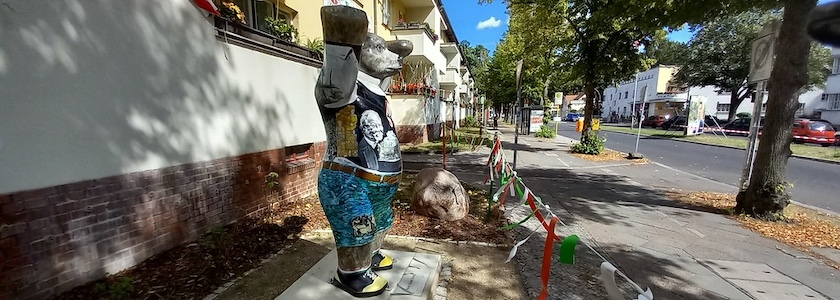
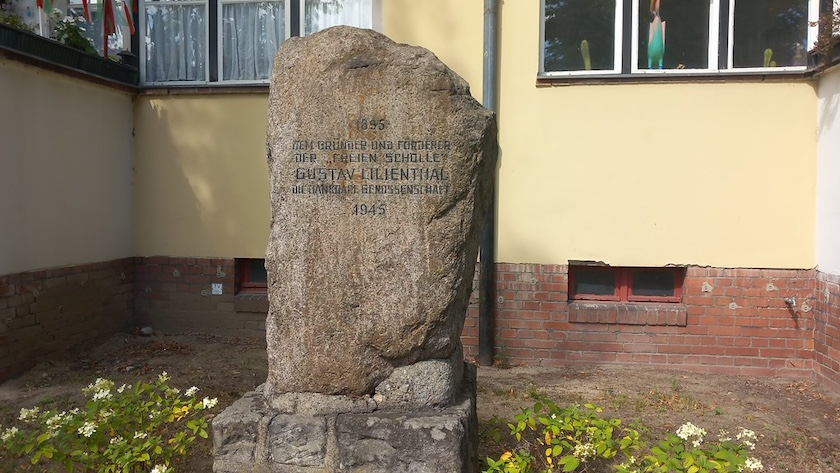
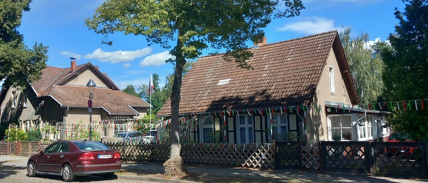
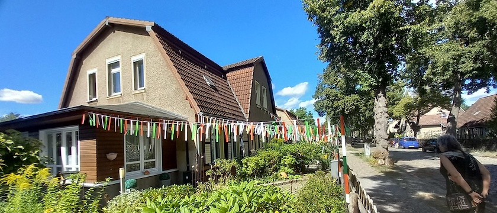
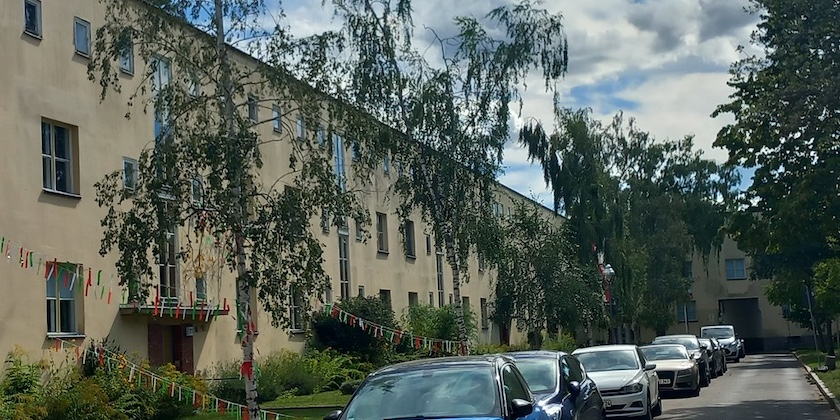
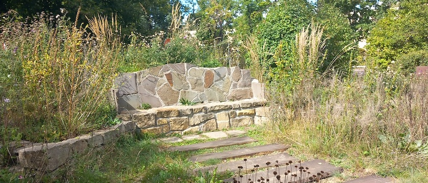
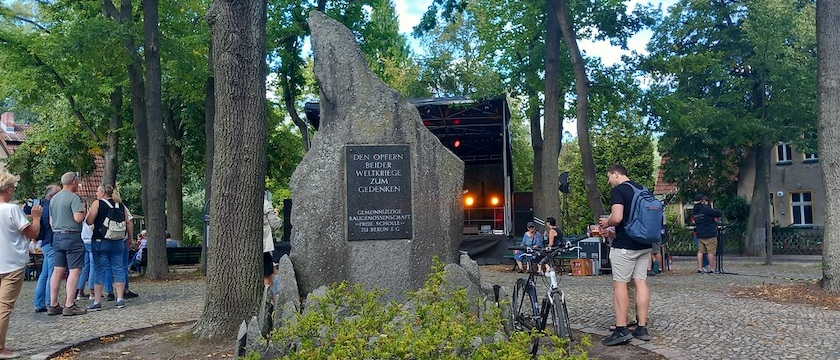

Am letzten Augustwochenende waren die liebste aller Freundinnen und ich mal wieder in Tegel unterwegs und besuchten das Schollenfest der [Baugenossenschaft »Freie Scholle«](https://www.freiescholle.de/).

Der Architekt, Baumeister und Flugpionier *Gustav Lilienthal* wollte die aus England stammende Idee einer Gartenstadt und genossenschaftlichen Siedlung verwirklichen. Das führte im August 1895 durch 14 Gründungsmitglieder zur Gründung einer der ältesten Baugenossenschaften Deutschlands. Der Name »Freie Scholle« war Programm: Das freie Leben auf eigenem Grund und Boden ohne kapitalistische Ausbeutung. Schon zu Beginn wurde die Idee dieser Genossenschaft von vielen Seiten angefeindet. Der Grundbesitzerverein befürchtete, die Bodenpreise in Tegel könnten wegen der »roten« Siedlung ins Bodenlose fallen und die Kirchengemeinde in Tegel fürchtete um ihre Schäfchen.

Aber auch den Sozialdemokraten waren die bürgerlich-liberalen Vorstellungen der Genossenschaftsgründer suspekt: Wer mühsam sein Eigentum zusammenspart und sich in jeder freien Stunde um Haus und Garten kümmern muss, hat keine Zeit mehr für den Klassenkampf. Erst die Gründung der Arbeitergenossenschaft »Paradies« 1902 erfolgte durch aktive Mitwirkung der SPD.

Allen Widerständen zum Trotz erwarb man ein Grundstück zwischen Tegel und Waidmannslust und 1900 wurden -- nahe am Tegeler Fließ -- in der Egidystraße 22 und 26 die ersten vier Doppelhäuser eingeweiht. 1901 sah sich die Genossenschaft wegen eines finanziellen Engpasses gezwungen, Staatsgelder als Darlehen entgegenzunehmen. Die mit öffentlichen Mitteln erbauten Häuser blieben zu einem Drittel für Beamte reserviert. Das führte zum Konflikt mit vielen Mitgliedern der Genossenschaft. Auch Lilienthal zog sich 1903 (nach anderen Quellen 1911) verärgert aus der Genossenschaft zurück und wirkte erst 1918 erneut im Beirat mit.

In den 1920 Jahren kooperierte die Genossenschaft mit der Gemeinnützigen Heimstätten Aktiengesellschaft für Angestellte (Gehag), einer Gesellschaft des Allgemeinen Deutschen Gewerkschaftsbundes. *Bruno Taut*, damals Chefarchitekt der Gehag, betreute 1925-1932 die Erweiterungsbauten. Es entstand der »Lilienhof«, später »Schollenhof«, ein geschlossenes Karree mit öffentlichen Freiflächen, funktionalen Grundrissen und schlichter Fassadengestaltung. Er war ein Beispiel für das »Neue Bauen« der zwanziger Jahre und ist bis heute ein Markenzeichen der »Freien Scholle«.

Allerdings musste hier auf weitere Grundsätze Lilienthals verzichtet werden: Das Wohnen auf eigenem Grund und Boden und die Bewirtschaftung eines Landstücks. Vom Traum der Gründer war nur ein (Gemeinschafts-) Gärtchen geblieben, und nun wurde sogar mehrgeschossig gebaut.

Doch wenn auch die Pläne der Gründer nicht in allen Teilen Wirklichkeit wurden, entstand doch eine Siedlung im Grünen, deren Baugenossen untereinander stärker verbunden sind als Großstädter üblicherweise. Davon zeugt auch das seit 1900 jährlich stattfindende »Schollenfest« (ursprünglich ein Erntedankfest), das älteste Volksfest Berlins, das von den Beiratsmitgliedern der Genossenschaft ehrenamtlich organisiert wird.

## Verwendete Quellen

- Renate Amman, Barbara von Neumann-Cosel: *[Freie Scholle. Ein Name wird Programm. 100 Jahre Gemeinnützige Baugenossenschaft »Freie Scholle« zu Berlin eG](https://www.freiescholle.de/ueber-uns/historie/buch-ein-name-wird-programm/)*, Berlin (Edition Arkadien) 1995
- Baugenossenschaft »Freie Scholle«: *[Siedlung Tegel](https://www.freiescholle.de/siedlungen/tegel/)*, aufgerufen am 2.&nbsp;September&nbsp;2026
- Uta Grüttner: *[»Hier weg - niemals!«. Baugenossenschaft »Freie Scholle« in Tegel feiert 100. Geburtstag](https://www.freiescholle.de/ueber-uns/historie/Zeitung-100-jahre-freie-scholle-1995/)*, Berliner Zeitung vom 8.&nbsp;Mai&nbsp;1995, Nachdruck auf den Seiten der Baugenossenschaft »Freie Scholle«
- Gerd Koischwitz: *Sechs Dörfer in Sumpf und Sand. Geschichte des Bezirkes Reinickendorf von Berlin*, Berlin (Verlag »Der Nord-Berliner«) 1984, S. 213ff.
- Wikipedia: *[Freie Scholle (Berlin-Tegel)](https://de.wikipedia.org/wiki/Freie_Scholle_(Berlin-Tegel))*, aufgerufen am 2.&nbsp;September&nbsp;2026
- Wikipedia: *[Gustav Lilienthal](https://de.wikipedia.org/wiki/Gustav_Lilienthal)*, aufgerufen am 2.&nbsp;September&nbsp;2026
- Wikipedia: *[Bruno Taut](https://de.wikipedia.org/wiki/Bruno_Taut)*, aufgerufen am 2.&nbsp;September&nbsp;2026
- Michale Zaremba: *Reinickendorf im Wandel der Geschichte. »Laß' hinter dir, was trüb und wild …«* Berlin (be.bra verlag) 1999, S. 54ff.

---

**Photos** ([cc](https://creativecommons.org/licenses/by-sa/4.0/deed.de)) 2026: *[Jörg Kantel](http://cognitiones.kantel-chaos-team.de/cv.html)*