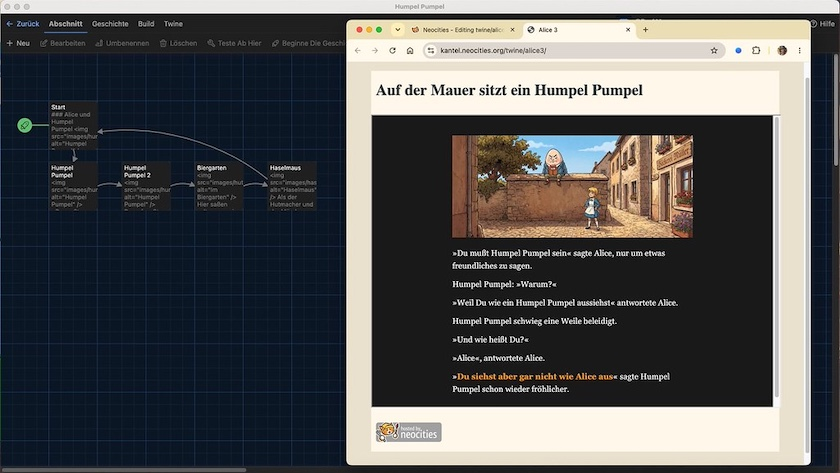

Alles neu macht der September. Und daher habe ich den Seiten mit meinen Twine-Tutorials auf Neocities ein Redesign spendiert. Ziel sollte es sein, daß sich das Layout ein wenig meinen bisherigen Neocities-Seiten anpasst und daß die Nutzerin oder der Nutzer, wenn sie auf den Badge links unten klicken, wieder zurück auf [meine Neocities-Startseite](https://kantel.neocities.org/) kommen.

Daher habe ich die [hier gemachten Erfahrungen](https://kantel.github.io/posts/2026082401_twine_einbinden/) auf Neocities angewandt und die Twine-Stories als `iframe` in eine »normale«, kleine HTML-Seite eingebunden:

~~~html
<!DOCTYPE html>
<html>
  <head>
    <meta charset="UTF-8">
    <meta name="viewport" content="width=device-width, initial-scale=1.0">
    <title>Alice 3</title>
    <link href="./../style.css" rel="stylesheet" type="text/css" media="all">
  </head>
  <body>
  

    <header>
        <h1>Auf der Mauer sitzt ein Humpel Pumpel</h1>
    </header>
    
    <section>
      <iframe width="100%" height="600" src="./alice3.html"></iframe>
    </section>
    
    <footer>
        

          
        

      </footer>
  
 <!-- container -->
  </body>
</html>
~~~

Hier müssen nur der Titel, der Header und im `iframe` der Name der einzubindenden Datei und die Höhe `height` jeweils angepasst werden.

Die Datei `style.css` liegt ein Verzeichnis höher, da jede Twine-Story von mir ein eigenes Verzeichnis spendiert bekommen hat, ich aber nicht für jede eine eigenes CSS schreiben wollte. Sie wird daher mit

~~~html
<link href="./../style.css" rel="stylesheet" type="text/css" media="all">
~~~

aufgerufen.

Das Bild des Badges und die Startseite liegen sogar zwei Verzeichnisse höher, daher sehr viele `./../../`. Das sieht dann so aus:

~~~html

~~~

Die `style.css` ist eine Abwandlung der `style.css` meiner Neocities-Startseite, wie ich sie hier schon [beschrieben (und erläutert)](https://kantel.github.io/posts/2026072901_back_to_the_roots/) hatte:

~~~css
body {
  background: #ede4d4;
  color: #354145;
}

header, nav, section {
  border: none;
}

header {
  grid-row: 1 / 2;
  grid-column: 1 / 3;
  padding-left: 10px;
}

section {
  grid-row: 2 / 3;
  grid-column: 1 / 3;
  height: max-content;
}

footer {
  grid-row: 3 / 4;
  grid-column: 1 / 3;
  padding-left: 10px;
}

.container {
  max-width: 840px;
  margin: 50px auto;
  display: grid;
  grid-gap: 10px;
  grid-template-columns: 200px auto;
  background: #fef8ec;
}
~~~

Die URLs der einzelnen Stories sind gleich geblieben. Ihr könnt also die ersten drei Tutorials

- Mit Twine und Harlowe ins Wunderland (1): [Der erste Ausflug ins Wunderland](https://kantel.neocities.org/twine/alice1/)
- Mit Twine und Harlowe ins Wunderland (2): [Alice und die Teeparty](https://kantel.neocities.org/twine/alice2/)
- Mit Twine und Harlowe ins Wunderland (3): [Alice und Humpel Pumpel](https://kantel.neocities.org/twine/alice3/)

immer noch unter den alten, obigen Links erreichen. Nur, daß die Seiten jetzt besser aussehen und der Badge links unten auf der Seite Euch einen Ausgang auf meine [Neocities-Startseite](https://kantel.neocities.org/) liefert.

Mir hat das Spielen mit HTML und CSS viel Spaß gemacht. Ich werde sicher noch mehr mit meinem Neocities-Account anstellen. Wartet nur ab&nbsp;… *Still digging!*
