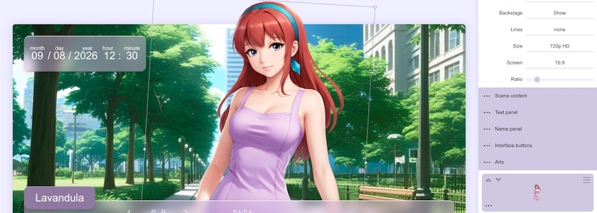
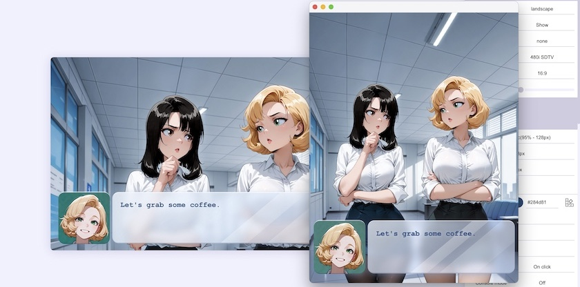

Ich weiß nicht, woran es liegt, dass ich die Updates von [Tuesday&nbsp;JS](http://cognitiones.kantel-chaos-team.de/multimedia/spieleprogrammierung/tuesdayjs.html) ständig [verpasse](https://kantel.github.io/posts/2026031703_tuesday_js_release_59/), der kleinen und freien (Apache-2.0-Lizenz) JavaScript-basierten Engine für interaktive Geschichten und *Visual Novels*, die mir allein schon deswegen so sympathisch ist, weil ihre Oberfläche mich immer ein wenig an [Twine](http://cognitiones.kantel-chaos-team.de/multimedia/spieleprogrammierung/twine2.html) erinnert.

So auch dieses Mal: Nur die Beschäftigung der letzten Tage mit Twine hat mich darauf gestoßen, dass ich mal wieder nach Tuesday&nbsp;JS schauen sollte. Und wieder war ich zu spät. Nicht nur, dass die [Homepage der Software](https://kirilllive.github.io/tuesday-js/#de) komplett überarbeitet wurde, sondern schon vor knapp einem viertel Jahr, am 13.&nbsp;Juli, wurde die [Version&nbsp;60](https://github.com/Kirilllive/tuesday-js/releases/tag/60.0.0) veröffentlicht.

Zwar ist es nur ein kleineres Update mit ein paar Bugfixes, wenigen Änderungen und Geschwindigkeitsverbesserungen, aber schon die Tatsache, dass Tuesday&nbsp;JS schon seit dem [letzen Update](https://kantel.github.io/posts/2026031703_tuesday_js_release_59/) die Responsivität der Seiten massiv verbessert hat, erinnert mich schmerzlich daran, dass -- gerade weil ich mit der [(Wieder-) Entdeckung des IndieWebs](https://kantel.github.io/#category=IndieWeb), aber auch mit meinen jüngsten Twine-Tutorials, verschärft meine HTML- und CSS-Kenntnisse auffrischen will -- dies doch die Gelegenheit wäre, mein ständig verschobenes Vorhaben, wieder etwas mit der Engine anzustellen, endlich wahr zu machen. Vielleicht schaffe ich es, mich parallel mit [Twine](https://kantel.github.io/#category=Twine) und [Tuesday&nbsp;JS](https://kantel.github.io/#category=Tuesday%20JS) zu beschäftigen. *Still digging!*