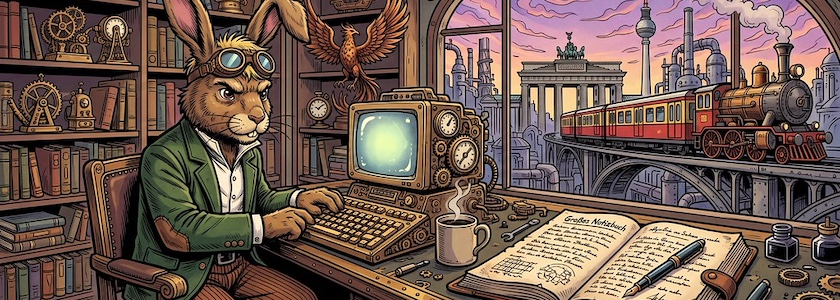
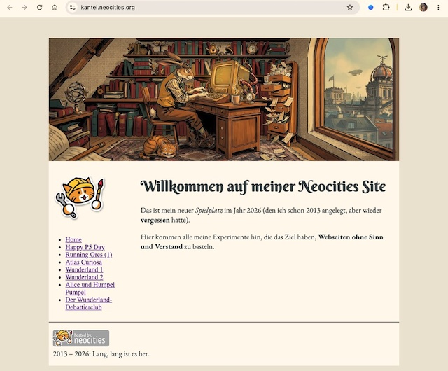
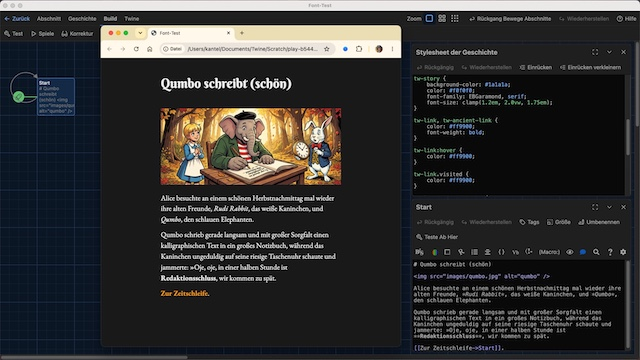

Meine Reisen durch das Wunderland von [Twine](http://cognitiones.kantel-chaos-team.de/multimedia/spieleprogrammierung/twine2.html), der kleinen, freien Engine für interaktive Geschichten (und vielem mehr) und dem (Default-) Storyformat [Harlowe](https://twine2.neocities.org/) gehen weiter. In diesem Tutorial möchte ich erkunden, wie ich andere Schriftarten (Fonts), als die, die die Browser üblicherweise zur Verfügung stellen, in meinen Twine-Geschichten nutzen kann.

Als Quelle für Fonts, die man frei verwenden kann, fällt einem als erstes meistens [Google Fonts](https://de.wikipedia.org/wiki/Google_Fonts) ein. Denn dort findet die geneigte Nutzerin oder der geneigte Nutzer zur Zeit fast 2.000 Schriftarten, die unter einer freien Lizenz (meist [SIL Open Font License Version 1.1](https://openfontlicense.org/open-font-license-official-text/)) zur kostenlosen Nutzung Verfügung gestellt werden. Besonders bequem ist es, dass man mit einem Klick auf `<> Get embed code` ein paar Zeilen HTML zur Verfügung gestellt bekommt, die man nur in die eigene Webseite hineinzukopieren braucht, und schon stehen die ausgewählten Fonts zur Verfgung -- ohne dass man die Fonts herunterladen und auf seinem eigenen Server wieder hochladen und einbinden muss.

Dieses »dynamische Einbindung« genannte Verfahren ist sehr bequem, hat allerdings einen gewaltigen Haken: Bei einer dynamischen Einbindung werden die Schriften von Google Fonts über einen Google-Server nachgeladen. Dadurch wird die IP-Adresse des Website-Besuchers an Google in die USA weitergeleitet, was nicht den Vorgaben der Datenschutz-Grundverordnung (DSGVO) entspricht. Das hatte um 2022 eine gewaltige Abmahnwelle ausgelöst, und auch wenn in vielen Fällen die Staatswanwaltschaft wegen betrügerischer Absichten ermittelt hat, sollte man sicherheitshalber auf die dynamische Einbindung verzichten (auch wenn Google das natürlich anders sieht.)

Allerdings kann man sich die Schriften von Google auch herunterladen und dann über seinen eigenen Server mit einem entsprechenden CSS-Code in die eigenen Webseiten einbinden. Diese »lokale/statische Nutzung« gilt in der Literatur als DSGVO-konform[^1].

[^1]: Ich bin allerdings kein Jurist und mache daher auch keine Rechtsberatung. Im Zweifelsfall konsultiert lieber noch einen Rechtsanwalt.

Diese letzte. DSGVO-konforme Methode funktioniert natürlich nicht nur mit Google Fonts, sondern mit allen Schriften, für die ihr das Recht besitzt, sie zu nutzen, entweder weil sie im Netz unter einer freien Lizenz zur Verfügung gestellt werden, oder weil Ihr sie gekauft habt[^2]. Allerdings habe hier die Götter vor dem Erfolg erst einmal den Schweiß gesetzt. Und da ich kein CSS-Guru bin, habe ich das erst einmal auf meiner [Spielwiese bei Neocities](https://kantel.neocities.org/) ausprobiert.

[^2]: Wie fast alle juristischen Angelegenheiten scheint aber auch das Lizenzrecht ein Minenfeld zu sein. Daher auch hier noch einmal der Rat: Im Zweifelsfalle lieber **vorher** einen Rechtsanwalt konsultieren.

Hierfür habe ich mir zuerst bei Google zwei Fonts ausgesucht: Einmal [Berkshire Swash](https://fonts.google.com/specimen/Berkshire+Swash), eine verspielte Schrift für die Überschriften, und dann die [EB Garamond](https://fonts.google.com/specimen/EB+Garamond), eine seriöse und gut lesbare Schrift für den Fließtext. Und dann habe ich meinem [Stylesheet dort](https://kantel.github.io/posts/2026072901_back_to_the_roots/) (`style.css`) noch diese zusätzlichen Zeilen spendiert:

~~~css
@font-face {
  font-family: Berkshire; /* set name */
  src: url(twine/fonts/BerkshireSwash-Regular.ttf) format("truetype");
}
@font-face {
  font-family: EBGaramond; /* set name */
  src: url(fonts/EBGaramond-Regular.ttf) format("truetype");
  font-style: normal;
}
@font-face {
  font-family: EBGaramond; /* set name */
  src: url(fonts/EBGaramond-Italic.ttf) format("truetype");
  font-style: italic;
}
@font-face {
  font-family: EBGaramond; /* set name */
  src: url(fonts/EBGaramond-Bold.ttf) format("truetype");
  font-weight: bold;
}
h1 {
  font-family: Berkshire, serif;
  font-size: 36px;
}
p {
  font-family: EBGaramond, serif;
  font-size: 18px;
}
~~~

Das Ergebnis sieht dann so aus:

Die ersten vier `@font-face`-Anweisungen legen den Namen und das Format der Schrift[^3] der Schrift, den Speicherort[^4] und -- wenn abweichend vom Default-Wert den Font-Schnitt und das Gewicht der Schrift fest. Beachtet dabei, daß jeder Schnitt eine eigene `@face-font`-Anweisung benötigt, daher hat die EB&nbsp;Garamond drei, je eine für *normal*, *kursiv* und *fett*[^5].

[^3]: Die seltsame Warnung `@font-face declaration doesn't follow the fontspring bulletproof syntax` könnt Ihr getrost ignorieren. Sie bedeutet nur, dass Uralt-Versionen des Internet Explorers das *True Type*-Format (`.ttf`) nicht unterstützen. Wenn Ihr jedoch die Notwendigkeit seht, alte Versionen des Internet-Explorers unterstützen zu müssen, zum Beispiel weil Eure Seiten auf Rechnern der Berliner Verwaltung in all ihrer Schönheit gelesen werden und glänzen sollen, dann könnt Ihr auf Seiten wie dern [Webfont-Generator](https://www.fontsquirrel.com/tools/webfont-generator) Eure `.ttf` in `.woff` und `.woff2` umwandeln. Mir reicht es aber, störrischen Uralt-Browsern eine generische Alternative anzubieten (in diesem Fall *serif*).

[^4]: Das seltsame Unterverzeichnis `twine/fonts` rührt daher, da ich ursprünglich die Schriften [nur auf meinen Twine-Seiten auf Neocities](https://kantel.github.io/posts/2026090302_twine_neocities/) ausprobieren wollte und später dann zu faul war, die Schriften noch einmal umzukopieren.

[^5]: Beim Download der EB Garamond bekommt man noch viel mehr Schnitte geliefert, aber diese drei reichten mir für meine Experimente aus.

Nachdem ich dieses Experiment erfolgreich abgeschlossen hatte, habe ich mich (endlich) wieder Twine und Harlowe zugewandt:

Dafür habe ich erst einmal eine minimale Geschichte geschrieben, die nur aus einer Passage besteht:

~~~html
# Qumbo schreibt (schön)

Alice besuchte an einem schönen Herbstnachmittag mal wieder ihre alten Freunde, 
*Rudi Rabbit*, das weiße Kaninchen, und *Qumbo*, den schlauen Elephanten.

Qumbo schrieb gerade langsam und mit großer Sorgfalt einen kalligraphischen Text 
in ein großes Notizbuch, während das Kaninchen ungeduldig auf seine riesige Taschenuhr 
schaute und jammerte: »Oje, oje, in einer halben Stunde ist **Redaktionsschluss**, 
wir kommen zu spät.

[[Zur Zeitschleife->Start]].
~~~

Und dann das bewärte [Stylesheet aus dem ersten Tutorial](https://kantel.github.io/posts/2026082301_twine_harlowe_wunderland/) (samt [Anhang](https://kantel.github.io/posts/2026082401_twine_einbinden/)) mit diesen Zeilen weiter aufgebohrt:

~~~css
@font-face {
  font-family: Berkshire; /* set name */
  src: url(fonts/BerkshireSwash-Regular.ttf) format("truetype");
}
@font-face {
  font-family: EBGaramond; /* set name */
  src: url(fonts/EBGaramond-Regular.ttf) format("truetype");
  font-style: normal;
}
@font-face {
  font-family: EBGaramond; /* set name */
  src: url(fonts/EBGaramond-Italic.ttf) format("truetype");
  font-style: italic;
}
@font-face {
  font-family: EBGaramond; /* set name */
  src: url(fonts/EBGaramond-Bold.ttf) format("truetype");
  font-weight: bold;
}
tw-story {
  	background-color: #1a1a1a;
    color: #f0f0f0;
  	font-family: EBGaramond, serif;
  	font-size: clamp(1.2em, 2.0vw, 1.75em);
}
h1 {
  font-family: Berkshire, serif;
  font-size: clamp(1.8em, 2.0vw, 2.75em);
}
~~~

Die Schwierigkeit bestand hierbei, dass Harlowe zwar für den Fließtext eine eigene Klasse besitzt (`tw-story`), nicht aber für Überschriften (es gibt keine `tw-heading` oder ähnliche Klasse[^6]). Hier musste ich mich mit einem simplen `h1` zufriedengeben.

[^6]: Zumindest habe ich in der Dokumentation zu Harlowe keine gefunden.

Mit `clamp(untergrenze, bevorzugter_wert, obergrenze)` habe ich die Seiten wieder responsiv angelegt. Da ich -- wie oben schon geschrieben -- kein CSS-Guru bin, haben mir die [wundervollen Seiten](https://www.mediaevent.de/css/clamp.html) von *Ulrike Häßler* bei der Erkundung der Funktion sehr geholfen.

So, und jetzt noch das Geschichtchen, eingebunden im *Schockwellenreiter*, damit Ihr nachvollziehen könnt, was ich hier angestellt habe:

<iframe width="100%" height="680" src="alice4/"></iframe>

Auch dieses kleine Tutorial habe ich sowohl als [HTML-Datei](https://github.com/kantel/twine-entdecken/blob/master/Twine/alicereloadedharlowe/qumboschreibt/Font-Test.html) wie auch als [Twee-Datei](https://github.com/kantel/twine-entdecken/blob/master/Twine/alicereloadedharlowe/qumboschreibt/Font-Test.twee) mit allen Assets ([Bilder](https://github.com/kantel/twine-entdecken/tree/master/Twine/alicereloadedharlowe/qumboschreibt/images) und [Schriften](https://github.com/kantel/twine-entdecken/tree/master/Twine/alicereloadedharlowe/qumboschreibt/alice4/fonts)) auf meinem GitHub-Account hochgeladen. *Habt Spaß damit!*

Und natürlich habe ich dieses Spielchen -- wie die anderen auch -- auf meinem Neocities-Account [veröffentlicht](https://kantel.neocities.org/twine/alice4/). Schließlich ist Neocities meine ++Spielwiese**!

### Was bisher geschah

Meine Twine-Harlowe-Reihe besteht bisher aus diesen sieben Beiträgen:

1. Der Wunderland-Debattierclub: [Klickbare Imagemaps in Twine](https://kantel.github.io/posts/2026081102_imagemaps_twine/)
2. [Zurück ins Wunderland (schon wieder)](https://kantel.github.io/posts/2026082001_zurueck_ins_wunderland/) und dieses Mal mit Harlowe
3. Alles auf Anfang: [Mit Twine und Harlowe ins Wunderland](https://kantel.github.io/posts/2026082301_twine_harlowe_wunderland/)
4. Aus meiner Webwerkstatt: [Twine-Stories in die eigenen Seiten einbinden](https://kantel.github.io/posts/2026082401_twine_einbinden/)
5. [Alice und die Teeparty](https://kantel.github.io/posts/2026082601_alice_teeparty/): Mit Twine und Harlowe ins Wunderland (Teil 2)
6. [Alice und Humpel Pumpel](https://kantel.github.io/posts/2026090102_alice_und_humpelpumpel/): Mit Twine und Harlowe ins Wunderland (Teil 3)
7. Qumbo schreibt (schön): Custom Fonts in Twine (Harlowe)

Fortsetzung folgt …

### Literatur

- Petra Bukovinski, Maša Majce: *[Adding custom fonts to HTML documents](https://www.nutrient.io/blog/adding-custom-fonts-to-html-documents/)*, Nutrient vom 11.&nbsp;Juni&nbsp;2024
- Ulrike Häßler: *[CSS clamp, min und max – Wertebereich einschränken](https://www.mediaevent.de/css/clamp.html)*. in *[CSS, HTML und Javascript mit {stil}](https://www.mediaevent.de/)*, Juli&nbsp;2025
- Sebastian Lenz (fachlich geprüft von RA Sören Siebert): *[Achtung Abmahnung: Prüfen Sie jetzt die Einbindung von Google Fonts](https://www.e-recht24.de/google-fonts-scanner?u=a2FudGVsLmdpdGh1Yi5pbw==&autostart=1#scanner)* eRecht24 vom 24.&nbsp;August&nbsp;2022
- Mozilla Developer Network: *[Web Fonts](https://developer.mozilla.org/en-US/docs/Learn_web_development/Core/Text_styling/Web_fonts)*, zuletzt besucht am 7.&nbsp;September&nbsp;2026
- Sascha Münch: *[Sind Google Fonts DSGVO-konform? Worauf Sie achten müssen!](https://www.datenschutz.org/google-fonts-dsgvo/)* Datenschutz.org vom 5.&nbsp;September&nbsp;2026
- Philip Westfall: *[The Easy Way to Add Fonts to Your Website (Including Custom Fonts)](https://www.pagecloud.com/blog/how-to-add-custom-fonts-to-any-website)*, Pagecloud vom 21.&nbsp;November&nbsp;2024
- W3-Schools: *[CSSCustom Font](https://www.w3schools.com/css/css3_fonts.asp)*, zuletzt besucht am 7.&nbsp;September&nbsp;2026
- W3-Schools: *[CSS @font-face Rule](https://www.w3schools.com/cssref/atrule_font-face.php)*, zuletzt besucht am 7.&nbsp;September&nbsp;2026

---

**Bild**: *[Der Märzhase schreibt](https://www.flickr.com/photos/schockwellenreiter/55456981481/), erstellt mit [OpenArt](https://openart.ai/home). Prompt: »*The @March Hare sits at a desk in front of an antiquated, steampunk-style computer, typing on a keyboard. He wears a pair of aviator goggles, which he has pushed up onto his forehead. Lying on the desk in front of him is a gigantic notebook, in which he is jotting down notes with an old-fashioned fountain pen. Beside the keyboard sits a mug of steaming coffee. Shelves crammed with books and steampunk knick-knacks line the walls. A statue of the phoenix stands on one of the shelves. Through a window, one looks out upon a steampunk version of Berlin with an elevated old-fashioned railway in a steampunk style, but in the colors of the Berlin S-Bahn. Colored classic American comic style. Language: German. No speech bubbles, no textboxes. No German flags.*« Modell: Nano Banana&nbsp;2.