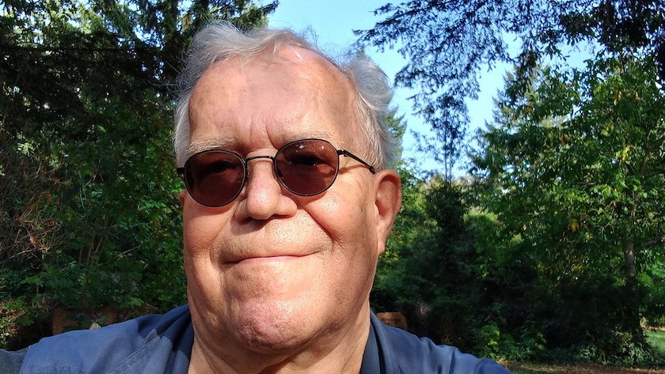

Eigentlich war das obligatorische Selfie nach dem Frieseurbesuch schon vor zwei Wochen fällig. Aber da die Berliner S-Bahn -- wie schon seit Jahren -- wieder ihrer Lieblingsbeschäftigung nachgegangen war, den Berliner Südosten vom Verkehr abzukoppeln und diese Blockade kurzfristig bis Ende August verlängert hatte[^1], wurden aus den sechs Wochen wilden Haarwuchses acht Wochen.

[^1]: Wer wundert sich eigentlich noch bei dieser Totalignoranz und dem Unvermögen der Politik, wenigstens die wichtigsten Lebensgrundlagen zu erhalten, über die Wahlklatsche vom Sonntag?

Aber heute war es soweit. Zwar hielt der 44er Bus den Fahrplan wie gewohnt für eine unverbindliche Abfahrtempfehlung und die Endhaltestelle des Busses war wegen einer Baustelle auch verlegt worden und zwang mich Gehbehinderten zu einem umständlichen Umweg (der auch noch durch viele Leihroller blockert war), aber da ich als erfahrener ÖPNV-Nutzer ohnenhin eine halbe Stunde Puffer eingeplant hatte: Nach 55 Minuten (statt 25 Minuten) hatte mich der Berliner ÖPNV tatsächlich von Britz nach ~~Schweineöde~~ Schöneweide gebracht und die Berliner Haarscheiderinnen meines Vertrauens, die [Coiffeure Marina & Team](https://www.facebook.com/coiffeuremarinaundteam/?locale=de_DE) *(Facebook-Link)*, konnten mir wieder die Haare schön machen.

Und in sechs bis acht Wochen geht es dann weiter mit den [unendlichen Geschichten](https://de.wikipedia.org/wiki/Bahnhof_Berlin-Sch%C3%B6neweide#Umbau) rund um den Bahnhof Schöneweide.

---

**Photo** ([cc](https://creativecommons.org/licenses/by-sa/4.0/deed.de)) 2026: *[Jörg Kantel](http://cognitiones.kantel-chaos-team.de/cv.html)*