[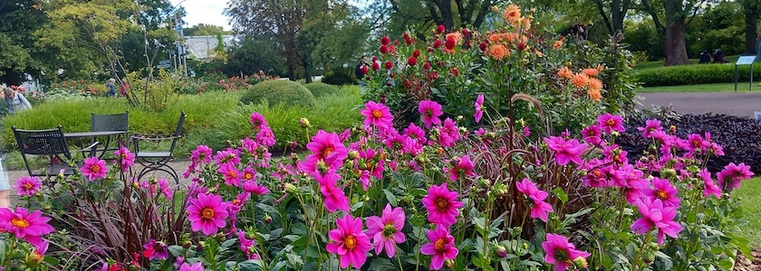](https://www.flickr.com/photos/schockwellenreiter/55511819034/)

Am Sonntag waren die liebste aller Freundinnen und ich auf einem Besuch im Britzer Garten, um uns das »[Dahlienfeuer&nbsp;2026](https://www.britzergarten.de/blueten-gaerten/bluetenschauen/dahlienfeuer/)« anzuschauen. Wie [jedes Jahr](https://kantel.github.io/posts/2023091402_dahlienfeuer/) ist das ein beeindruckendes Erlebnis. Zu sehen sind fast 4.000 Dahlien in 200 unterschiedlichen Sorten und in fast allen Farben -- von naturnahen einfachen Dahlien über architektonische Balldahlien bis zu den skurrilen Hirschgeweihdahlien.

[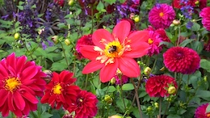](https://www.flickr.com/photos/schockwellenreiter/55511817189/)&nbsp;[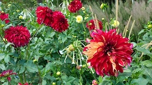](https://www.flickr.com/photos/schockwellenreiter/55511765693/)&nbsp;[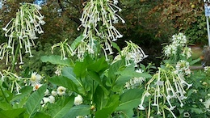](https://www.flickr.com/photos/schockwellenreiter/55510648497/)  
[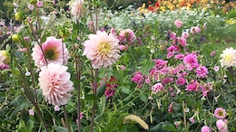](https://www.flickr.com/photos/schockwellenreiter/55511657366/)&nbsp;[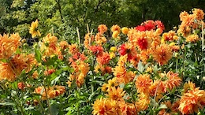](https://www.flickr.com/photos/schockwellenreiter/55511657521/)&nbsp;[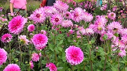](https://www.flickr.com/photos/schockwellenreiter/55510649042/)  
&nbsp;[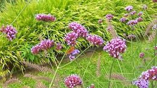](https://www.flickr.com/photos/schockwellenreiter/55511818439/)&nbsp;[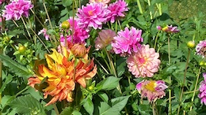](https://www.flickr.com/photos/schockwellenreiter/55511658301/)  
[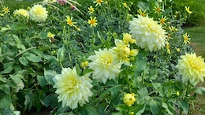](https://www.flickr.com/photos/schockwellenreiter/55512034230/)&nbsp;[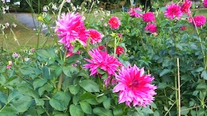](https://www.flickr.com/photos/schockwellenreiter/55511658941/)&nbsp;[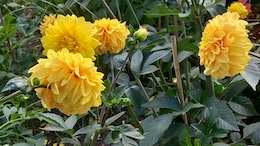](https://www.flickr.com/photos/schockwellenreiter/55510650537/)  
[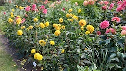](https://www.flickr.com/photos/schockwellenreiter/55512034615/)&nbsp;[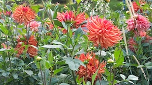](https://www.flickr.com/photos/schockwellenreiter/55511659246/)

*Mit einem Klick auf die Vorschaubilder kommt Ihr je auf eine Seite mit einer Vergrößerung.*

Einen Wermutstropfen hatte die Angelegenheit. Da die Garten-Töff-Töff **immer noch nicht fährt**, ist das Dahlienfeuer für Fußkranke wie uns nur sehr schwer zu erreichen. Wir haben uns über den [Eingang »Sangershauser Weg«](https://www.britzergarten.de/besuch-planen/besucherinformationen/anfahrt-eingaenge/) dorthin geschleppt, aber von der Bushaltestelle oder den Parkplätzen ist es auch von dort noch ein schönes Stück zu laufen.

Ich hatte ja die letzten Jahre immer ein Jahreskarte, aber ohne die [Parkeisenbahn](https://www.britzergarten.de/events/parkbahn/) ist der Britzer Garten für Menschen mit eingeschränkter Mobilität nur sehr schwer zugänglich. 

---

**Photos** ([cc](https://creativecommons.org/licenses/by-sa/4.0/deed.de)) 2026: *[Jörg Kantel](http://cognitiones.kantel-chaos-team.de/cv.html)*