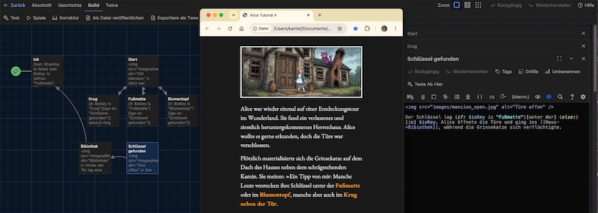
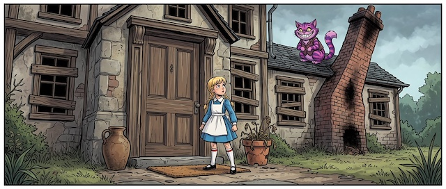
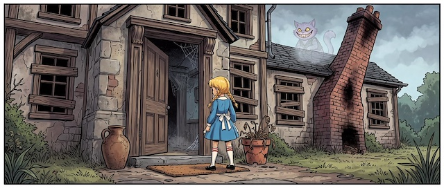
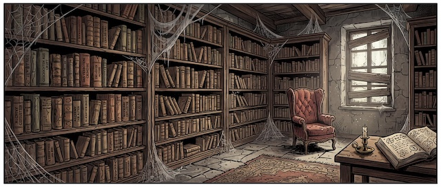

Ich möchte meine kleine Reihe über [Twine](http://cognitiones.kantel-chaos-team.de/multimedia/spieleprogrammierung/twine2.html), der kleinen, freien Engine für interaktive Geschichten (und vielem mehr) und dem (Default-) Storyformat [Harlowe](https://twine2.neocities.org/) fortsetzen. In dieser Ausgabe geht es speziell um Variablen, (einigen) Makros und Hooks. Dafür habe ich Alice in ein altes, verlassenes Haus mit einer Bibliothek geschickt. In einem späteren Tutorial soll sie und sollt Ihr bei der Erkundung dieses Hauses noch mehr Makros und ihre Anwendung kennenlernen. Aber fangen wir erst einmal an.

Die Startpassage heißt dieses Mal `Init` und besteht nur aus den Makros `set:`, `either:` und `go-to:`:

~~~txt
{(set: $hasKey to false)
(set: $isKey to (either: "Fußmatte", "Blumentopf", "Krug"))
}

(go-to: "Start")
~~~

Makros beginnen und Enden in Harlowe immer mit einem Klammerpaar `(…)`. Nach der Klammer steht der Name des Makros, der immer mit einem Doppelpunkt (`:`) abschließt, gefolgt von den Argumenten, zum Beispiel:

~~~txt
(set: $hasKey to false)
~~~

Mit dem Makro `set:` werden Variablen initialisiert[^1]. Variablen sind in der Regel **global** (das heißt, sie gelten während der gesamten Laufzeit der interaktiven Geschichte) und beginnen mit einem Dollarzeichen (`$`). Variablennamen dürfen nur aus Groß-, Kleinbuchstaben oder Ziffern bestehen, Sonderzeichen (mit Ausnahme des Unterstrichs (`_`)) sind nicht erlaubt. Bei der Verwendung des Unterstrichs ist zu beachten, daß Variablennamen, die mit einem Unterstrich statt des Dollarzeichens beginnen (zum Beispiel `_lokal`), von Harlowe als **lokale** Variablen behandelt werden, die nur innerhalb **einer** Passage ihr Gültigkeit besitzen.

[^1]: Harlowe nutzt das Wörtchen `to` statt dem Gleichheitszeichen für die Zuweisung. Das erinnert mich an das seelige [HyperCard](http://cognitiones.kantel-chaos-team.de/programmierung/hypercard.html) und deswegen ist mir Harlowe gleich doppelt sympathisch.&nbsp;🤓

Harlowe kennt drei verschiedene Typen von (einfachen) Variablen:

- *boolean*: Kann nur *true* oder *false* sein
- *numerisch*: Enthält Zahlen (sowohl Ganzzahlen als auch Zahlen mit Nachkommastellen)
- *Zeichenkette (string)*: Besteht aus jeder Art von Text und wird von einem Hochkomma-Paar eingeschlossen (entweder `"Das ist ein Text"` oder `'Das ist auch ein Text'`)

Daneben können auch konkrete Makros Variablen zugeweisen werden, zum Beispiel

~~~txt
(set: $c to (font: "Courier New"))
~~~

und dann im weiteren Verlauf der Geschichte verwendet werden:

~~~txt
$c[Dieser Text ist in Courier.] Und dieser in der Default-Schrift.
~~~

Wie Ihr an dem obigen Beispiel seht, können Makros auch verschachtelt werden. Das geschieht in der zweiten Zeile der `Init`-Passage:

~~~txt
(set: $isKey to (either: "Fußmatte", "Blumentopf", "Krug"))
~~~

Das Makro `either:` besitzt mehrere, durch Kommata getrennte Argumente. Im obigen Fall wird der Variablen `$isKey` genau **einer** der (String-) Werte *Fußmatte*, *Blumentopf* oder *Krug* zugewiesen.

Das letzte Makro in dieser Passage ist das Makro `go-to`:

~~~txt
(go-to: "Start")
~~~

Es sorgt dafür, daß die Zielpassage (in diesem Fall `Start`) **sofort** aufgerufen wird. Das heißt, der Nutzer bekommt die `Init`-Passage gar nicht erst zu sehen[^2]. Es gibt aber auch keinen Pfeil von der `Init`- zur `Start`-Passage und die `Start`-Passage wird von Twine auch nicht automatisch erzeugt. Der Nutzer muss sie im Menü `Abschnitt -> + Neu` manuell anlegen.

[^2]: Es sei denn, er hat einen seeeeehr langsamen Rechner.

### Der Beginn der Geschichte

Mit der `Start`-Passage geht dann die Geschichte richtig los:

~~~html

Alice war wieder einmal auf einer Entdeckungstour im Wunderland. Sie fand ein 
verlassenes und ziemlich heruntergekommenes Herrenhaus. Alice wollte es 
gerne erkunden, doch die Türe war verschlossen.

Plötzlich materialisierte sich die Grinsekatze auf dem Dach des Hauses neben 
dem schrägstehenden Kamin. Sie meinte: »Ein Tipp von mir: Manche Leute verstecken 
ihre Schlüssel unter der [[Fußmatte->Fußmatte]] oder im [[Blumentopf->Blumentopf]], 
manche aber auch im [[Krug neben der Tür->Krug]].
~~~

In dieser Passage gibt es keine neuen Syntaxelemente, daher möchte ich Euch gerne sofort auf die drei neuverlinkten Passagen `Krug`, `Fußmatte` und `Blumentopf` eingehen. Sie sind alle drei nahezu identisch. Zuerst die Passage `Krug`:

~~~html
(if: $isKey is "Krug")[(go-to: "Schlüssel gefunden")]
(else:)[

Im Krug lag nichts als nur ein paar abgestorbene Blätter.

Alice [[suchte weiter->Start]].]
~~~

Dann die Passage `Fußmatte`:

~~~html
(if: $isKey is "Fußmatte")[(go-to: "Schlüssel gefunden")]
(else:)[

Unter der Fußmatte lag nichts.

Alice [[suchte weiter->Start]].]
~~~

und *last but not least* die Passage `Blumentopf`:

~~~html
(if: $isKey is "Blumentopf")[(go-to: "Schlüssel gefunden")]
(else:)[

Unter dem Blumentopf krabbelten nur ein paar Insekten, ansonsten war nichts zu sehen.

Alice [[suchte weiter->Start]].]
~~~

Neu ist hier das Makropaar `if:` und `else:`[^3] und die Verwendung von *Hooks*. Hooks stehen in einfachen, eckigen Klammern `[…]` genau hinter einem Makro und das Makro gilt auch nur für diesen Hook. Sie sind also im wahrsten Sinne des Wortes Haken, an denen die Makros hängen. 

[^3]: Für fortgeschrittene Coder: Es gibt auch noch das Makro `else-if:` als drittes im Bunde. Doch darüber eventuell in einem späteren Tutorial mehr.

Das einfachste Beispiel eines Hooks folgt diesem Beispiel (vergleiche auch das Beispiel oben):

~~~txt
(font: "Courier New")[Dies ist ein Hook und der Text darin ist in Courier New.]
~~~

Das Makro `font:` gilt nur für den Text **innerhalb** der eckigen Klammern, also innerhalb des »anonymen« Hooks[^4].

[^4]: Es gibt aber auch noch Hooks mit Namen *(named hook)*, aber die sind seltener und werden daher auch erst in einem späteren Tutorial behandelt.

Genau so geht es in den drei obigen Passagen zu: Wenn Alice den Schlüssel gefunden hat, zum Beispiel im Blumentopf, 

~~~html
(if: $isKey is "Blumentopf")[(go-to: "Schlüssel gefunden")]

~~~

dann wird sie in dem anhängenden Hook mit dem Makro `go-to:` zu der Passage `Schlüssel gefunden` geschickt[^5]. Im anderen Falle `else:` wird das Bild mit der geschlossenen Tür weiter angezeigt, ein kurzer Text sagt, dass hier nichts gefunden wurde und Alice wird gefragt, ob sie es weiter versuchen will:

[^5]: Noch einmal: Beachtet bitte, dass `go-to:` die Passage nicht anlegt. Ihr müsst sie über `Abschnitt -> + Neu` selber manuell erzeugen.

~~~txt
Alice [[suchte weiter->Start]].
~~~

Hier liegt auch der tiefere Sinn der `Init`-Passage: Würde die Variabke `$isKey` in der Startpassage neu belegt, so bekäme sie bei jedem neuen Versuch von Alice, den Schlüssel zu finden, einen neuen Fundort zugewiesen. Das heißt, wenn Alice unter der Fußmatte den Schlüssel nicht gefunden hätte, dann könnte `Start` ihn nun unter der Fußmatte verstecken. Alice kann unter Umständen unmöglich den Schlüssel finden -- zumindest wäre das Spiel sehr unfair.

### Schlüssel gefunden

Aber weiter zur Passage `Schlüssel gefunden`, die das erklärte Ziel der drei vorherigen Passagen ist:

~~~html

Der Schlüssel lag (if: $isKey is "Fußmatte")[unter der] (else:)[im] $isKey. 
Alice öffnete die Türe und ging ins [[Haus->Bibiothek]], während die Grinsekatze 
sich verflüchtigte.
~~~

Hier wird als erstes das Bild mit der geöffneten Tür geladen, damit die Spielerin oder der Spieler über den Fortgang der Geschichte informiert ist, während sich die Grinsekatze dematerialisiert.

Ansonsten ist in der Passage nur noch ein weiteres Beispiel der `if:` und `else:` Konstruktion: Wenn der Schlüssel **unter der** Fußmatte lag, dann wird das auch im Text so angezeigt, andernfalls (`else:`) lag der Schlüssel **im** Blumentopf oder **im** Krug.

Und die Passage zeigt, dass Variablenwerte im Text einfach mit dem Aufruf der Variablen (hier: `$isKey`) ersetzt werden können. Je nach Inhalt von `$isKey` steht im Text *Fußmatte*, *Blumentopf* oder *Krug*.

### In der Bibliothek

Jetzt kommen wir aber zum Schluß der Geschichte und in der alten Bibliothek an:

~~~html

Hinter der Tür lag eine alte, verstaubte Bibliothek mit vielen seltsamen Büchern 
voller geheimnisvoller Abbildungen und mythischer Erzählungen. Alice wäre gerne 
geblieben und hätte ein wenig die alten Schwarten erkundet. Doch das ist eine andere 
Geschichte, unsere ist hier zu Ende.

[[Noch einmal spielen->Init]]?
~~~

Die Passage bringt nicht wirklich Neues. Sie soll lediglich Lust auf die weiteren, folgenden Tutorials zu Twine und Harlowe machen, die voraussichtlich in dieser Bibliothek beginnen werden. Aber sie sind noch in der Planung, da kann noch viel geschehen.

Aber sie lädt die Spielerin oder den Spieler ein, es noch einmal zu versuchen. Hier linkt sie aber nicht auf `Start`, sondern auf `Init`, wo alle Variablen neu besetzt werden und die Geschichte wirklich von vorne beginnt.

### Das Stylesheet

Ich habe das Stylesheet der bisherigen Tutorials sukkzessive erweitert, aber immer nur die Erweiterungen abgedruckt. Daher dachte ich, daß es eine gute Idee wäre, es hier noch einmal in seiner vollen Pracht anzuzeigen, um eventuellen Verwirrungen vorzubeugen:

~~~css
@font-face {
  font-family: Berkshire; /* set name */
  src: url(fonts/BerkshireSwash-Regular.ttf) format("truetype");
}
@font-face {
  font-family: EBGaramond; /* set name */
  src: url(fonts/EBGaramond-Regular.ttf) format("truetype");
  font-style: normal;
}
@font-face {
  font-family: EBGaramond; /* set name */
  src: url(fonts/EBGaramond-Italic.ttf) format("truetype");
  font-style: italic;
}
@font-face {
  font-family: EBGaramond; /* set name */
  src: url(fonts/EBGaramond-Bold.ttf) format("truetype");
  font-weight: bold;
}
tw-story {
    background-color: #1a1a1a;
    color: #f0f0f0;
    font-family: EBGaramond, serif;
    font-size: clamp(1.2em, 2.0vw, 1.75em);
}
h1 {
  font-family: Berkshire, serif;
  font-size: clamp(1.8em, 2.0vw, 2.75em);
}
tw-link, tw-ancient-link {
    color: #ff9900;
    font-weight: bold;
}
tw-link:hover {
    color: #ff9900;
}
tw-link.visited {
    color: #ff9900;
}
tw-link.visited:hover {
    color: #ff9900;
}
.enchantment-link:hover, tw-link:hover {
    color: #ff9900;
}
tw-sidebar {
    display: none;
}
img {
  max-width: 100%;
  height: auto;
}
~~~

Eigentlich habe ich nur die Fonts eingebunden und sie -- wie auch die Bilder -- responsiv gemacht und **alle** Linkfarben auf <b style="color: #ff9900;">orange</b> gesetzt. Doch das macht schon etliches aus, wie das eingebunden Spiel hier beweist:

### Das Spiel: Alice und die Bibliothek

<iframe width="100%" height="640" src="alice5/"></iframe>

Auch dieses Tutorial habe ich sowohl als [HTML-Datei](https://github.com/kantel/twine-entdecken/blob/master/Twine/alicereloadedharlowe/alice5/index.html) wie auch als [Twee-Datei](https://github.com/kantel/twine-entdecken/blob/master/Twine/alicereloadedharlowe/alice5/Alice%20Tutorial%204.twee) mit allen Assets ([Bilder](https://github.com/kantel/twine-entdecken/tree/master/Twine/alicereloadedharlowe/alice5/images) und [Schriften](https://github.com/kantel/twine-entdecken/tree/master/Twine/alicereloadedharlowe/alice5/fonts)) auf meinem GitHub-Account hochgeladen. *Habt Spaß damit!*

Und natürlich habe ich dieses Spielchen – wie die anderen auch – auf meiner Neocities-Spielwiese [veröffentlicht](https://kantel.neocities.org/twine/alice5/), der ich übrigens letztes Wochenende ein komplettes Redesign gegönnt habe (doch darüber vielleicht ein anderes Mal mehr).

### Was bisher geschah

Meine Twine-Harlowe-Reihe besteht bisher aus diesen acht Beiträgen:

1. Der Wunderland-Debattierclub: [Klickbare Imagemaps in Twine](https://kantel.github.io/posts/2026081102_imagemaps_twine/)
2. [Zurück ins Wunderland (schon wieder)](https://kantel.github.io/posts/2026082001_zurueck_ins_wunderland/) und dieses Mal mit Harlowe
3. Alles auf Anfang: [Mit Twine und Harlowe ins Wunderland](https://kantel.github.io/posts/2026082301_twine_harlowe_wunderland/)
4. Aus meiner Webwerkstatt: [Twine-Stories in die eigenen Seiten einbinden](https://kantel.github.io/posts/2026082401_twine_einbinden/)
5. [Alice und die Teeparty](https://kantel.github.io/posts/2026082601_alice_teeparty/): Mit Twine und Harlowe ins Wunderland (Teil 2)
6. [Alice und Humpel Pumpel](https://kantel.github.io/posts/2026090102_alice_und_humpelpumpel/): Mit Twine und Harlowe ins Wunderland (Teil 3)
7. [Qumbo schreibt (schön)](https://kantel.github.io/posts/2026090701_custom_fonts_harlowe/): Custom Fonts in Twine (Harlowe)
8. Mit Alice in die Bibliothek: Variablen, Makros und Hooks in Twine (Harlowe)

Fortsetzung folgt …