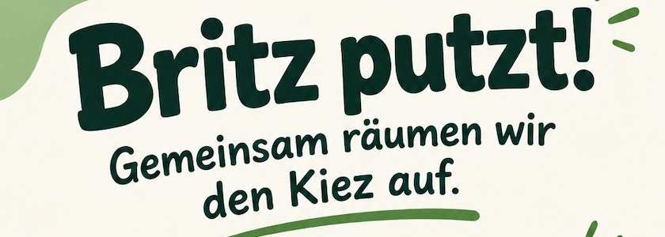

Aus der Nachbarschaft für die Nachbarschaft: Am **Sonnabend, den 19. September 2026 zwischen 13:00 Uhr und 15:00 Uhr** findet rund um die Neuköllner Runguisstraße in 12347 Berlin eine *Clean Up Aktion* statt, um unseren Kiez zu säubern. Veranstaltet wird die Aktion von Menschen aus der Nachbarschaft, die sich schon seit drei Jahren mehrmals im Jahr zusammenfinden, um den Kiez aufzuräumen.

Treffpunkt ist um **13:00 Uhr bei der Bank vor dem Haus Rungiusstraße 29**. Material zum Putzen (Besen, Zangen und Mülltüten) ist vorhanden.

Anschließend (von 15:00 Uhr bis 17:00 Uhr) treffen sich die Akteurinnen und Akteure zu einem selbstorganisierten Kaffee und Kuchen auf dem [Dach des Kulturbunkers](https://kantel.github.io/posts/2023100601_kulturbunker/) in der Rungiusstraße&nbsp;19. Mitgebrachtes Essen und Trinken zum Teilen ist gerne gesehen.

Kommt vorbei und putzt mit! Die Macherinnen und Macher der Aktion freuen sich auf Euch und Eure tatkräftige Hilfe.