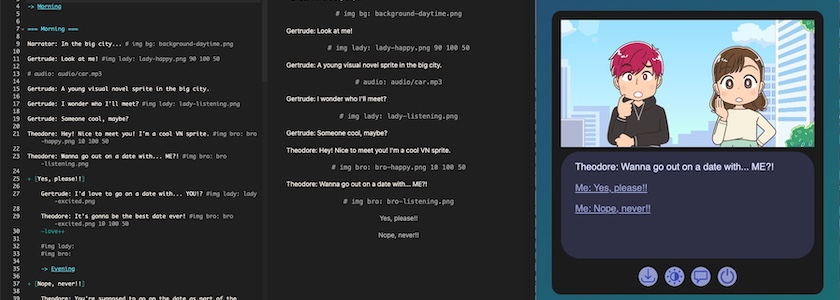

Eigentlich hatte ich ja schon [mehrmals](https://kantel.github.io/posts/2026061601_ink_und_inky_2/) [geschrieben](https://kantel.github.io/posts/2026071401_ink_workshop/), dass ich -- zumindest momentan -- noch(?) nichts mit [Ink](https://www.inklestudios.com/ink/), der freien (MIT-Lizenz) Skriptsprache für interaktive Fiktion, und dem dazugehörenden Editor [Inky](http://cognitiones.kantel-chaos-team.de/multimedia/spieleprogrammierung/inkle.html) anstellen möchte. Aber es trudeln immer wieder Meldungen in meinen Feedreader, die an dieser Entscheidung rütteln. So auch heute:

Denn manchmal sind die großen Engines wie [Ren'Py](http://cognitiones.kantel-chaos-team.de/multimedia/spieleprogrammierung/renpy.html), [Monogatari](https://monogatari.io/) oder [Tuesday&nbsp;JS](http://cognitiones.kantel-chaos-team.de/multimedia/spieleprogrammierung/tuesdayjs.html) einfach ein Overkill, wenn man mal schnell etwas für das Web entwickeln will.

<iframe class="if16_9" src="https://www.youtube.com/embed/avNlsLUg3LY?si=yZsSWZuA81v9TCFT" title="YouTube video player" frameborder="0" allow="accelerometer; autoplay; clipboard-write; encrypted-media; gyroscope; picture-in-picture; web-share" referrerpolicy="strict-origin-when-cross-origin" allowfullscreen></iframe>

Das haben auch der narrative Designer *Geoffrey Golden* *(Murder in the Alps)* und Programmierer *Josh Grams* so gesehen und eine freie (MIT-Lizenz) CSS-Vorlage bereitgestellt, mit er Ihr in Ink/Inky relativ einfach und unkompliziert eine interaktive Geschichte oder ein *Visual Novel* für das Web erstellen könnt.

Einfach das Template [herunterladen](https://joshgrams.itch.io/ink-vn-lite) und die `story.ink` in Inky öffnen. Dann Eure Geschichte darin schreiben und die Bilder und Audio-Dateien in den entsprechenden Ordnern ablegen. Neben dem [obigen Video](https://www.youtube.com/watch?v=avNlsLUg3LY) ist das Tutorial »[Writing web-based interactive fiction with Ink](https://www.inklestudios.com/ink/web-tutorial/)« beim Erstellen der Geschichte sicher eine große Hilfe.

Im Regelfalle sollte es reichen, wenn Ihr nach Fertigestellung nur die `story.js` austauscht (`File -> Exports story.js only …`), wenn Ihr allerdings Größeres vorhabt, könnt Ihr auch noch an der `index.html` oder an der `style.css` herumschrauben (Ihr solltet dann aber wissen, was Ihr tut&nbsp;🤓).

Sicher, mit dem Teil könnt Ihr nur eine ganz einfache, interaktive Geschichte erzählen, aber manchmal will man auch nicht mehr. Das Template ist einigermaßen responsive, Ihr könnt Eure Geschichte im Browser Cache oder lokal auf Eurer Festplatte speichern, es gibt einen *Dark Mode* und einen *Light Mode*, es gibt eine Verlaufsansicht Eurer Dialoge und Ihr könnt das Spiel neu starten.

Ich bin jedenfalls hin- und hergerissen. Mir gefällt das Teil und es juckt mich gewaltig in den Fingern, damit etwas anzustellen. *Still digging!*