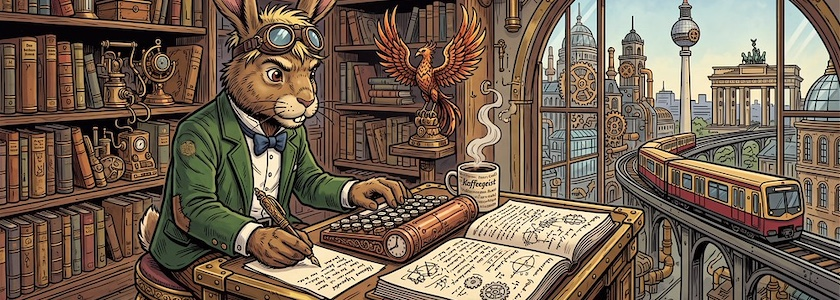

[Beunruhigende Meldungen](https://kurtis-redux.medium.com/why-is-anytype-the-local-first-notion-alternative-being-rewritten-b1a57bbd05f4) erreichen mich aus dem Hause [Anytype](https://anytype.io/), meiner bisherigen, digitalen Rumpelkammer, die zusammen mit [Joplin](http://cognitiones.kantel-chaos-team.de/webworking/staticsites/joplin.html) die [Basis für mein »zweites Gehirn«](https://kantel.github.io/posts/2025112701_anytype_051/) bildet: Die App soll in Zukunft komlett neugeschrieben werden und unter dem Namen **Anytwo** herauskommen.

Laut dem Anytype-Team hat die alte und zunehmend komplexe Middleware-Schicht die Stabilität und Entwicklungsgeschwindigkeit beeinträchtigt. Auch der seit sechs Jahren im Einsatz befindliche Editor hat einige Probleme angesammelt. Anytwo wird die alte Middleware durch eine neue Datenbank ersetzen und das Dateiknotensystem neu aufbauen. Anytype scheint sich als Anytwo vom lokalen Notizwerkzeug allmählich zu einer **persönlichen Computerplattform** entwickeln zu wollen.

<iframe class="if16_9" src="https://www.youtube.com/embed/vMSGiBqFOTc?si=2jVuONITSkLceMEZ" title="YouTube video player" frameborder="0" allow="accelerometer; autoplay; clipboard-write; encrypted-media; gyroscope; picture-in-picture; web-share" referrerpolicy="strict-origin-when-cross-origin" allowfullscreen></iframe>

*Auch die fokussierte Neugier berichtete schon über Anytwo.*

Das sind ja alles ganz hehre Ziele, nur **dies erfordert eine Migration, kein routinemäßiges Upgrade**, denn die neue Plattform wird nicht abwärtskompatibel sein. Und die neuen Versionen von Anytwo werden einige Funktionen der aktuellen Anytype-Version vermissen. Ich befürchte zudem etliche Kompatibilitätsprobleme. Mir scheint die Architektur von Obsidian, die von Anfang an so konzipiert wurde, dass sie mit zukünftigen Technologien und Anwendungen kompatibel bleibt, der bessere Weg.

Aber ich schütte so schnell das Kind nicht mit dem Bade aus und warte erst einmal ab. Allerdings werde ich Anytype nicht mehr so häufig nutzen und mich verstärkt nach Alternativen umschauen. Mit [SoloMD](https://kantel.github.io/posts/2026061802_solomd/), [Tolaria](https://kantel.github.io/posts/2026052601_tolaria/) und [Chronicler](https://kantel.github.io/posts/2026051301_chronicler/) haben ja schon einige vielversprechende Kandidaten für (m)eine digitale Rumpelkammer bei mir angeklopft. *Still digging!*

---

**Bild**: *[Der Märzhase schreibt](https://www.flickr.com/photos/schockwellenreiter/55455994532/)*, erstellt mit [OpenArt](https://openart.ai/home). Prompt: *The @March Hare sits at a desk in front of an antiquated, steampunk-style computer, typing on a keyboard. He wears a pair of aviator goggles, which he has pushed up onto his forehead. Lying on the desk in front of him is a gigantic notebook, in which he is jotting down notes with an old-fashioned fountain pen. Beside the keyboard sits a mug of steaming coffee. Shelves crammed with books and steampunk knick-knacks line the walls. A statue of the phoenix stands on one of the shelves. Through a window, one looks out upon a steampunk version of Berlin with an elevated old-fashioned railway in a steampunk style, but in the colors of the Berlin S-Bahn. Colored classic American comic style. Language: German. No speech bubbles, no textboxes. No German flags.*« Modell: Nano Banana 2.