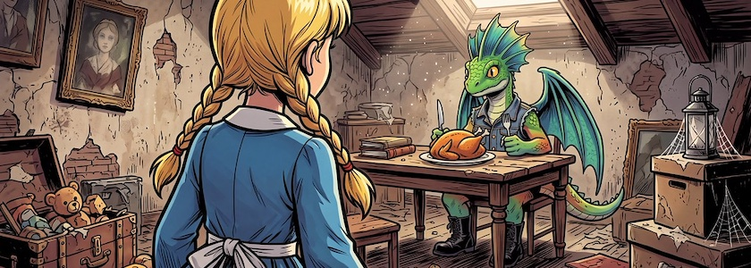

Auch wenn mich das [heute vorgestellte](https://kantel.github.io/posts/2026091501_visual_novel_mit_ink/) Template um interaktive Geschichten und *Visual Novels* mit [Ink](https://www.inklestudios.com/ink/)/[Inky](http://cognitiones.kantel-chaos-team.de/multimedia/spieleprogrammierung/inkle.html) zu erstellen, fasziniert, liegt mein Augenmerk momentan aber auf meiner Tutorialreihe zu interaktiven Geschichten mit [Twine](https://kantel.github.io/posts/2026091001_alice_tutorial_5/) und dem (Default-) Storyformat [Harlowe](https://twine2.neocities.org/). Das hat natürlich unsere allwissende Datenkrake auch spitzbekommen und mich mit einigen Tutorials dazu versorgt:

Das erste Tutorial »[Twinery: Building Literary Hypertexts](https://www.youtube.com/watch?v=pZsUYirIl2U)« von *Megan Perram* von der *University of Alberta* ist zwar nicht mehr ganz so taufrisch, aber dennoch interessant. Denn in diesem Workshop werden Anwendungen von Twine in drei Bereichen erörtert: Literarisches Spieledesign, Mindmapping im Bildungsbereich und therapeutische Ansätze für Krankheitsnarrative. Also weit über den üblichen Fokus »normaler« Twine-Tutorials hinaus.

Das Einbinden des Videos in andere Seiten wurde vom Inhaber deaktiviert. Daher müsst Ihr es Euch direkt auf [YouTube anschauen](https://www.youtube.com/watch?v=pZsUYirIl2U).

<iframe class="if16_9" src="https://www.youtube.com/embed/MQ_rle9v698?si=8BbPRruLNBl_UWKQ" title="YouTube video player" frameborder="0" allow="accelerometer; autoplay; clipboard-write; encrypted-media; gyroscope; picture-in-picture; web-share" referrerpolicy="strict-origin-when-cross-origin" allowfullscreen></iframe>

MMP 270 steht für den Kurs »[Introduction to Video Game Design](https://openlab.bmcc.cuny.edu/mmp-270-fall-2026/)«, den *Owen Roberts* schon seit etlichen Semestern hält. In diesem Semester werden -- falls sich der [Plan](https://openlab.bmcc.cuny.edu/mmp-270-fall-2026/schedule/) nicht noch ändert -- dabei die Engines Twine, [Bitsy](http://cognitiones.kantel-chaos-team.de/multimedia/spieleprogrammierung/bitsy.html), [microStudio](http://cognitiones.kantel-chaos-team.de/multimedia/spieleprogrammierung/microstudio.html) und [Godot](http://cognitiones.kantel-chaos-team.de/multimedia/spieleprogrammierung/godot.html) behandelt, also alles Engines, die für regelmäßige Leser dieses ~~Blogs~~ Kritzelheftes nicht unbekannt sein sollten. Der Kurs beginnt auch in diesem Semester mit Twine und daher solltet Ihr und sollte ich [der Playlist dazu](https://www.youtube.com/playlist?list=PLHLSMyDRl7Z8) Eure/meine Aufmerksamkeit schenken. Die Playlist wird im Laufe des Semesters noch regelmäßig aktualisiert.

<iframe class="if16_9" src="https://www.youtube.com/embed/ep1ZC1Y1Dmc?si=euN_neT9tDhW5ltb" title="YouTube video player" frameborder="0" allow="accelerometer; autoplay; clipboard-write; encrypted-media; gyroscope; picture-in-picture; web-share" referrerpolicy="strict-origin-when-cross-origin" allowfullscreen></iframe>

**War sonst noch was?** Ach ja, der schon mehrfach hier erwähnte Kanal *Let's Make A Game* hat eine neue Playlist zu »[Tactical Combat](https://www.youtube.com/playlist?list=PLWqAaLTaO77c)« hochgeladen. Momentan besteht sie aus 27 Videos, mindestens sechs weitere sollen noch folgen. Zwar benutzt der Autor das Storyformat [SugarCube](https://www.motoslave.net/sugarcube/2/docs/), aber die verwendeten Algorithmen sind so grundlegend für Spiele, daß ich sie auch einmal in Harlowe implementieren sollte. *Still digging!*

---

**Bild**: *[Alice und der hungrige Drache](https://www.flickr.com/photos/schockwellenreiter/55525919403/)*, erstellt mit [OpenArt](https://openart.ai/home). Prompt: *@Alice is standing in the attic room of a dilapidated old house as seen in @image1. In the background, @Dino Filz sits at a table before an  plate with a roast turkey, holding a knife and fork. Clutter is scattered around the room. A few old oil paintings hang on the walls. Daylight streams in through a skylight. A close-up shot of Alice from a rear-angle perspective. Classic American comic book style. No text boxes, speech bubbles, or captions. Language: German.*« Modell: Nano Banana&nbsp;2.