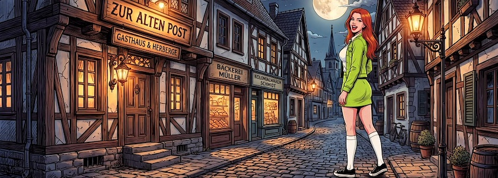
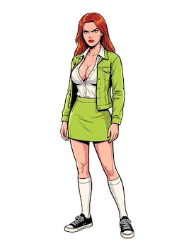
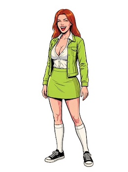
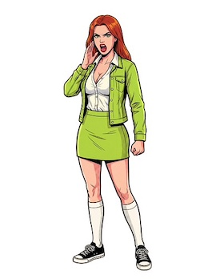
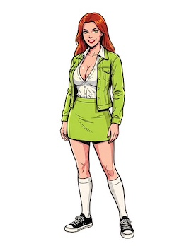
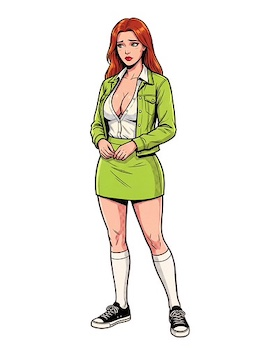

Angeregt durch die [gestrige Entdeckung](https://kantel.github.io/posts/2026091501_visual_novel_mit_ink/) des [Templates](https://joshgrams.itch.io/ink-vn-lite), mit dem man interaktive Geschichten und *Visual Novels* in [Ink](https://www.inklestudios.com/ink/)/[Inky](http://cognitiones.kantel-chaos-team.de/multimedia/spieleprogrammierung/inkle.html) erstellen kann, habe ich mich gestern noch einmal hingesetzt und in [Scenario](http://cognitiones.kantel-chaos-team.de/technikgeschichte/rechnerundnetze/scenario.html) eine weitere Figur für die Verwendung in *Visual Novels* erzeugt. Ich habe sie »Babsi« genannt und als hochaufgelöste `.png`-Dateien mit freigestelltem Hintergrund auf [Itch.io hochgeladen](https://kantel.itch.io/babsi-visual-novel-projekt-3).

&nbsp;&nbsp;  
&nbsp;&nbsp;

Die obigen Bilder sind nur eine Auswahl, insgesamt besteht das Set aus 30 Posen.

Die Konsistenz des Charakters ist dieses Mal ein wenig verbesserungswürdig, denn Googles Nano Banana war sich nicht sicher, wie viele Knöpfe an der Bluse offen bleiben sollten.&nbsp;🤓

Da das verwendete Modell Googles Nano Banana 2 war, war die Auswahl des KI-Dienstleisters eigentlich nebensächlich, da diese den Prompt nur durchreichen. Ich habe aber die einzelnen Posen mit Scenario generieren lassen, da diese über ein in meinen Augen über besseres Tool zur Freistellung des Hintergrunds verfügen.

Ihr könnt mit diesen Bildern anstellen, was Ihr wollt -- sie sind schließlich KI generiert und damit frei von Urheberrechten --, doch würde ich mich freuen, wenn Ihr mir einen Link zu Eurem Ergebnissen schickt, damit ich diese dann auf diesen Seiten vorstellen kann.

---

**Bild**:  *[Babsi Mockup](https://www.flickr.com/photos/schockwellenreiter/55530702986/)*, Collage aus zwei mit [Scenario](http://cognitiones.kantel-chaos-team.de/technikgeschichte/rechnerundnetze/scenario.html) generierten Bildern, Modell: Nano Banana&nbsp;2.

