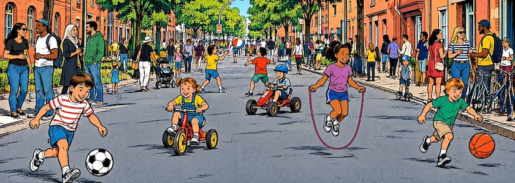

Am nächsten **Dienstag, den 22. September 2026 zwischen 15:00 Uhr und 18:00 Uhr** ist es endlich wieder soweit. Denn dann geht die [temporäre Spielstraße](https://qm-glasower-strasse.de/veranstaltung/temporaere-spielstrasse-auf-der-glasower-strasse/) in der Glasower Straße in die vierte und für dieses Jahr letzte Runde. Dafür wird die **Glasower Straße zwischen Benda- und Bruno-Bauer-Straße** in 12051 Berlin-Neukölln zum vierten Mal in diesem Jahr für den Autoverkehr gesperrt. Wie schon bei den letzten Terminen [im Juni](https://kantel.github.io/posts/2026060801_temporaere_spielstrasse/), [im Juli](https://kantel.github.io/posts/2026070601_temporaere_spielstrasse_2/) und [im August](https://kantel.github.io/posts/2026082101_temporaere_spielstrasse_3/) dieses Jahres kann dann fröhlich und unbehelligt vom Autoverkehr auf der Straße gespielt, getobt, getanzt und gelacht werden.

**Autofahrer, bitte aufgepasst**: Die Straße ist im besagten Abschnitt nicht nur gesperrt, sondern von 13:00 Uhr bis 18:00 Uhr gilt hier auch absolutes Halteverbot. Das Ordnungsamt ist vor Ort. Autos, die dennoch dort parken, werden abgeschleppt.

Es ist das letzte Mal für dieses Jahr, dass die temporäre Spielstraße in der Glasower Straße stattfindet. Die Macherinnen und Macher hoffen, sie auch im nächsten Jahr wieder aufleben zu lassen. Veranstaltet und organisiert wird die Spielstraße von anwohnenden Menschen aus dem Kiez – aus der Nachbarschaft für die Nachbarschaft! Sie freuen sich über viele, fröhliche Kinder und ihre erwachsenen Begleitpersonen.

---

**Bild**:  *[Spielstrasse](https://www.flickr.com/photos/schockwellenreiter/55534918597/)*, erstellt mit [OpenArt](https://openart.ai/). Prompt: »*A traffic-calmed city street like the one in @5ofqvwcmdDvIY7Glj79a , where many children are playing with balls, pedal cars, tricycles, and jump ropes. Many adults of various nationalities are standing along the sides of the street, talking to one another or watching their children. Classic American comic book style. Language: German. No text boxes, speech bubbles, or headings.*« Modell: GPT Image 2.5.

