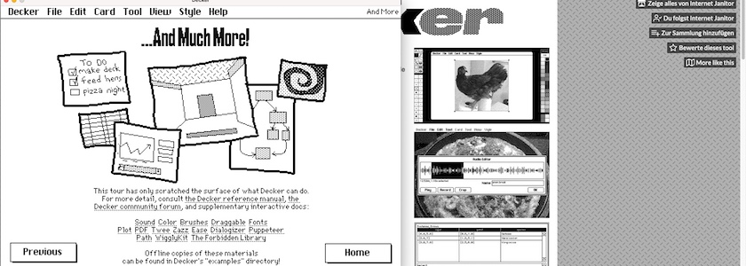

Hätte mich der regelmäßig auf diesen Seiten erwähnte »Freund aus Bremen« nicht darauf aufmerksam gemacht, wäre ein weiteres Update unbemerkt an mir vorbeigerauscht. Denn von [Decker](http://cognitiones.kantel-chaos-team.de/programmierung/decker.html), der freien (MIT-Lizenz) und plattformübergreifenden (macOS, Linux, Windows, Web) Multimedia-Plattform zum Erstellen und Teilen interaktiver Dokumente mit Ton, Bildern, Hypertext und Skriptfunktionen, kurzum, dem Erbe von [HyperCard](http://cognitiones.kantel-chaos-team.de/programmierung/hypercard.html), ist schon vor etwa einem Monat die [Version 1.70](https://internet-janitor.itch.io/decker/devlog/1636068/decker-170) freigegeben worden.

Decker 1.70 ist eine Wartungs-Release mit Schwerpunkt auf Fehlerbehebungen und kleineren Verbesserungen der Benutzerfreundlichkeit. Alle Neuerungen könnt Ihr in den oben verlinkten Release-Notes nachlesen.

Und ich? Ich muss zugeben, auch wenn ich schon lange einmal mit Decker und seiner schwarz-weißen Retro-Ästhetik eine [Ditherpunk](https://surma.dev/things/ditherpunk/)-Visual-Novel basteln wollte, mir fehlt momentan einfach die Zeit dazu. So wird auch die aktuelle Version von Decker ungenutzt auf meiner Festplatte schmoren und auf bessere Zeiten hoffen. Aber vielleicht fühlt sich ja irgendjemand von Euch da draußen angesprochen, etwas mit dem Erbe von HyperCard anzustellen. Wenn sie oder er mir dann auch noch den Link zum Ergebnis schickt, stelle ich das gerne in diesem ~~Blog~~ Kritzelheft vor.