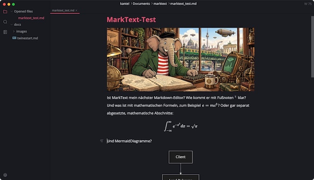

Die [beunruhigenden Meldungen über Anytypes nicht abwärtskompatiblen Nachfolger Anytwo](https://kantel.github.io/posts/2026091502_anytwo/) haben mich besorgt den Artikel »[My Top 4 Open Source Markdown Editors](https://medium.com/@x.line/4-open-source-markdown-editors-52bb16a81bd0)« (€) von *C. A. Exline* lesen lassen. Darin wurden die freien Markdown-Editoren [GhostWriter](https://github.com/KDE/ghostwriter), [Zettlr](http://cognitiones.kantel-chaos-team.de/webworking/auszeichnungssprachen/zettlr.html), [Joplin](http://cognitiones.kantel-chaos-team.de/webworking/staticsites/joplin.html) und [MarkText](http://cognitiones.kantel-chaos-team.de/webworking/auszeichnungssprachen/marktext.html) vorgestellt.

Das brachte zwar (für mich) keine wirklich neuen Erkenntnisse, da GhostWriter nur unter Linux und Windows läuft und [Joplin](https://kantel.github.io/index.html#category=Joplin) und [Zettlr](https://kantel.github.io/index.html#category=Zettlr) in diesem ~~Blog~~ Kritzelheft schon hinreichend oft erwähnt wurden. Lediglich dass ich MarkText zuletzt [vor vier Jahren auf diesen Seiten erwähnt](http://blog.schockwellenreiter.de/2022/09/2022090103.html) hatte, überraschte mich selber ein wenig, denn MarkText ist schon länger auf meinem [Chromebook](https://kantel.github.io/index.html#category=Chromebook) der Markdown-Editor meiner Wahl, obwohl er als fette Elektron-App 330 MB Festplattenplatz belegt. Und das hat seinen Grund:

Denn das herausragende Merkmal von **[MarkText](https://marktext.me/)** (MIT-Lizenz, [Quellcode auf GitHub](https://github.com/marktext/marktext)) ist die Echtzeitvorschau. Anstatt eines separaten Bearbeitungs- und Vorschaufensters werden die Textänderungen direkt auf der Seite angezeigt, ähnlich wie bei einer WYSIWYG-Anwendung. Das ist zwar anfangs etwas gewöhungsbedürftig, doch man gewöhnt sich sehr schnell daran, mit `⎇ + ⌘ + s` (auf meinem Chromebook `alt gr + strg + s`) zwischen Bearbeitungs- und Vorschaumode umzuschalten. Aber man braucht das eigentlich nur selten, in MarkText kann man meistens sehr flüssig direkt im Vorschaumode schreiben.

Ansonsten kann MarkText alles, was man von einem Markdown-Editor erwartet. Er beherrscht *GitHub Flavoured Markdown* (GFM) mit Fußnoten, mathematischen Formeln, YAML-Frontmatter und Mermaid-Diagrammen. Und er exportiert anstandslos nach HTML und PDF, wobei man das Erscheinungsbild der Seiten durch CSS noch beeinflussen kann. Damit lässt sich zwar kein *Digital Garden* realisieren, aber um schnell mal einzelne Seiten ins Web hochzuladen reicht das Tool allemal.

Ich habe jedenfalls das Teil nun auch auf meinem Mac Mini installiert, als Markdown-Editor für zwischendurch und als potentiellen Nachfolger für Anytype als meine digitale Rumpelkammer.

---

**Bild**: *[Qumbo schreibt](https://www.flickr.com/photos/schockwellenreiter/55539520094/)*, erstellt mit [OpenArt](https://openart.ai/home). Prompt: »*@Qumbo sits at a desk in front of an antiquated, steampunk-style computer, typing on a keyboard. Lying on the desk in front of him is a gigantic notebook, in which he is jotting down notes with an old-fashioned fountain pen. Beside the keyboard sits a mug of steaming coffee. Shelves crammed with books and steampunk knick-knacks line the walls. A statue of the phoenix stands on one of the shelves. Through a window, one looks out upon a steampunk version of Berlin with an elevated old-fashioned railway in a steampunk style, but in the colors of the Berlin S-Bahn. Colored classic American comic style. Language: German. No speech bubbles, no textboxes. No German flags.*« Modell: GPT Image 2.5.